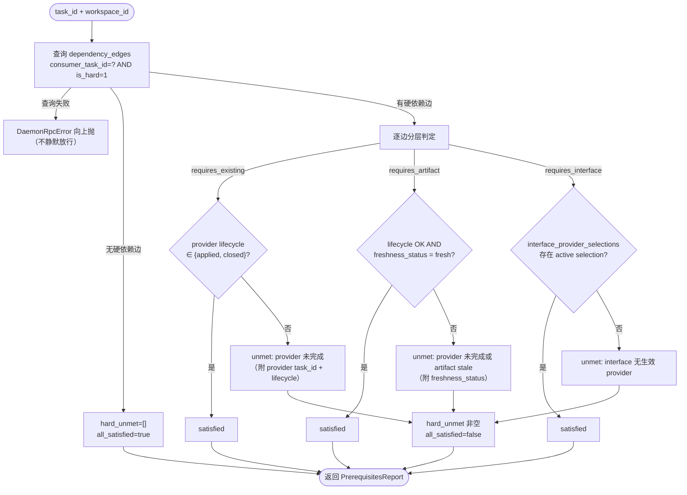
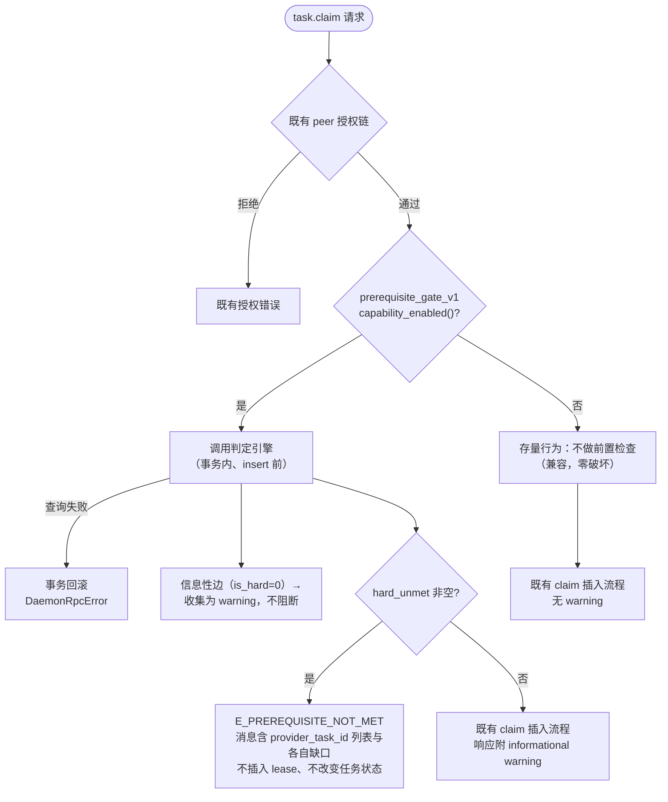
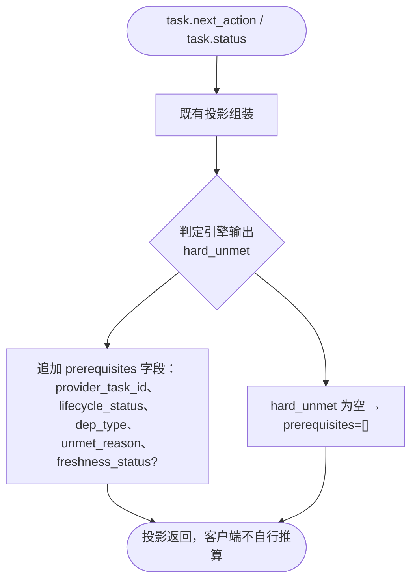
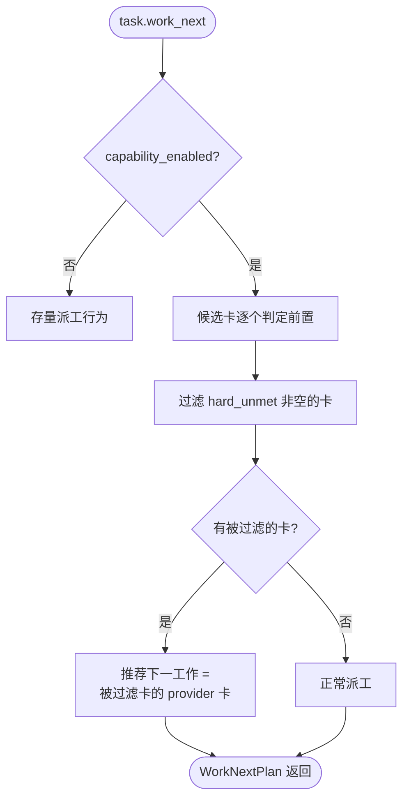

# 前置条件告知 — 端到端数据流（R1，含异常分支）

## 1. 判定引擎数据流

```mermaid
flowchart TD
    Start([task_id + workspace_id]) --> Q1["查询 dependency_edges<br/>consumer_task_id=? AND is_hard=1"]
    Q1 -->|查询失败| Err1["DaemonRpcError 向上抛<br/>（不静默放行）"]
    Q1 -->|无硬依赖边| Empty["hard_unmet=[]<br/>all_satisfied=true"]
    Q1 -->|有硬依赖边| Loop["逐边分层判定"]
    Loop -->|requires_existing| L{"provider lifecycle<br/>∈ {applied, closed}?"}
    Loop -->|requires_artifact| A{"lifecycle OK AND<br/>freshness_status = fresh?"}
    Loop -->|requires_interface| S{"interface_provider_selections<br/>存在 active selection?"}
    L -->|是| Sat1[satisfied]
    L -->|否| Unmet1["unmet: provider 未完成<br/>（附 provider task_id + lifecycle）"]
    A -->|是| Sat2[satisfied]
    A -->|否| Unmet2["unmet: provider 未完成或 artifact stale<br/>（附 freshness_status）"]
    S -->|是| Sat3[satisfied]
    S -->|否| Unmet3["unmet: interface 无生效 provider"]
    Sat1 & Sat2 & Sat3 --> Next
    Unmet1 & Unmet2 & Unmet3 --> Report["hard_unmet 非空<br/>all_satisfied=false"]
    Empty --> Next([返回 PrerequisitesReport])
    Report --> Next
```

## 2. claim 层门禁流（写路径）

```mermaid
flowchart TD
    C0([task.claim 请求]) --> Auth{既有 peer 授权链}
    Auth -->|拒绝| E403[既有授权错误]
    Auth -->|通过| Cap{"prerequisite_gate_v1<br/>capability_enabled()?"}
    Cap -->|否| Legacy["存量行为：不做前置检查<br/>（兼容，零破坏）"]
    Cap -->|是| Eval["调用判定引擎<br/>（事务内、insert 前）"]
    Eval -->|查询失败| ErrR["事务回滚<br/>DaemonRpcError"]
    Eval --> Info["信息性边（is_hard=0）→<br/>收集为 warning，不阻断"]
    Eval --> Hard{"hard_unmet 非空?"}
    Hard -->|是| EGate["E_PREREQUISITE_NOT_MET<br/>消息含 provider_task_id 列表与各自缺口<br/>不插入 lease、不改变任务状态"]
    Hard -->|否| Insert[既有 claim 插入流程<br/>响应附 informational warning]
    Legacy --> Insert2[既有 claim 插入流程<br/>无 warning]
```

## 3. 投影层流（只读）

```mermaid
flowchart TD
    P0([task.next_action / task.status]) --> P1[既有投影组装]
    P1 --> P2{"判定引擎输出<br/>hard_unmet"}
    P2 --> P3["追加 prerequisites 字段：<br/>provider_task_id、lifecycle_status、<br/>dep_type、unmet_reason、freshness_status?"]
    P2 --> P4["hard_unmet 为空 →<br/>prerequisites=[]"]
    P3 & P4 --> P5([投影返回，客户端不自行推算])
```

## 4. work_next 派工流（第二批，should）

```mermaid
flowchart TD
    W0([task.work_next]) --> W1{"capability_enabled?"}
    W1 -->|否| WLegacy[存量派工行为]
    W1 -->|是| W2[候选卡逐个判定前置]
    W2 --> W3["过滤 hard_unmet 非空的卡"]
    W3 --> W4{"有被过滤的卡?"}
    W4 -->|是| W5["推荐下一工作 =<br/>被过滤卡的 provider 卡"]
    W4 -->|否| W6[正常派工]
    W5 & W6 --> W7([WorkNextPlan 返回])
```
