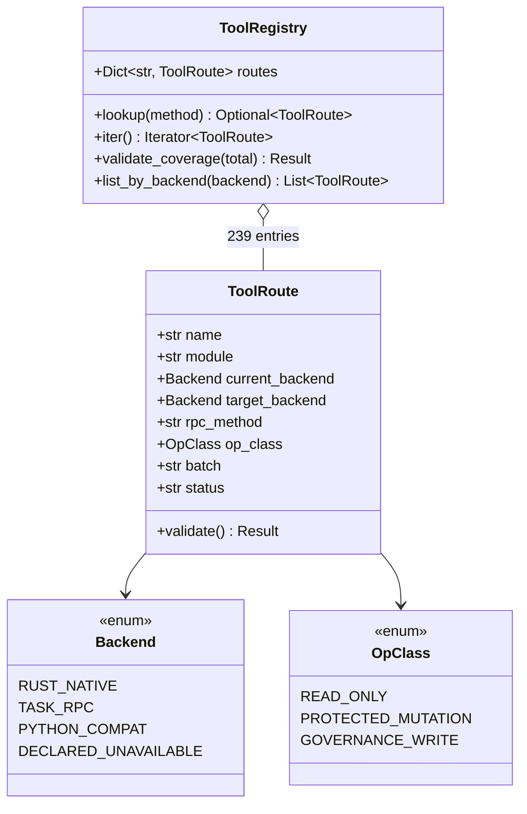
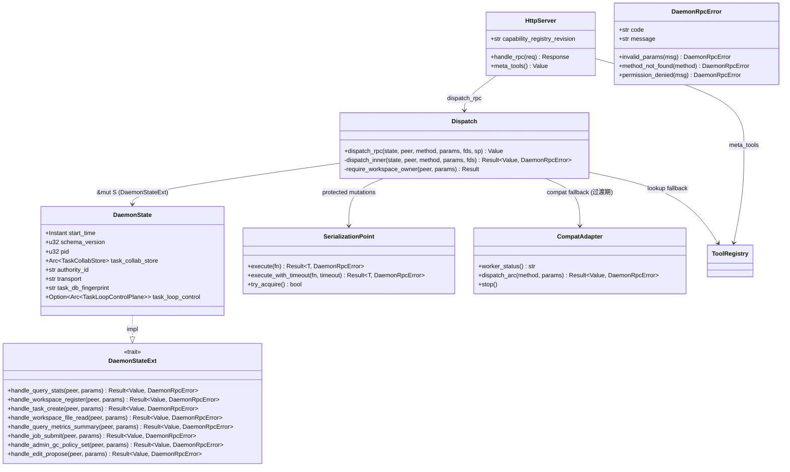
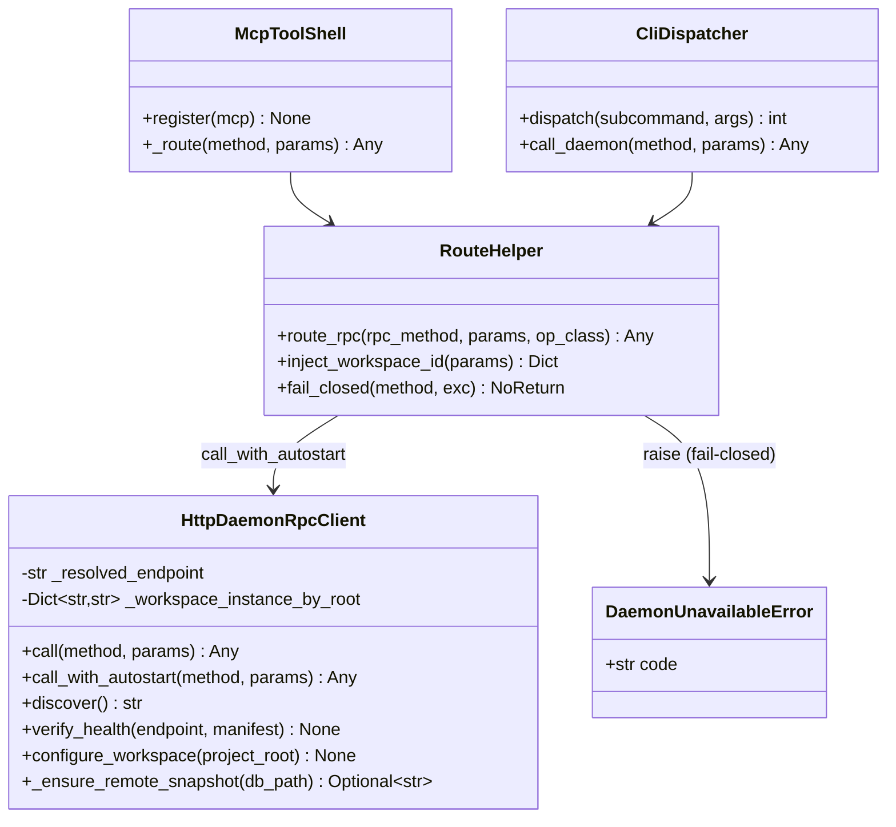
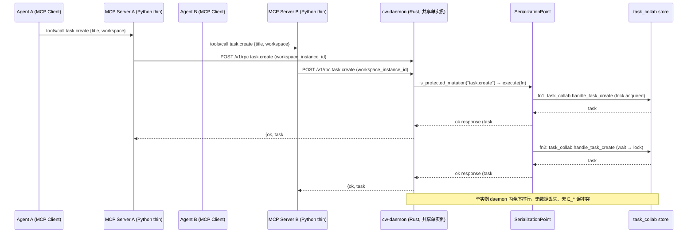
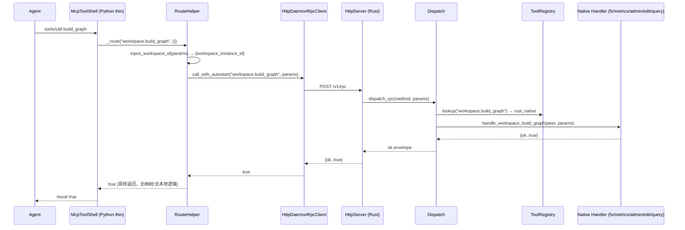
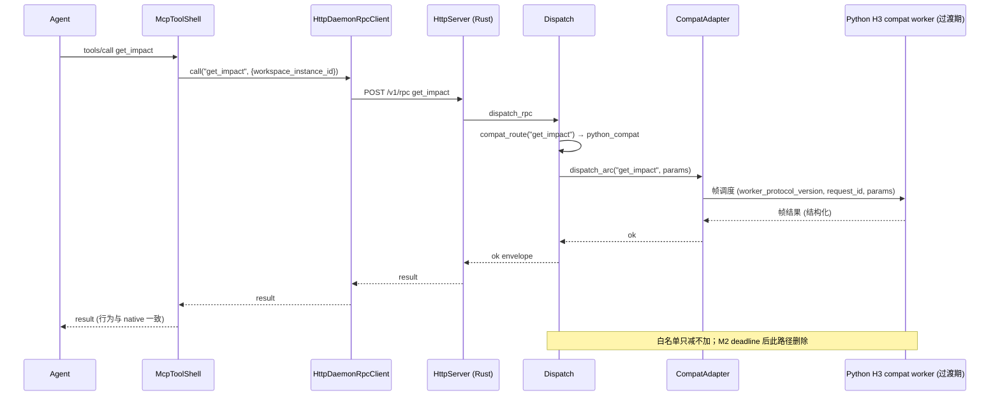
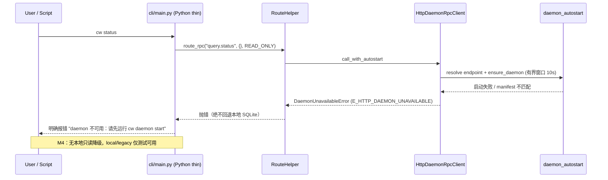
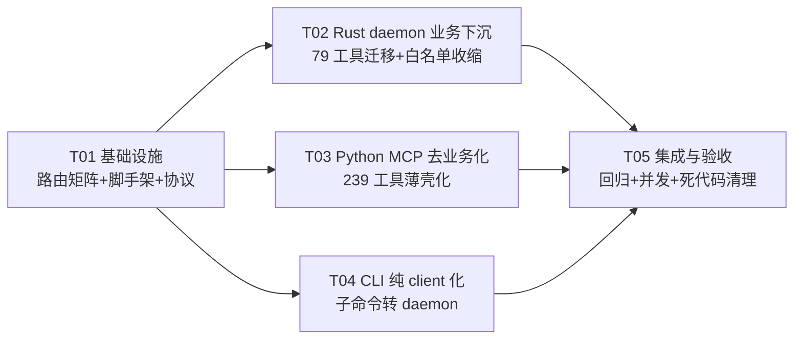

# 设计文档：CW Python 纯 Client 化 + Rust Daemon 业务下沉

| 字段 | 值 |
|---|---|
| Language | 中文 |
| Project Name | `cw-rust-client-convergence` |
| 版本 | v0.1（架构评审稿） |
| 作者 | Bob（架构师） |
| 上游输入 | PRD（Alice）+ `deliverables/mcp-tools-implementation-map.md` + 代码库 `C:\git_work\callwarden` |

> 用户目标（必须满足）：
> **"python 只实现 mcp 和 cli 命令的 client，所有业务逻辑都在 rust daemon 中实现，既确保不同 agent 同时调用 cw mcp 不冲突。"**

---

# Part A: System Design

## 1. 实现方案

### 1.1 核心难点分析

| 难点 | 现状证据 | 收敛策略 |
|---|---|---|
| **D1 · 79 个传统工具迁移** | 61 个 HTTP 拒止（`E_HTTP_COMPAT_UNSUPPORTED`）+ 18 个纯本地 SQL（`tools_workspace.py` 直接 `get_db()` → `db.build_full_graph()` 等），daemon 无对应 RPC 分支 | 单一真相源路由矩阵驱动分批迁移（见 1.2 Q1）；每个工具必须有 daemon 路由（native / task RPC / compat 过渡 / 显式废弃），无"本地隐式路径" |
| **D2 · Python/Rust 双实现消除** | `server/tools/*.py` 共 9818 行、`cli/main.py` 约 10000+ 行且含 318 处 DB 引用、`db/` 承载查询/写入算法 | Python 收敛为薄壳（MCP 透传 + CLI 转发）；业务逻辑收敛 Rust `dispatch.rs`（132 handler）+ `task_collab.rs`（9391 行）+ `workspace.rs`；Python 侧静态检查 0 业务 SQL |
| **D3 · 多 Agent 并发安全** | 现状依赖 `SerializationPoint`（Protected_Mutation）+ task lease/CAS + `DaemonMutex`；Python 侧存在本地 SQLite 竞争（`cw.py` 的 SQLite 预热注释即为此） | 全部写操作经 daemon 单一权威路径；daemon 内串行化（`dispatch_rpc` → `SerializationPoint.execute`）+ 租约 fencing + CAS；Python 侧零锁零写 |
| **D4 · 160 个 HTTP 工具零回归** | 59 native + 22 task RPC + 79 compat worker 已有 HTTP 路由 | 路由矩阵记录每个工具当前 backend 与目标 backend；改造只改 Python 薄壳内部实现，不改变 MCP 工具名/参数/返回结构；全量回归（QA 协同） |

### 1.2 架构模式与关键决策

**总体架构模式：分层透传 + 单一权威写点（Thin Client + Authoritative Backend）**

```
┌─ Python 薄壳层（纯 client，无业务逻辑、无 SQLite 业务读写）────────────┐
│  MCP 工具函数（239 个）：参数校验 → route_rpc() → 结果原样返回            │
│  CLI（cw 子命令）：命令解析 → route_rpc() → 输出格式化                     │
└──────────────┬──────────────────────────────────────────────────────┘
               │ HTTP POST /v1/rpc（JSON-RPC over loopback，manifest 校验）
┌──────────────▼──────────────────────────────────────────────────────┐
│ Rust cw-daemon（权威业务层）                                          │
│  HttpServer: capability registry + COMPAT_ROUTE_WHITELIST + /v1/meta/tools │
│  Dispatch: dispatch_rpc → SerializationPoint(Protected_Mutation) → handler │
│  Handlers: query_handlers / workspace / task_collab / fs / metrics / admin │
│  CompatAdapter: 过渡期调度 Python H3 worker（仅 read_only，白名单只减不加） │
└─────────────────────────────────────────────────────────────────────┘
```

#### Q1 · 79 个传统工具迁移路线（决策：分批全量迁移，P0 全部有路由）

**决策结论**：一次全量 + 分批落地（P0 内全部 79 个获得 daemon 路由；P1 清除 compat 白名单剩余）。逐工具目标见路由矩阵（§2.1 单一真相源，机器可核对）。迁移分 4 条路径：

| 路径 | 适用 | 数量（约） | 迁移后 backend |
|---|---|---|---|
| **A. Rust native handler** | 18 个本地 SQL + 61 拒止中可同步实现的查询/写面 | 18 + 41 = 59 | `rust_native`（dispatch match 分支） |
| **B. Task RPC + job 状态机** | 长任务/异步扫描（detect_clones、embed_symbols、semgrep_scan、import_* 等） | 12 | `task_rpc`（`job_*` + `task.wait_for_job` 模式） |
| **C. compat worker 过渡** | 高成本派生指标，P0 来不及 native 化的只读工具（**白名单只减不加**） | 8（P0 过渡） | `python_compat` → deadline 前全部转 A/B |
| **D. 显式废弃** | 与收敛架构冲突/低频且无迁移价值的运维工具 | 0（P0）；如超限可 ≤5 个 | `declared_unavailable`（结构化 `E_TOOL_DEPRECATED`，仍占路由数） |

**18 个纯本地 SQL 拆分**：
- **文件/构建面（9 个）** → Rust native workspace 文件 handler：`build_graph`、`refresh_file`、`file_read`、`file_grep`、`file_list`、`file_symbol_content`、`build_directory`、`remove_file`、`check_file_health` → 新 RPC `workspace.build_graph` / `workspace.file.read` / `workspace.file.grep` / `workspace.file.list` / `workspace.file.symbol_content` / `workspace.file.remove` / `workspace.file.health`（沿用 `workspace.file.refresh` 既有模式）。
- **度量/状态面（9 个）** → Rust native query handler：`get_code_health_check`、`get_code_metrics_summary`、`get_complexity_hotspots`、`get_coupling_analysis`、`get_function_metrics`、`get_largest_functions`、`get_most_coupled_functions`、`get_status`、`get_symbol_content_by_hash` → 新 RPC `query.code_health` / `query.metrics_summary` / `query.complexity_hotspots` / `query.coupling_analysis` / `query.function_metrics` / `query.largest_functions` / `query.most_coupled_functions` / `query.status` / `query.symbol_content_by_hash`。

**61 个拒止工具分组（详见矩阵）**：
- 异步长任务组（→ B）：`run_semgrep_scan`、`scan_semgrep_incremental`、`semgrep_scan_async`、`detect_clones`、`detect_clones_async`、`embed_symbols`、`embed_symbols_async`、`embed_single_symbol`、`import_git_history`、`import_git_blame`、`import_codeowners`、`import_project_dependencies`、`import_envelope_dependencies`、`import_coverage`、`build_hard_dependency_edges`、`detect_cross_repo_deps`、`prune_external_symbols`、`cancel_job`。
- GC/审计/运维组（→ A admin）：`gc_archive_import`、`gc_archive_inspect`、`gc_archive_list`、`gc_audit_get`、`gc_audit_list`、`gc_policy_get`、`gc_policy_set`、`gc_retention`、`rotate_audit_signing_key`、`cleanup_agent_rule_sync_log`、`compare_snapshots`、`get_metrics`、`register_branch`、`switch_branch`。
- 编辑/提案/规则写面组（→ A + CAS）：`propose_edit`、`propose_range_patch`、`propose_symbol_id_patch`、`propose_symbol_patch`、`revert_edit`、`resolve_gate_findings`、`record_token_savings`、`rule_seed_bootstrap`、`extract_rule_candidates_from_quality_findings`、`rule_candidate_accept`、`rule_candidate_create`、`rule_candidate_reject`、`rule_insert_agents_md_block`、`rule_sync_agents_md`、`run_check_gate`、`guardrail_add_rule`、`generate_summary`。
- 协同/身份/依赖写面组（→ A）：`assignment_create`、`assignment_revoke`、`record_action_identity`、`register_attestation_revocation`、`record_artifact_identity`、`publish_interface`、`select_interface_provider`、`diff_callees`、`diff_callers`、`restore_all_comments`、`restore_comment`。

#### Q2 · CLI 迁移范围（决策：业务子命令全部走 daemon；运维/自举命令例外）

| CLI 面 | 走向 | 说明 |
|---|---|---|
| 业务子命令（query/search/callers/callees/task/gc/rule/audit/clone/workspace/stats/status/graph/semgrep/coverage/dependency/identity/lease/assignment/collab 等全部） | daemon RPC | `cli/main.py` 改为「解析 → `route_rpc()` → 格式化输出」，删除 318 处 DB 引用 |
| **例外 1 · daemon 自身管理** | 本地进程管理，不走 RPC | `cw daemon serve/start/stop/status/ping/health`（鸡生蛋：daemon 未启动时无法问 daemon 自己） |
| **例外 2 · 自举/诊断** | 本地执行，仅运维 | `cw install`（装依赖）、`cw doctor`（诊断 daemon 可用性）、`cw config`（读配置）、`cw daemon metrics --from-file`（读 daemon dump 文件离线诊断） |
| **例外 3 · MCP server 启动** | 本地进程，无业务 | `cw server`（启动 MCP 服务进程本身） |

例外项均为"客户端自身的本地操作"，不含业务数据读写，不违反 G1。

#### Q3 · local/legacy 模式（决策：统一 fail-closed，local 仅限测试）

- **结论**：`local`/`legacy` 不保留生产回退；`legacy` 直接标记废弃；`local` 降级为测试专用（`CW_DAEMON_TRANSPORT=local` 仅允许在 `CW_TEST_MODE=1` 下启用）。
- **理由**：保留 local 即保留 Python 业务双实现（违反 G1/G2），且并发安全无法保证（本地 SQLite 多进程竞争）。
- **实施**：`config.py` 的 `get_daemon_mode()` 增加校验——非测试环境 `local`/`legacy` 一律视为配置错误（`E_MODE_DEPRECATED`）；默认 `auto`（自动拉起 daemon），生产显式 `http`。`is_daemon_required()` 语义扩展为"除测试外全部模式 daemon 必须可用"。

#### Q4 · 18 个纯本地 SQL 工具（决策：不暴露通用 SQL RPC，逐个业务 handler）

- **否决通用 SQL 查询 RPC**：`query.raw_sql` 类接口越权/注入面过大，与现有 `QueryBudget`、owner ACL、`workspace_instance_id` 强制约束冲突。
- **逐个实现业务 handler**：文件面 9 个 + 度量面 9 个，参数白名单化，SQL 由 Rust 侧硬编码/模板化（仅允许项目自有的预编译查询，不接受客户端 SQL 片段）。
- **安全边界**（daemon handler 强制，Python 无权限逻辑）：
  1. `workspace_instance_id` 必须显式注入且归属当前 peer（owner ACL）；
  2. 路径参数经 `validate_owned_path`（canonicalize + owner_uid），禁止 `..` 穿越；
  3. 查询受 `QueryBudget`（max_nodes/timeout_ms）约束；
  4. 文件读取仅限 workspace 根内（`validate_owned_path` 已有机制复用）。

#### Q5 · compat worker 兼容窗口（决策：白名单只减不加，2 个里程碑后清空）

- **机制**：`COMPAT_ROUTE_WHITELIST`（当前 79 项）与 Python `RUST_COMPAT_ROUTE` 保持两端对齐门（已有 `validate_against_rust_route`）。
- **deadline**：**2 个发布里程碑**（M1 收敛发布 → M2 清理发布）。规则：
  - P0 迁移后白名单 ≤ 8 项（仅剩高成本只读派生指标）；
  - 每个里程碑至少迁移 50% 剩余白名单到 `rust_native`；
  - `http_server.rs` 新增 `/v1/meta/tools` 自描述接口，暴露 `backend=python_compat` 的工具清单供监控；
  - M2 结束时白名单为空 → 删除 `compat_adapter.rs` 的 worker 调度、`server/compat_worker.py`、`server/compat_registry.py`。
- **理由**：79 个 compat 工具是"Python 业务逻辑仍在运行"的唯一合法窗口，必须设终止点，否则 G2 永不达成。

#### Q6 · daemon 部署形态（决策：每用户/每主机共享单一 daemon 实例）

- **结论**：**共享单一实例**（每用户每主机一个），不随 Python 进程起多个。
- **现状基础**：`daemon_autostart.ensure_daemon` 已实现三平台拉起 + manifest + authority_id + loopback-only + stale-PID 校验；`DaemonMutex` 防多实例竞争。
- **多 Agent 共享**：不同 coding agent（不同进程/不同 MCP server）指向**同一** loopback HTTP endpoint；`workspace_instance_id` 由 `workspace.register` 幂等返回（同 root 确定性派生），天然共享同一图谱与任务库。
- **并发串行化保证范围**：
  - **单实例（本次）**：daemon 内 `SerializationPoint` 对 Protected_Mutation 全序串行 + `task_collab` lease/CAS/状态机 → 强一致；
  - **多实例（禁止）**：文档与 manifest 明确 loopback-only，禁止两台机器直连同一 daemon；跨机器共享走共享文件系统 + 同一 authority（本轮不实现，属 R2.3 未来项）。
- **服务形态**：`cw daemon serve` 前台 / systemd / launchd / Windows 分离进程（现状保持）。

#### Q7 · 只读降级策略（决策：严格 fail-closed，无本地只读）

- **结论**：daemon 未启动时 Python 侧**不允许**任何本地只读业务查询（对应 M4：CLI 明确报错，不降级本地执行）。
- **理由**：只读降级 = Python 双实现仍在（读算法在 Python 侧），且 snapshot 未发布时本地 SQLite 读到的数据可能与 daemon 权威状态不一致（多 Agent 场景尤其危险）。
- **允许的例外**（非业务数据路径）：`cw doctor`、`cw daemon status/ping`（诊断）、`cw daemon metrics --from-file`（读 daemon dump）、`cw config`（读配置）。
- **实施**：`route_task_read`/`route_worker_call`/`_call_daemon_rpc` 的 auto 模式回退分支删除；`HttpDaemonRpcClient.call_with_autostart` 的启动窗口失败统一抛 `DaemonUnavailableError`（结构化错误码 `E_HTTP_DAEMON_UNAVAILABLE`）。

### 1.3 双实现消除的工程抓手

1. **单一真相源路由矩阵**（§2.1）：`tool_migration_matrix.json` 为唯一权威，Rust dispatch / capability registry / compat 白名单 / Python 薄壳 / 迁移清单均由此生成或校验，杜绝"两边手写漂移"。
2. **静态检查门禁**：新增 `scripts/check_client_purity.py`，CI 检查 `server/tools/`、`cli/` 无 `import sqlite3`、无 `get_db()` 业务调用（允许 `_mcp_common.get_db` 仅配置读取）、无 `CodeGraphDB` 实例化。
3. **回归双层**：239 工具冒烟（HTTP 模式全绿）+ 双 Agent 并发写场景（QA 协同，M3）。
4. **路由矩阵一致性测试**：`verify_route_matrix.py` 断言 239/239 工具在矩阵中、`dispatch.rs`/白名单/薄壳与矩阵一致（数量/名称/backend/状态可机器核对，M1）。

---

## 2. 文件清单

> 路径均为相对仓库根 `C:\git_work\callwarden\`。标注（新）= 新建，（改）= 修改，（删）= 删除。

### 2.1 单一真相源与脚手架（T01）

| 文件 | 动作 | 说明 |
|---|---|---|
| `deliverables/software-company/tool_migration_matrix.json` | （新） | **239 工具迁移矩阵唯一真相源**：每工具含 module/current_backend/target_backend/rpc_method/op_class/batch/status |
| `scripts/gen_route_matrix.py` | （新） | 从矩阵生成：dispatch 分支声明清单、capability registry 行、compat 白名单、Python 薄壳骨架、迁移核对报告 |
| `scripts/verify_route_matrix.py` | （新） | 机器核对：239/239 覆盖率、dispatch/白名单/薄壳与矩阵一致、无 local 隐式路径 |
| `scripts/check_client_purity.py` | （新） | 静态检查 Python 薄壳层 0 业务 SQL / 0 CodeGraphDB / 0 sqlite3 |
| `rust_ext/src/daemon/route_matrix.rs` | （新） | 路由矩阵 Rust 侧数据结构（ToolRoute/ToolRegistry/lookup/validate），编译期+运行时双校验 |

### 2.2 Rust 新增（T02，业务下沉）

| 文件 | 动作 | 说明 |
|---|---|---|
| `rust_ext/src/daemon/fs_handlers.rs` | （新） | 文件/构建面 handler：`workspace.build_graph`、`workspace.file.read/grep/list/remove/symbol_content/health`、`refresh_file`、`build_directory` |
| `rust_ext/src/daemon/metrics_handlers.rs` | （新） | 度量/状态面 handler：`query.code_health`、`query.metrics_summary`、`query.complexity_hotspots`、`query.coupling_analysis`、`query.function_metrics`、`query.largest_functions`、`query.most_coupled_functions`、`query.status`、`query.symbol_content_by_hash` |
| `rust_ext/src/daemon/job_runner.rs` | （新） | 异步长任务 job 状态机（detect_clones/embed_symbols/semgrep_scan/import_* 等 18 个 → `task.job_*` + `task.wait_for_job` 复用） |
| `rust_ext/src/daemon/admin_handlers.rs` | （新） | GC/审计/运维 handler（`gc.archive_*`、`gc.audit_*`、`gc.policy_*`、`gc.retention`、`audit.rotate_key`、`branch.register/switch`、`snapshot.compare`、`metrics.get` 等） |
| `rust_ext/src/daemon/edit_handlers.rs` | （新） | 编辑/提案/规则写面 handler（`edit.propose*`、`edit.revert`、`rule.*`、`gate.run_check`、`guardrail.add_rule`、`summary.generate` 等，经 CAS + SerializationPoint） |

### 2.3 Rust 修改（T02/T05）

| 文件 | 动作 | 说明 |
|---|---|---|
| `rust_ext/src/daemon/dispatch.rs` | （改） | 新增 4 个 handler 模块的 match 分支 + registry fallback（lookup 失败 method_not_found）；`is_protected_mutation` 覆盖新写面 |
| `rust_ext/src/daemon/http_server.rs` | （改） | capability registry 行更新；`COMPAT_ROUTE_WHITELIST` 只减不加；新增 `GET /v1/meta/tools` 自描述接口（C2） |
| `rust_ext/src/daemon/mod.rs` | （改） | 注册新模块（route_matrix/fs_handlers/metrics_handlers/job_runner/admin_handlers/edit_handlers） |
| `rust_ext/src/daemon/compat_adapter.rs` | （改） | worker 协议版本提升 + 状态报告扩展（backend 计数），M2 删除 |
| `rust_ext/src/daemon/workspace.rs` | （改） | 扩展文件面 handler（`workspace.file.*` 家族） |
| `rust_ext/src/daemon/query_handlers.rs` | （改） | 扩展度量/状态 query handler |
| `rust_ext/src/daemon/task_collab.rs` | （改） | 扩展 job 状态机与写面 handler |
| `rust_ext/src/daemon/serialization.rs` | （改） | op_class 覆盖扩展（如无新增则仅测试对齐） |
| `rust_ext/src/daemon/error_codes.rs` | （改） | 新增 `E_TOOL_DEPRECATED` / `E_MODE_DEPRECATED` / `E_TOOL_MIGRATION_PENDING` 等结构化错误码 |

### 2.4 Python 修改（T03/T04，瘦身）

| 文件 | 动作 | 说明 |
|---|---|---|
| `server/tools/tools_workspace.py` | （改） | 薄壳化：18 个本地 SQL 工具改为 `_route()` 透传；其余工具去除 get_db 分支 |
| `server/tools/tools_query.py` | （改） | 薄壳化：统一 `_route()`；移除 SQL 回退 |
| `server/tools/tools_semantic.py` | （改） | 薄壳化 |
| `server/tools/tools_task.py` | （改） | 薄壳化：统一 `route_task_write/read` 收敛为 `_route()` |
| `server/tools/tools_summary.py` | （改） | 薄壳化 |
| `server/tools/tools_security.py` | （改） | 薄壳化 |
| `server/tools/tools_rules.py` | （改） | 薄壳化 |
| `server/tools/tools_collab.py` | （改） | 薄壳化 |
| `server/tools/tools_p2_graph.py` | （改） | 薄壳化 |
| `server/tools/tools_p3_identity.py` | （改） | 薄壳化 |
| `server/tools/tools_p4_lease.py` | （改） | 薄壳化 |
| `server/tools/__init__.py` | （改） | 维持模块注册（若模块合并则同步） |
| `server/_mcp_common.py` | （改） | `get_db()` 仅保留配置读取（无业务 SQL）；`_call_daemon_rpc` 增强 fail-closed |
| `server/daemon_client.py` | （改） | 路由收敛：`route_task_write/read/worker_call` → 统一 `route_rpc(method, params, op_class)`；`HttpDaemonRpcClient` 扩展通用 `call`；删除 auto 降级分支（Q7） |
| `server/compat_registry.py` | （改） | 白名单收缩对齐矩阵（只减不加） |
| `server/compat_worker.py` | （改） | M2 前保持；deadline 后删除 |
| `server/mcp_server.py` | （改） | 启动逻辑简化；移除本地 SQL 预热/写路径 |
| `cli/main.py` | （改） | 全部业务子命令改为 `route_rpc()` 转发；删除 318 处 DB 引用；fail-closed 报错（M4） |
| `cli/daemon_commands.py` | （改） | daemon 运维子命令保持并强化 fail-closed（`serve/start/stop/status/ping/health`） |
| `cli/agent.py` / `cli/agent_registry.py` | （改） | agent 元数据经 daemon RPC；本地注册表仅缓存 |
| `cli/client.py` / `cli/console.py` | （改） | 适配新路由层 |
| `cw.py` | （改） | 删除 SQLite 预热逻辑（`_warmup_sqlite`）与本地回退 |
| `config.py` | （改） | `get_daemon_mode()` 校验 local/legacy 仅测试可用；`is_daemon_required()` 语义扩展 |
| `server/daemon_autostart.py` | （改） | 启动窗口失败统一 fail-closed；manifest/健康检查强化 |

### 2.5 Python 删除（T05，死代码清理）

| 文件 | 动作 | 说明 |
|---|---|---|
| `server/degraded_mode.py` | （删） | fail-closed 全开后无降级路径 |
| `server/daemon_server.py`（UDS 旧服务） | （删/冻结） | 若 local/legacy 移除则不再需要 |
| `server/compat_worker.py` + `server/compat_registry.py` | （删） | M2 deadline 后 |
| `db/` 下不再被引用的业务模块 | （删） | 按 `check_client_purity.py` + 引用扫描结果清理（如 `db/db_tasks.py`、`analyzers/*` 中被 daemon 承接的部分） |
| `server/watcher.py` / `server/refresh_scheduler.py` 等 | （删/冻结） | 业务被 daemon 承接后 |

### 2.6 协议与文档（T01/T05）

| 文件 | 动作 | 说明 |
|---|---|---|
| `docs/design/rust-client-convergence-protocol.md` | （新） | daemon RPC schema（新 method 全部收录）+ 错误码表 + workspace_instance_id 注入约定 |
| `docs/design/cw-rust-client-convergence-migration-guide.md` | （新） | 迁移指南（每批次的 handler/薄壳/测试清单） |
| `docs/design/http-daemon-mvp-compatibility-contract.md` | （改） | compat 窗口与 deadline 更新 |
| `docs/mcp_tools.md` / `TOOLS.md` | （改） | 239 工具路由矩阵文档化（含 2 个差异工具 `task_remediation_create`/`task_step_resolve`） |
| `deliverables/software-company/cw-rust-client-convergence-design.md` | （新） | 本文档 |

---

## 3. 数据结构与接口

### 3.1 路由矩阵数据模型（单一真相源）



### 3.2 Rust handler 侧



### 3.3 Python client 侧



### 3.4 关键接口契约（跨文件约定速览，详见 §8）

- **RPC 信封**：`POST /v1/rpc` body `{id, method, params}`，响应 `{ok|error, result|error{code,message}}`（现状冻结协议，不改变）。
- **workspace 强制**：除 `workspace.list`/`ping`/`health`/`schema.version` 外，所有 RPC 必须携带 `workspace_instance_id`（由 `workspace.register` 幂等返回，Python 只透传不派生，杜绝 cwd 猜测）。
- **错误码**：`E_*` 结构化（见 `error_codes.rs` 与 `config.py` 常量）；新增 `E_TOOL_DEPRECATED`、`E_MODE_DEPRECATED`、`E_HTTP_DAEMON_UNAVAILABLE` 统一。

---

## 4. 程序调用流程

### 4.1 场景 A：多 Agent 并发写 task（G3 核心）



### 4.2 场景 B：MCP 工具透传（native 路径）



### 4.3 场景 C：79 工具迁移后调用链（compat 过渡期）



### 4.4 场景 D：fail-closed（daemon 未启动 / 模式废弃）



---

## 5. 待明确事项

1. **61 拒止工具中"低频运维"的具体 P0 边界**：建议全部迁移（0 个 declared_unavailable）；若工程师评估工作量超限，需与产品确认 ≤5 个可暂标 `E_TOOL_DEPRECATED`（仍注册路由，占 239/239 数）。**建议默认全迁。**
2. **compat worker 中 8 个 P0 过渡工具的清单**：按"实现成本/返回结构复杂"评估（候选：`ask_codebase`、`repo_map`、`generate_summary` 相关族等）；需与工程师确认最终 8 个。
3. **`db/` 删除范围**：`check_client_purity.py` 只能保证 tools/cli 不引用；`db/` 内哪些模块被 daemon 完全承接、哪些仍被 parsers/analyzers 外部使用，需工程师按引用扫描确认（R1.4 指标口径）。
4. **Windows 下 `workspace.file.*` 路径语义**：`validate_owned_path` 在 Windows 的 canonicalize 差异（长短路径/大小写），沿用现状约定，无新增假设。
5. **M2 deadline 的"里程碑"定义**：建议以 release 版本计（如 v0.1 收敛版 → v0.2 清理版），需产品确认版本节奏。
6. **跨机器共享**：本轮明确不支持（loopback-only）；共享文件系统 + 远程 daemon 是否纳入 R2.3，待产品排期。
7. **`cw server` 的 transport 默认值**：PRD 未明确 stdio/sse 取舍；建议保持现状（stdio 默认 + sse 可选），不影响本架构。

---

# Part B: Task Decomposition

## 6. 依赖包清单

**Rust（新增依赖尽量为零，优先用现有 crates）**：
```
- serde_json@^1: JSON-RPC 信封（现有）
- tokio@^1: 异步（现有）
- sha2@^0.10: workspace_instance_id / fingerprint（现有）
- rusqlite@^0.31（或现有 sqlite 封装）: daemon 侧业务 SQL（现有能力）
- （可选）regex / walkdir: 文件面 handler（workspace.rs 现有或等价）
```
> 原则上本次**不新增**第三方 crate；如 file_grep 需递归 glob，可用 std::fs + 现有 glob 能力；若确需，建议 `ignore`/`walkdir`（小、稳）。

**Python（精简，只减不加）**：
```
- mcp (fastmcp) : MCP server 壳（现有，保留）
- urllib3 / urllib.request : HTTP client（stdlib，现有）
- （删除/不再 import）sqlite3 业务使用、CodeGraphDB、db.* 业务模块、compat 相关（M2 后）
```

## 7. 任务列表（≤5 个）

| Task ID | 名称 | 源文件（≥3） | 依赖 | 优先级 |
|---|---|---|---|---|
| **T01** | 项目基础设施：路由矩阵单一真相源 + 生成/校验脚手架 + 协议骨架 | `tool_migration_matrix.json`（新）、`rust_ext/src/daemon/route_matrix.rs`（新）、`scripts/gen_route_matrix.py`（新）、`scripts/verify_route_matrix.py`（新）、`scripts/check_client_purity.py`（新）、`docs/design/rust-client-convergence-protocol.md`（新）、`rust_ext/src/daemon/mod.rs`（改）、`rust_ext/src/daemon/error_codes.rs`（改） | — | P0 |
| **T02** | Rust daemon 业务下沉：79 传统工具迁移（native + task RPC + admin + edit）+ 白名单收缩 + meta/tools | `rust_ext/src/daemon/fs_handlers.rs`（新）、`metrics_handlers.rs`（新）、`job_runner.rs`（新）、`admin_handlers.rs`（新）、`edit_handlers.rs`（新）、`dispatch.rs`（改）、`http_server.rs`（改）、`workspace.rs`/`query_handlers.rs`/`task_collab.rs`/`compat_adapter.rs`/`serialization.rs`（改） | T01 | P0 |
| **T03** | Python MCP 工具层去业务化：239 工具薄壳化 + 路由收敛 + fail-closed | `server/tools/tools_workspace.py`、`tools_query.py`、`tools_task.py`、`tools_security.py`（改，覆盖 11 个 tools 模块）、`server/_mcp_common.py`（改）、`server/daemon_client.py`（改）、`server/compat_registry.py`（改）、`server/mcp_server.py`（改） | T01 | P0 |
| **T04** | CLI 纯 client 化：全部业务子命令转 daemon RPC + 移除本地 DB + fail-closed 报错 | `cli/main.py`（改）、`cw.py`（改）、`cli/daemon_commands.py`（改）、`cli/agent.py`/`cli/agent_registry.py`/`cli/client.py`/`cli/console.py`（改）、`config.py`（改）、`server/daemon_autostart.py`（改） | T01 | P0 |
| **T05** | 集成与验收：全量回归（160 零回归 + 79 新路由）+ 双 Agent 并发验证 + 死代码清理 + 文档发布 | `tests/`（改，239 冒烟 + 并发测试）、`scripts/verify_route_matrix.py`（启用）、`scripts/check_client_purity.py`（启用）、`server/degraded_mode.py`（删）、`server/compat_worker.py`（M2 删）、`db/` 业务模块（删）、`docs/mcp_tools.md`/`TOOLS.md`/`docs/design/cw-rust-client-convergence-migration-guide.md`（改/新） | T02, T03, T04 | P0 |

**任务分组原则**：T01 基础设施（矩阵 + 脚手架 + 协议）→ T02/T03/T04 三路并行（Rust 下沉 / Python MCP / CLI），仅依赖 T01；T05 集成验收聚合三路成果。避免长链依赖，最大化并行。

## 8. 共享知识（跨文件约定）

1. **RPC 信封协议**：`POST /v1/rpc` body `{id, method, params}`；响应 `{ok: true, result}` 或 `{ok: false, error: {code, message}}`（冻结协议，任何改动须先更新 `rust-client-convergence-protocol.md`）。
2. **workspace_instance_id 注入**：所有 RPC 必须显式携带 `workspace_instance_id`（`workspace.list`/`ping`/`health`/`schema.version` 除外）；Python 只透传 `workspace.register` 返回的权威值，禁止用 cwd/本地派生兜底（`_inject_workspace_id` 保持）。
3. **fail-closed 语义**：daemon 不可用 → `DaemonUnavailableError(E_HTTP_DAEMON_UNAVAILABLE)` 上抛，**永不**回退本地 SQLite/CodeGraphDB；`local`/`legacy` 仅 `CW_TEST_MODE=1` 下可用（`E_MODE_DEPRECATED`）。
4. **路由矩阵一致性**：`tool_migration_matrix.json` 是唯一真相源；`dispatch.rs` 分支、capability registry、`COMPAT_ROUTE_WHITELIST`、Python `RUST_COMPAT_ROUTE`、薄壳工具列表必须与矩阵一致（`verify_route_matrix.py` 强制）。
5. **白名单纪律**：`COMPAT_ROUTE_WHITELIST` 只减不加；每个白名单条目必须关联迁移 ticket，M2 deadline 清空。
6. **错误码**：业务/基建错误一律结构化 `E_*`（`error_codes.rs` + `config.py` 常量），Python 不得自定义裸字符串错误。
7. **写路径权威**：Python 侧任何工具函数/CLI handler 不得执行 INSERT/UPDATE/DELETE SQL；所有写操作经 daemon（Protected_Mutation 串行化 + CAS/lease）。
8. **所有日期/时间**：RPC 参数与结果中时间戳统一 ISO 8601 UTC（秒级），daemon 内 `now_ts()` 为准。
9. **文档同步**：工具名/参数/返回结构变更须同步 `docs/mcp_tools.md` + `TOOLS.md`（当前缺 2 个 collab 工具，T05 补齐）。

## 9. 任务依赖图


