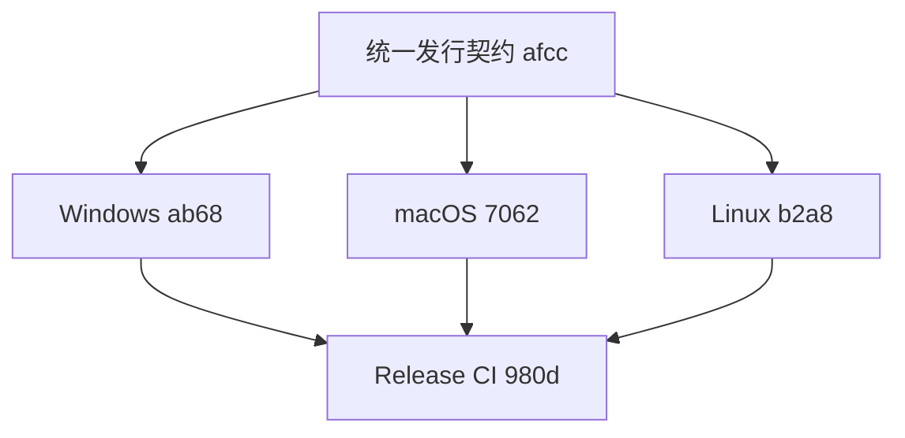

# Call Warden 跨平台打包、安装与发布设计

> 状态：待实施
> 父任务：`T-1783983115204-19fc`
> 目标平台：Windows、macOS、Linux

## 1. 目标

建立不依赖源码目录、开发虚拟环境和现场编译器的正式发行体系。用户应能从安装包完成：

- 全新安装、配置、运行和诊断；
- N-1 覆盖升级、失败回滚、修复安装和卸载；
- Python 表现层与 Rust parse/query/storage 扩展的一致部署；
- CLI、MCP、watcher 以及 Linux Enterprise Daemon 的角色化安装；
- 离线校验、签名验证、SBOM 和许可证审计。

安装包测试必须在干净 runner 上进行。测试过程禁止把仓库根目录加入 `PYTHONPATH`，禁止
使用 `maturin develop`，禁止从 `rust_ext/target` 或开发 venv 偷取扩展。

## 2. 当前发布阻塞

1. `pyproject.toml` 使用 setuptools，PyO3 扩展由独立 Cargo/maturin 流程构建；普通
   Python wheel 不包含 `callwarden_core`。
2. console script 是 `cw = callwarden.cw:main`，部分 systemd/runbook 仍调用源码树中的
   `cw.py` 或假设存在 `target/release/cw`。
3. Python、Rust、schema、parser ABI 和安装包版本没有单一版本源。
4. Linux runbook 引用了尚未注册的 daemon 管理命令，不能作为安装脚本依赖。
5. 现有 `docs/deployment.md` 混合源码开发、pip、Docker 和企业 daemon，且部分示例与
   “唯一 daemon 单写者”架构冲突。

以上问题由统一发行契约任务先修复，三个平台任务不得分别打补丁绕过。

## 3. 平台能力矩阵

| 能力 | Windows | macOS | Linux |
|---|---:|---:|---:|
| 本地 CLI / local SQLite | 支持 | 支持 | 支持 |
| MCP stdio | 支持 | 支持 | 支持 |
| 本地 watcher | 支持 | 支持 | 支持 |
| Enterprise UDS client | 预留，不默认承诺 | 预留，不默认承诺 | 支持 |
| per-UID enterprise agent | 不支持 | 不支持 | 支持 |
| Enterprise Daemon | 不支持 | 不支持 | 支持 |
| systemd / `SO_PEERCRED` / SCM_RIGHTS | 不适用 | 不适用 | 支持 |

Windows/macOS 安装器如果收到 `daemon` 或 `agent` 角色，必须返回
`unsupported_platform`，不能安装一个无法满足身份与 FD 协议的伪 daemon。

## 4. 统一发行模型

任务：`T-1783983162955-afcc`

### 4.1 两层产物

第一层是可测试、可复用的标准构建产物：

```text
callwarden-<version>-py3-none-any.whl
callwarden_core-<version>-<python>-<abi>-<platform>.whl
wheelhouse/<locked third-party wheels>
```

第二层是最终用户安装器，它只消费第一层产物：

```text
Windows: CallWarden-<version>-x64.msi / arm64.msi
macOS:   CallWarden-<version>-universal2.pkg / tar.gz
Linux:   deb / rpm / tar.zst role packages
```

安装器不得重新从 PyPI 下载依赖，也不得现场运行 Cargo。所有依赖在构建阶段锁定并进入
wheelhouse 或自包含运行时。

### 4.2 唯一版本和入口

建立一个机器可读版本源，例如 `release/version.toml`：

```toml
product = "0.3.1"
python_abi = "cp311"
parser_abi = 2
snapshot_abi = 2
schema_registry = 3
schema_cas = 2
schema_workspace = 4
```

构建时校验并同步：Python metadata、Cargo package、`cw --version`、daemon version RPC、
安装包版本和 artifact manifest。任一不一致直接失败。

稳定公开入口：

```text
cw                 完整 CLI，根据平台和配置路由 local/enterprise
cw-client          Linux RPC/MCP proxy，不含 parser 和本地 DB 写能力
cw-agent           Linux per-UID watcher agent
cw-daemon          Linux system daemon 前台入口
```

服务定义只能调用安装后的稳定入口，禁止调用源码路径 `cw.py`。

### 4.3 自包含运行时

最终安装器携带经过固定版本验证的 CPython 运行时和 site-packages，安装到产品私有目录。
不修改系统 Python，不依赖用户预装 Python，不把包安装进全局 site-packages。

Rust 扩展必须由对应平台 runner 构建。v0.3 发布边界为：

- Windows：当前 x64 `.pyd`；arm64 仍需独立 runner；
- macOS：当前 arm64 `.so`；不把单架构 PyInstaller runtime 声称为 universal2；
- Linux：当前 x86_64 `.so`；aarch64 仍需独立 runner。

同一 PyInstaller bundle 中的全部入口必须共享一个根级 `_internal/`。Windows/macOS
只冻结 `cw`；Linux bundle 冻结 `cw`、`cw-client`、`cw-agent` 三个入口。发布前必须运行
`cw server --check-imports`，仅 `--version`/`--help` 通过不代表 MCP 动态依赖完整。

运行时启动时输出 Python/Rust/parser/snapshot/schema ABI，并对不兼容组合 fail-closed。

### 4.4 角色化安装

统一角色：

| 角色 | 内容 |
|---|---|
| `local` | `cw`、Rust 扩展、local DB、MCP、watcher |
| `client` | Linux `cw-client`、MCP proxy、配置，不含 parser/CAS |
| `agent` | Linux `cw-agent`、systemd user unit、client |
| `daemon` | Linux `cw-daemon`、system unit、迁移/备份工具 |
| `all` | 平台支持的全部角色；Linux 等价 enterprise 元包 |

Windows/macOS 默认 `local`；Linux 桌面默认 `local`，共享开发机选择 `all`。容器通常只安装
`client`，Ubuntu 14.04-18.04 默认不装包，由宿主 agent 观察 bind mount。

## 5. 配置和数据目录

| 平台 | 系统配置 | 用户配置 | 系统数据 | 用户数据 |
|---|---|---|---|---|
| Windows | `%ProgramData%\CallWarden\config.toml` | `%LocalAppData%\CallWarden\config.toml` | `%ProgramData%\CallWarden\data` | `%LocalAppData%\CallWarden\data` |
| macOS | `/Library/Application Support/CallWarden/config.toml` | `~/Library/Application Support/CallWarden/config.toml` | `/Library/Application Support/CallWarden/data` | `~/Library/Application Support/CallWarden/data` |
| Linux | `/etc/callwarden/config.toml` | `${XDG_CONFIG_HOME:-~/.config}/callwarden/config.toml` | `/var/lib/callwarden` | `${XDG_STATE_HOME:-~/.local/state}/callwarden` |

优先级：CLI 参数 > 环境变量 > 用户配置 > 系统配置 > 默认值。`cw config explain` 应输出每个
有效值的来源，但隐藏 secret。安装器只创建模板，不覆盖用户已经修改的配置。

Linux daemon runtime 固定为 `/run/callwarden`。容器通过挂载整个目录并设置
`CW_DAEMON_SOCKET` 访问；不得挂载单个 socket inode，不得挂载 `/var/lib/callwarden`。

## 6. Windows 安装包

任务：`T-1783983162956-ab68`

主产物为 MSI。v0.3 当前构建/验证 x64，arm64 是后续独立 runner 目标。Windows
只安装 `local` 角色，不发布依赖 Linux UDS 的 `cw-client`。安装器至少提供：

- `CurrentUser` 与管理员 `AllUsers` 两种范围；
- `local` 组件；
- 可选加入 PATH、写入 MCP 配置、安装本地 watcher 自启动；
- 静默参数、确定的退出码、repair 和日志路径；
- 默认不删除 `%LocalAppData%` 数据，显式勾选才清理；
- Authenticode 签名、产品/升级 GUID 稳定、降级阻断。

黑盒验收覆盖 Windows 10/11 与 Server：安装后在仓库外执行 `cw --version`、Rust extension
自检、refresh/query、MCP stdio、升级、repair、卸载和数据保留。

## 7. macOS 安装包

任务：`T-1783983162956-7062`

主产物为 signed/notarized `.pkg`，同时提供便于自动化的 signed `tar.gz`。安装到
`/Library/Application Support/CallWarden`，在 `/usr/local/bin` 或 Apple Silicon 标准路径
创建稳定 shim。可选安装用户 LaunchAgent watcher，不安装 system daemon。

v0.3 当前只发布 arm64。必须完成 hardened runtime、codesign、notarization、stapling 和
`spctl`/Gatekeeper 验证。若后续恢复 Intel 支持，应增加 x86_64 runner 独立产物或真正
构建 universal2，不能只把 Rust 扩展合并后就声称整个 PyInstaller runtime 是 universal2。

## 8. Linux Enterprise 安装包

任务：`T-1783983162956-b2a8`

### 8.1 子包

```text
callwarden-client
callwarden-local
callwarden-agent
callwarden-daemon
callwarden-enterprise  # daemon + agent + client 元包
```

Debian/Ubuntu 以 deb 为第一优先，RPM 系以 rpm 提供同等能力；离线场景提供包含包、repo
metadata、SBOM、manifest 和安装脚本的 tar.zst。

### 8.2 Linux 安装行为

daemon 包负责：

- 创建 `callwarden` 服务账户和 `callwarden-clients` 连接组；
- 安装 `/usr/bin/cw-daemon`、systemd unit、tmpfiles/sysusers 配置；
- 创建 `/etc/callwarden`、`/var/lib/callwarden`、`/var/log/callwarden`；
- 由 systemd 创建 `/run/callwarden`，socket 为 `0660`；
- pre-start 执行 schema compatibility check，迁移失败不得启动；
- 卸载默认保留数据，purge 才删除配置，数据删除需要二次显式选项。

agent 包负责安装 systemd user unit，但不得自动为所有用户启用 linger。管理员可选择：登录时
启动，或对指定用户启用 linger。用户进程只读取自己有权限的 workspace，并通过 UDS/FD
向 daemon 报告。

容器 `client` 示例：

```bash
docker run \
  --user "$(id -u):$(id -g)" \
  --group-add "$(getent group callwarden-clients | cut -d: -f3)" \
  --mount type=bind,src=/run/callwarden,dst=/cw-runtime,readonly \
  -e CW_DAEMON_SOCKET=/cw-runtime/callwarden.sock \
  <image> cw-client ping
```

enterprise 模式 socket 不存在时必须失败，不能静默创建容器本地数据库。

### 8.3 Maintainer script

升级顺序：版本/空间预检 → drain → 在线备份 → 停服务 → 替换程序 → N-1 migration → 启动 →
health/generation 验证。失败时恢复旧程序和备份，不能留下“新 schema + 旧二进制”组合。

真实 Linux 安装包是此前跳过门禁的执行载体。双 UID、10×5、P95、systemd kill/recovery、
SMB 和 Ubuntu 容器矩阵必须针对已安装包运行，而不是源码 checkout。

## 9. Release CI 与供应链

任务：`T-1783983162957-980d`

每次 release 使用干净、固定镜像 runner，输出：

```text
artifacts/
├── packages/
├── checksums.txt
├── checksums.txt.sig
├── artifact-manifest.json
├── sbom.spdx.json
├── licenses/
├── provenance.intoto.jsonl
└── release-notes.md
```

门禁顺序：源码测试 → canonical wheels → wheel 黑盒测试 → 平台安装器 → 安装黑盒测试 →
N-1 升级/回滚 → 签名/notarization → SBOM/许可证/漏洞扫描 → staging 发布 → 人工批准正式发布。

签名密钥只存在受保护 release runner/HSM。普通 PR 生成 unsigned 测试包；tag release 才可
签名。所有包管理仓库和离线 bundle 都必须验证 manifest 与签名。

## 10. Agent 协作边界

任务依赖：



- Common Agent 独占版本源、Python/Rust wheel、入口和配置加载器；
- Windows Agent 独占 MSI/WiX、Windows runtime 和签名脚本；
- macOS Agent 独占 pkg、universal2、LaunchAgent 和 notarization；
- Linux Agent 独占 deb/rpm、systemd、maintainer scripts 和容器 client 示例；
- Release Agent 只编排既有构建入口，不复制各平台打包逻辑。

各平台不得修改公共 ABI 来解决自己的安装问题；需要变更时先回到 Common 子任务评审。

## 11. 完成定义

父任务只有在以下条件全部满足时才能进入 review：

- 五个子任务 38 步全部完成；
- Python/Rust/CLI/schema/ABI/安装包版本完全一致；
- 每个平台从干净 runner 安装，不依赖源码、系统 Python、Cargo 或互联网；
- 安装后的 Rust parse/query/storage 路径真实启用，不允许 Python fallback 冒充通过；
- Windows/macOS 对 enterprise daemon 角色明确 fail-closed；
- Linux 角色化安装、容器 UDS、双 UID 和真实 enterprise 门禁通过；
- fresh install、N-1 upgrade、失败回滚、repair、uninstall/purge 数据语义通过；
- 所有正式产物完成签名、校验、SBOM、许可证和 provenance；
- 安装手册中的每条命令都由 CI 在已安装包上执行过。
