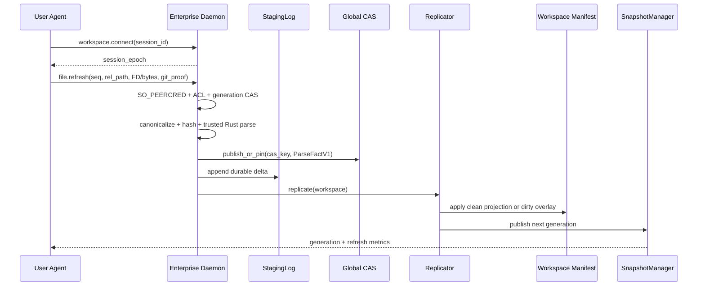
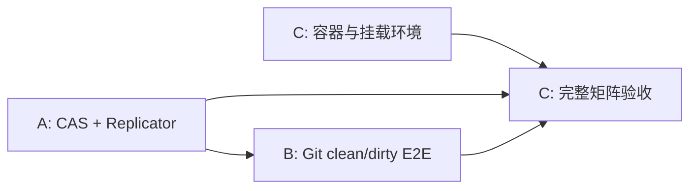

# Enterprise Daemon 完整请求链路与多环境 E2E 设计

> 状态：待实施
> 前置提交：`da723a7`（最小 UDS 纵向切片）
> 父任务：`T-1783952125413-9371`

## 1. 目标与当前缺口

本设计补齐最小纵向切片尚未覆盖的三组企业能力：

1. daemon refresh 接入现有 CAS、StagingLog、Replicator 和 SnapshotManager；
2. 使用真实 Git 仓库验证同 repo、不同分支、clean/dirty workspace；
3. 使用真实 Linux UID 和容器矩阵验证 Ubuntu 14.04-24.04、SMB 与 VS Code 工作区。

`da723a7` 已完成 UDS framing、`SO_PEERCRED`、workspace owner ACL、SQLite FD
发布、共享 Rust snapshot 查询和基础 CLI 路由。当前 `refresh` 仍是“客户端 checkpoint
SQLite 后把 DB FD 交给 daemon 全量发布”，没有经过 CAS/Replicator；现有双 UID 测试也没有
Git 分支、dirty overlay、mount namespace 或 SMB。

## 2. 强制架构约束

### 2.1 单写者和真相源

- Global CAS、workspace manifest、staging log 和 snapshot generation 只能由 daemon 写。
- agent/client 只负责观察文件、打开自己有权限的 FD、传输内容和报告事件代次。
- daemon 不信任客户端提交的 UID、hash、语言、clean 状态或绝对路径。
- SQLite/CAS 是持久化真相；Rust GraphSnapshot 是查询副本，不反向写持久层。
- dirty 内容只能进入 per-workspace overlay，未经 Git blob 证明不得进入 Global CAS clean 集合。

### 2.2 禁止按客户端绝对路径读取

容器、SMB 和 VS Code Remote 环境中的 `client_view_root` 可能在 daemon mount namespace
中不存在。daemon 不得调用 `open(client_abs_path)` 或 `parse_file_lang(abs_path)`。

文件内容只允许通过以下方式进入 daemon：

1. 小文件：有界分帧 canonical bytes；
2. Linux 3.17+：sealed memfd + `SCM_RIGHTS`；
3. Linux 3.13/Ubuntu 14.04：客户端创建 `0600` 临时文件，写完后以只读 FD 打开并 unlink，
   再通过 `SCM_RIGHTS` 发送；daemon 必须先复制/流式 hash，不能依赖 seals；
4. clean Git 文件：daemon 从自己的 bare mirror 按可信 commit + rel_path 读取 blob。

`st_uid == peer_uid` 只能作为本地文件审计信息，不能作为统一授权条件。CIFS/SMB 的
mount uid 可能与连接 UID 不一致；真正授权依据是 `SO_PEERCRED`、workspace ACL，以及
该 peer 是否能够由内核成功打开并传递 FD。

### 2.3 统一 IPC 实现

以 `server/daemon_protocol.py` 的“首包 `recvmsg` 同时接 framing header 和 ancillary FD”
为唯一实现。不得继续扩展 `server/ipc_transport.py` 中先 `recv()` header、随后再
`recvmsg()` FD 的双协议路径，因为 ancillary data 绑定首次接收字节，可能被前一次
`recv()` 丢失。

完成迁移后，旧 transport 要么成为新协议的薄包装，要么标记 deprecated；测试必须证明
短写、拆包、`MSG_CTRUNC`、多 FD、超大消息和断线清理行为。

## 3. 目标数据流

refresh 成功响应必须在 staging entry durable、manifest generation 条件提交、snapshot
发布完成后返回。失败时不得把 `latest_committed_generation` 提前推进。

## 4. Workstream A：CAS 与 Replicator

任务：`T-1783952125417-7a09`

### 4.1 RPC

新增或固定以下方法：

- `workspace.connect`
  - 输入：`workspace_instance_id`、随机 `agent_session_id`
  - 输出：daemon 分配的单调 `session_epoch`
- `file.refresh`
  - 输入：`workspace_instance_id`、`agent_session_id`、`session_epoch`、
    `monotonic_seq`、`rel_path`、`observed_mtime_ns`、可选 Git proof
  - 内容：一个 canonical/source FD 或有界 bytes frame
  - 输出：`status`、`generation`、`cas_state`、`snapshot_generation`、分阶段耗时
- `workspace.recover`
  - 仅管理/启动恢复路径调用，重放 pending staging entries

不得从请求读取 `owner_uid`、可信 `content_hash` 或 daemon 可访问的 `abs_path`。

### 4.2 现有实现改造

- `daemon_handle_refresh()` 改为接收 daemon 已验证的 bytes/FD，不再拼接
  `workspace_root + rel_path`。
- Rust 暴露 `parse_canonical_bytes(canonical_bytes, module_path, lang)`；CAS key 与 parse
  必须来自同一份 canonical bytes，消除 TOCTOU。
- `EnterpriseDaemonService` 按 workspace 初始化：
  - registry/session connection；
  - daemon-only CAS connection；
  - workspace staging log；
  - `Replicator(staging_log, snapshot_service)`。
- Replicator 必须真正应用 delta/manifest 后再发布 snapshot。禁止只读取 pending 后重新加载
  一个未变化的客户端 DB。
- staging log 的状态更新不能每条重写整个 JSONL 文件；实施 agent 应评估 SQLite WAL log
  或 append-only status record，保证百万事件规模可接受。
- daemon 启动时扫描 pending entries，按 workspace 串行 recover；单 workspace 单写，跨
  workspace 可并行。

### 4.3 原子性

提交顺序：

1. generation seen CAS；
2. canonicalize/hash/parse；
3. CAS publish/pin；
4. staging append + fsync；
5. workspace manifest/projection 条件提交；
6. generation committed CAS；
7. SnapshotManager 原子发布；
8. staging applied/compact。

进程在任意一步崩溃后，重放必须幂等。CAS 先发布但 manifest 未提交时由 pending pin/TTL
保护；manifest 已提交而 snapshot 未发布时，recover 重新发布 snapshot。

### 4.4 验收

- CAS miss 第一次 parse/publish；相同内容第二 workspace 命中且 parse miss=0。
- stale session、重复 seq、乱序 seq、断线重连均不覆盖新 generation。
- 在步骤 3-7 每个边界注入 crash，重启后 manifest 与 snapshot 最终一致。
- refresh 时并发 100 个 reader 无 SQLite 锁错误，旧 snapshot 在新发布前持续可查。
- 报告 hash、CAS lookup、parse、resolve、manifest、snapshot 各阶段耗时。

## 5. Workstream B：同 Repo 多分支 Clean/Dirty

任务：`T-1783952125417-8255`
依赖：Workstream A 的 `file.refresh` 与 manifest/overlay 提交接口稳定。

### 5.1 Fixture

测试必须创建真实 bare origin 和至少三个 commit：

- `stable`：基线函数和调用链；
- `product-a`：函数签名变化、增加调用边；
- `product-b`：删除/重命名函数、改变调用方向。

两个真实 UID 分别 clone 同一 origin，并同时保留多个工作区。测试内容不能只复制同一个
SQLite fixture。

### 5.2 Clean 证明

- daemon 维护只读 bare mirror。
- agent 只报告 `registered_commit + rel_path`；daemon 验证 commit 是受信 ref 的祖先，并
  从 mirror 读取 blob。
- canonical hash 与 Git blob 派生内容一致时标记 clean。
- 同一 blob + language + ABI 必须得到同一 CAS key，与路径、UID、branch 名无关。

### 5.3 Dirty overlay

- 工作区文件与 registered commit blob 不一致即 dirty。
- dirty parse fact 可以复用内容 CAS，但 projection、resolved edge、qualified name 和
  manifest 必须绑定 workspace；不得把 dirty 状态宣称为全局 clean snapshot。
- 删除文件使用 tombstone：先删除 workspace edge，再删除 symbol/projection。
- clean→dirty→clean 和 clean→clean commit 切换都必须原子替换 projection。

### 5.4 查询验收

对每个 workspace 验证：

- 函数签名差异；
- callers/callees 变化；
- 新增、删除、重命名符号；
- branch ahead/behind stable；
- dirty 未提交修改出现且只对本 workspace 可见；
- dirty 撤销后回到 clean CAS projection；
- UID A 无法查询 UID B 未授权 workspace。

同时记录第二工作区复用率、parse miss、首次/增量 refresh 时间和 RSS 增量。

## 6. Workstream C：容器、SMB 与 VS Code 矩阵

任务：`T-1783952125417-d343`
可与 A/B 并行搭建环境；最终业务验收依赖 A/B。

### 6.1 部署模型

- Enterprise daemon 运行在宿主机的受限 `callwarden` 账号。
- 每个用户运行 user agent；容器通过 bind mount 访问宿主机 UDS。
- 默认不启用 user namespace；若启用，必须显式配置 container UID → host UID 映射，未知
  映射 fail closed。
- `/opt` 和 `/home` 可以在多个容器中呈现不同路径；daemon 只保存
  `client_view_root` 作为展示信息，内容身份来自 Git/blob 或 FD。
- VS Code Remote/SSH 场景沿用登录用户 agent，不增加 daemon 对用户 home 的读取权限。
- SMB/CIFS 场景由用户进程打开文件并传 FD；daemon 不直接 mount SMB。

### 6.2 Legacy 客户端

Ubuntu 14.04 默认 Python 无法满足 Call Warden Python 3.9+。验收不得通过在 14.04 中
临时安装一套现代 Python 来掩盖部署问题。实施 agent 必须二选一并记录 ADR：

1. 提供以 musl 静态链接、兼容 Linux 3.13 的最小 `cw-agent`；或
2. agent 固定运行在宿主机，14.04 容器只通过挂载路径和宿主 watcher 被观察。

若选择静态 agent，memfd 在 Linux 3.13 不可用，必须覆盖 unlinked temp FD/streaming
fallback。不得把 memfd 作为协议必需条件。

### 6.3 测试矩阵

| 维度 | 必测值 |
|---|---|
| Ubuntu | 14.04、16.04、18.04、20.04、22.04、24.04 |
| 用户 | UID A、UID B、未授权 UID C |
| Git | stable、product branch、dirty overlay |
| 路径 | host `/home`、container `/home`、host/container `/opt` |
| 访问 | 本地、SMB/CIFS、VS Code Remote/SSH |
| 生命周期 | 首次注册、增量 refresh、断线重连、daemon restart |

各版本串行运行，避免共享磁盘和内存干扰。镜像无法从公开 registry 获取时，CI 应明确
报告 infrastructure skip，禁止把未运行标记为 pass。

### 6.4 SMB/VS Code 验收

- SMB fixture 使用真实 Samba/CIFS mount；若 CI kernel 禁止 mount，则在专用 privileged
  runner 执行，不用普通目录伪装 SMB。
- 文件 owner 与 peer UID 不一致时，只要 peer 能合法打开并传 FD，refresh 应成功；审计
  日志记录 mount/fs 类型和 owner mismatch。
- VS Code 测试从 remote 用户 shell 调用 CLI/MCP，验证 socket discovery、环境变量继承、
  workspace 切换和断线重连。
- UID A/B 即使看到同一 repo 内容，也只能查询自己拥有或显式授权的 workspace。

## 7. MCP 与 CLI 完整门禁

不能只调用 `DaemonClient` 单元测试。最终必须启动真实 MCP stdio/SSE 进程，并验证：

- `local`：不连接 daemon；
- `auto`：daemon 可用时走 UDS，不可用时回退并记录 metric；
- `enterprise`：daemon 不可用、ACL 失败或 refresh 失败时明确报错，禁止 SQL 静默回退；
- `get_symbol/search_symbols/get_callers/get_callees/get_stats` 返回与 CLI 相同 generation；
- MCP 长连接期间 watcher refresh 后，无需重启 MCP 即可看到新 snapshot。

## 8. 任务依赖和交接

每个 agent 开工前执行 `cw task next <task_id>`，只修改自己 workstream 的文件。A 负责
协议和持久化边界；B 不另造 refresh 协议；C 不以 mock 目录替代容器/SMB。发现跨任务
接口问题时，在父任务记录 finding，不直接重构另一 agent 的模块。

## 9. 完成定义

只有以下条件全部满足，父任务才可进入 review：

- A、B、C 三个子任务全部处于 review；
- CAS/Replicator 是真实 daemon refresh 必经路径；
- 真实 Git 多分支 clean/dirty 测试通过；
- Linux 双 UID 与未授权 UID 测试通过；
- 六个 Ubuntu 版本均有 pass 或明确的 infrastructure failure，不允许静默跳过；
- SMB 和 VS Code Remote 使用真实环境验收；
- CLI 和真实 MCP 进程均覆盖 enterprise/auto/local；
- `cw --refresh-all`、Rust/Python 回归和性能报告完成；
- 设计、部署文档和任务结果引用实际命令、环境及报告文件。
