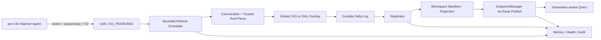
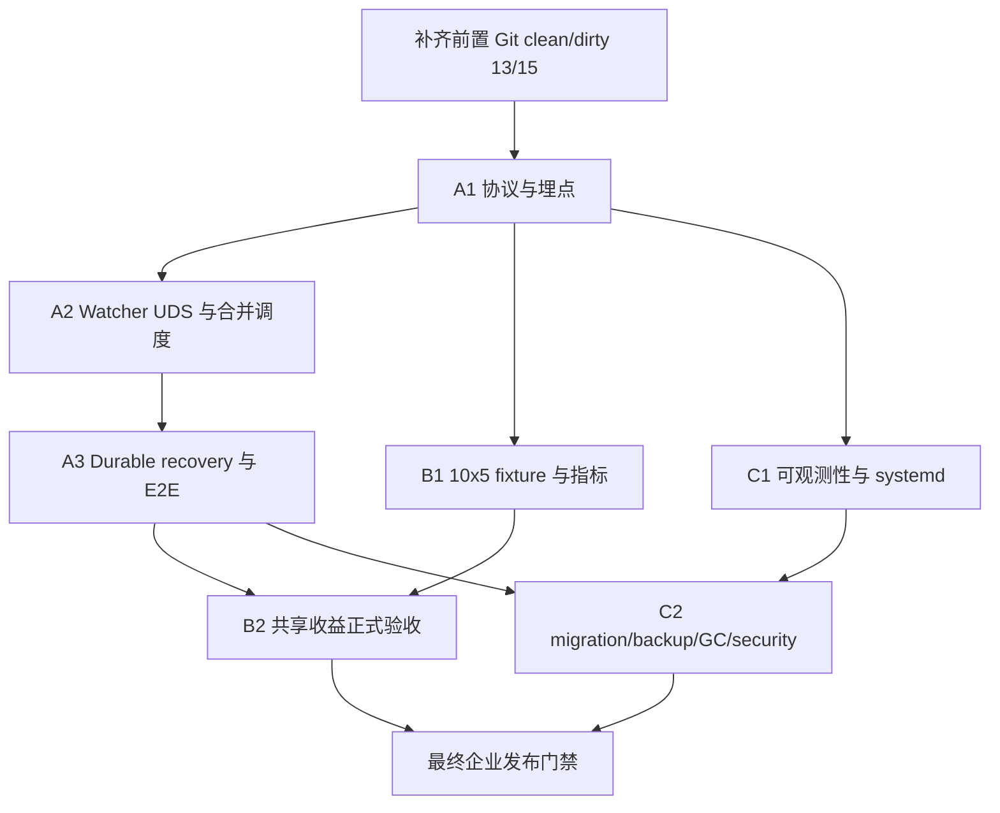

# Enterprise Daemon Watcher、共享收益与生产化闭环设计

> 状态：待实施
> 父任务：`T-1783974380747-8580`
> 前置设计：`enterprise-daemon-full-e2e-followup.md`、`watcher-generation-state-machine.md`
> 前置提交：`4642f05`

## 1. 目标与边界

本阶段不再增加新的代码分析能力，而是把已有 CAS、Replicator、SnapshotManager、
watcher 和运维组件闭合成可以长期运行的企业服务。交付分为三条工作流：

1. 文件保存后，目标 generation 在单文件 P95 3 秒内可查询；
2. 用 10 个用户、每人 5 个同源 workspace 证明共享确实减少解析和内存；
3. 完成 systemd、可观测性、迁移备份 GC、安全和资源耗尽门禁。

本设计不把已有类、伪造 UID、合成数据库或纯单元测试视为完成。验收必须经过真实 UDS、
真实文件事件、真实 Git workspace、真实 daemon 进程和至少两个真实 Linux UID。10 UID
容量实验在具备权限的 Linux runner 上使用真实 UID；普通开发机只运行缩小版功能测试。

### 1.1 当前基线

| 能力 | 当前状态 | 本阶段缺口 |
|---|---|---|
| UDS、`SO_PEERCRED`、ACL | 已有纵向链路 | watcher agent 尚未接入 |
| session epoch、两阶段 generation CAS | Replicator 已有 | 缺真实并发、重启和查询可见性验证 |
| durable staging | JSONL + fsync | 状态更新重写全文件，不适合事件风暴 |
| SnapshotManager | 可发布、可查询、可共享符号层 | 缺事件到 snapshot 的自动发布与等待协议 |
| Python watcher / Rust watcher | 可收集、防抖事件 | 未处理全局队列、reconcile、generation、daemon 背压 |
| metrics、health、audit | 独立组件已有 | 未接 daemon 热路径和运维端点 |
| migration、backup、snapshot GC | 独立组件已有 | 缺在线一致性、升级回滚和恢复演练 |
| systemd | 可生成 unit | 缺真实安装、异常重启和恢复 E2E |

前置父任务 `T-1783952125413-9371` 当前为 13/15。其子任务
`T-1783952125417-8255` 尚有 clean→dirty→clean/分支切换和双 UID 查询隔离两步。
这两步必须先完成，或由本阶段相应 E2E 原样承接；未完成时不得宣布共享收益任务通过。

## 2. 总体架构



强制约束：

- agent 只观察用户能访问的文件并传 FD/字节，不写 Global CAS、manifest 或 snapshot；
- daemon 只信任 `SO_PEERCRED`，不信任请求中的 UID、hash、clean 状态和绝对路径；
- 同一 `(workspace_id, rel_path)` 采用 latest-wins，但 durable 后的 generation 不得倒退；
- clean 内容必须通过 daemon bare mirror 的 commit/blob 证明后才能进入 Global CAS；
- dirty 内容只进入 per-workspace overlay，不能新增 Global CAS 内容、pin 或 clean live root；
- SQLite/CAS/manifest 是持久化真相，Rust snapshot 是可重建的共享查询副本；
- 查询响应返回实际使用的 `snapshot_generation`，不能只返回“刷新请求已提交”。

## 3. Workstream A：闭合秒级 Watcher

任务：`T-1783974522648-e2d3`

### 3.1 Generation 与可见性协议

agent 建立连接后得到 daemon 分配的 `session_epoch`。每个事件携带：

```text
workspace_instance_id
agent_session_id
session_epoch
monotonic_seq
rel_path
event_kind
observed_mtime_ns
observed_raw_hash
event_observed_mono_ns
```

文件 generation 使用 `(session_epoch, monotonic_seq)` 比较；workspace snapshot generation
由 daemon 单调分配。refresh 成功响应必须包含：

```text
file_generation
snapshot_generation
cas_result = hit | miss | dirty_overlay
coalesced_event_count
stage_durations_ms
```

`query.*` 增加可选 `min_snapshot_generation` 与 `wait_timeout_ms`。查询线程在 ArcSwap 发布后
唤醒等待者；超时返回当前 generation 和明确的 `generation_not_visible`，不得悄悄查询旧图。
普通查询不带该参数时保持现有低延迟行为。

### 3.2 延迟定义

统一使用单调时钟记录以下时间点：

| 时间点 | 含义 |
|---|---|
| T0 | watcher 收到内核 close-write/move/delete 事件 |
| T1 | 防抖/合并完成并进入发送队列 |
| T2 | daemon 完成接收、ACL、字节限制与 generation seen CAS |
| T3 | canonicalize、hash、CAS lookup/parse 完成 |
| T4 | delta durable，manifest/projection 条件提交完成 |
| T5 | SnapshotManager 发布新 ArcSwap generation |
| T6 | 第一条带目标 generation 的查询返回新符号/调用边 |

核心 SLO 是 `T6 - T0`，不是 parse 时间或 RPC 时间。单文件 warm 场景运行至少 200 次，
预热 20 次不计样本，要求 P95 `< 3s`、错误率 `0`、generation 回退 `0`。报告同时列出
T0→T1、T1→T2、T2→T3、T3→T4、T4→T5、T5→T6，避免总耗时掩盖具体瓶颈。

### 3.3 事件合并与批量变更

scheduler 按 `(workspace_id, rel_path)` 保存最新事件，并保留事件因果：

- `modify + modify`：只发送最新内容，累计 coalesced count；
- `create + modify`：合并为 create/update；
- `delete + create`：若 inode/内容无法证明 rename，按 replace 处理；
- `move(src,dst)`：生成 src tombstone 与 dst upsert，二者同一 batch commit；
- `modify + delete`：只提交 tombstone；
- 已经 durable 的旧事件不能被内存合并删除，只能由 generation CAS 判为 stale。

参数初值：单文件 quiet window 250ms，workspace batch quiet window 500ms，最大等待 2s，
单 batch 1000 文件。参数必须配置化，并在指标中暴露真实等待时间。

Git checkout/repo sync 以“事件风暴 + reconcile barrier”处理：

1. 检测 `.git/index.lock`、HEAD/index 变化或短窗内大量文件事件；
2. 暂缓逐文件立即发布，但继续 latest-wins 收集；
3. 安静 500ms 或到达 2s 上限后，对 workspace 做一次受 ignore 规则约束的清单扫描；
4. 将 scan 与事件集合求并集，生成 upsert/tombstone batch；
5. 一个 batch 只发布一个 workspace generation；
6. 处理期间的新事件进入下一代，不能混入已冻结 batch。

队列同时限制条数与字节。达到软上限时暂停该连接读取并让 UDS 背压；超过硬上限或 watcher
报告 overflow 时，丢弃可重建的内存事件并设置 `needs_reconcile=true`，绝不能静默漏文件。

### 3.4 Durable log 与崩溃恢复

现有 JSONL `append()` 每条 fsync，但 `mark_applied_batch()` 仍重写整个文件。第一版生产实现
改为 workspace staging SQLite WAL，至少包含：

```sql
staging_entries(
  lsn INTEGER PRIMARY KEY AUTOINCREMENT,
  workspace_id TEXT NOT NULL,
  rel_path TEXT NOT NULL,
  session_epoch INTEGER NOT NULL,
  monotonic_seq INTEGER NOT NULL,
  event_kind TEXT NOT NULL,
  content_hash TEXT,
  delta_blob BLOB NOT NULL,
  state TEXT NOT NULL,
  created_at REAL NOT NULL,
  applied_generation INTEGER,
  error TEXT,
  UNIQUE(workspace_id, rel_path, session_epoch, monotonic_seq)
)
```

状态只允许 `pending → applying → applied` 或 `pending/applying → failed`。delta 在响应成功前
提交 WAL；manifest 与 staging 不能跨库原子提交，因此恢复必须幂等：先检查 manifest 的
file generation，已提交则补记 applied，未提交则重放。daemon 启动顺序固定为：

1. 加载配置并迁移 schema；
2. 打开 CAS、registry、workspace staging；
3. 阻止 readiness；
4. 恢复 `pending/applying`，重建缺失 snapshot；
5. 校验 generation 单调性；
6. readiness 变为 true，开始接受 refresh。

故障注入至少覆盖：收到 FD 后、CAS publish 后、staging commit 后、manifest commit 前后、
snapshot publish 前后、响应发送前后。每个点都要证明重启后最终状态唯一且查询不倒退。

### 3.5 Watcher 验收矩阵

| 场景 | 必须证明 |
|---|---|
| 保存单文件 | 新符号、签名与调用边在目标 generation 可见，P95 `<3s` |
| 连续保存同文件 | 只发布最新内容，旧 seq 不覆盖 |
| 两个 agent 重连竞争 | 旧 session 全部拒绝 |
| rename/delete | 旧符号消失，新符号出现，无悬空 edge |
| checkout/repo sync | 事件合并后与全量 scan 的 manifest 完全一致 |
| 队列 overflow | 自动 reconcile，无静默漏文件 |
| daemon kill -9 | durable log 恢复，重复重放幂等 |
| watcher 断线重连 | 新 epoch 接管，旧缓存事件不能污染新状态 |

## 4. Workstream B：验证共享企业收益

任务：`T-1783974522651-d7f9`

### 4.1 实验拓扑

创建一个含代表性语言、生成文件忽略规则和三个产品分支的 bare origin。Linux runner 创建
10 个真实 UID，每个 UID clone 5 个 workspace，共 50 个：

- 30 个指向相同 clean commit，用于最大共享验证；
- 10 个指向两个相邻产品分支，用于部分 CAS 复用；
- 10 个基于 clean commit 加少量 dirty overlay，用于隔离验证。

所有规模顺序执行，不并行跑 A/B；每组清理进程但不清理受测持久 CAS，重复三次取中位数，
并记录 CPU、内存、磁盘、内核、文件系统、SQLite 和 Rust 扩展版本。

### 4.2 指标定义

不能用“扫描文件数减少”代替 parse 复用。定义：

```text
parse_attempts = 可信 Rust parser 的实际调用次数
duplicate_parse = 调 parser 时对应 cas_key 在调用前已经是 ready
duplicate_parse_rate = duplicate_parse / parse_eligible_occurrences_after_first_workspace
cas_hit_rate = ready CAS hits / CAS lookups
```

相同 clean commit 的第二个及后续 workspace 验收：

- `parse_miss = 0`；
- 不调用 parser，不复制 symbol/call 语法事实；
- 只构建 workspace manifest/projection，并引用已有 snapshot identity；
- 相同 `(commit, build_context_hash, parser_abi)` 的 GraphSnapshot payload 只保留一个 Arc；
- 50 workspace 总重复 parse 率 `<5%`，目标 CAS hit rate `>=95%`。

分支不同的 workspace 可对新增/修改文件产生 miss；未变化文件仍必须 hit。报告同时输出：

- CAS lookup/hit/miss、parse attempts/failures/fallback；
- snapshot payload 数、Arc strong count、每 workspace 控制对象内存；
- daemon RSS、PSS、peak RSS、可用内存和 page fault；
- registry/CAS/staging/snapshot 磁盘增量与 WAL 峰值；
- 队列条数/字节、单 workspace 与全局 inflight；
- refresh、snapshot publish、generation visible 的 P50/P95/P99。

内存硬门禁使用结构事实而不是易受页缓存影响的单次 RSS：相同 snapshot identity 的
`full GraphSnapshot payload count == 1`。容量报告另设初始预算：额外 clean workspace 的
daemon 控制面内存中位数 `<10MB/workspace`；超出时阻断发布并重新基线，而不是放宽统计。

### 4.3 Dirty overlay 隔离

在 dirty 更新前后记录 Global CAS 的：ready key 集合、clean pin 集合、manifest live roots 和
可信 snapshot identity。提交 dirty 文件后必须满足：

- 四个集合均不因 dirty 内容新增条目；
- dirty parse facts 只存在 workspace overlay store；
- workspace A 可查询 dirty 符号，其他 UID/workspace 仍查询 clean 图；
- dirty→clean 后 overlay tombstone 清除，workspace 重新引用可信 CAS/snapshot；
- 只有 dirty 内容成为 mirror 中受信 commit/blob 后，才允许晋升 Global CAS。

若实现希望让 dirty 内容跨 workspace 去重，应使用独立、带 UID/workspace ACL 和 TTL 的
overlay CAS；不得借用 Global CAS clean namespace。

### 4.4 实验输出

产出机器可读 JSON 和 Markdown 报告。报告必须包含每个阈值的 pass/fail、原始分位数、
三次运行结果、失败样本和环境信息。CI 每次跑 2 UID × 2 workspace 缩小门禁；10 × 5
容量门禁在专用 Linux runner 定期运行，不能用 mock UID 替代最终报告。

## 5. Workstream C：生产化闭环

任务：`T-1783974522652-e0c7`

### 5.1 systemd 与启动恢复

Enterprise unit 必须启动 UDS daemon，不得继续使用旧 SSE 示例。至少配置：

- 独立 `callwarden` 用户、`RuntimeDirectory`、`StateDirectory`、`LogsDirectory`；
- `Restart=on-failure`、合理 `TimeoutStartSec/TimeoutStopSec`；
- `LimitNOFILE`、`TasksMax`、`MemoryHigh/MemoryMax`、CPU 配额；
- `NoNewPrivileges`、最小 capability、明确 `UMask=0077`；
- socket、registry、CAS、audit 的 owner/mode 启动自检；
- SIGTERM 停止接收新 refresh，排空有界队列，checkpoint 后退出；超时由 durable recovery 接管。

真实 E2E 执行 install → start → refresh → query → kill -9 → systemd restart → recovery → query，
并验证旧 session 不能复用。单纯断言 unit 文本包含字段不算完成。

### 5.2 Metrics、Health 与 Audit

将现有 `MetricsCollector` 接入 RPC、scheduler、CAS、Replicator 和 SnapshotManager。新增核心指标：

```text
cw_watcher_events_total{kind,result}
cw_watcher_coalesced_total{kind}
cw_refresh_total{result,cas_result}
cw_refresh_latency_seconds
cw_refresh_stage_seconds{stage}
cw_parse_total{result}
cw_cas_lookup_total{result}
cw_queue_depth / cw_queue_bytes
cw_uid_inflight_bytes / cw_daemon_inflight_bytes
cw_stale_generation_total{reason}
cw_recovery_entries_total{result}
cw_recovery_duration_seconds
cw_snapshot_payloads / cw_snapshot_publish_seconds
```

metrics label 禁止包含 UID、workspace path、repo URL、symbol 或任意高基数字符串。需要追踪时
使用审计事件中的稳定 workspace ID；审计日志记录 peer UID、method、workspace、结果、
generation、字节数和拒绝原因，但不记录源代码内容、FD 或令牌。

健康状态拆分：

- liveness：事件循环仍响应；
- readiness：schema 完成、CAS/registry 可写、recovery 完成、snapshot 服务可用；
- degraded：磁盘/内存接近阈值、队列持续积压、GC 失败或 snapshot 落后；
- unhealthy：DB 不可用、generation 不一致、审计链损坏或恢复失败。

管理 RPC 只允许 daemon 管理组访问，普通用户只可读取自己 workspace 的有限状态。

### 5.3 Schema migration、Backup/Restore 与 GC

registry、CAS、workspace manifest/staging、audit 分别维护 schema version。启动支持当前版本和
N-1 原地升级；更老版本拒绝启动并给出离线升级指令。迁移必须单事务、可重复检测、失败后
保留原 DB，并通过旧版本 fixture → 升级 → 查询/refresh → 重启测试。

在线备份流程：进入短暂 publication barrier，SQLite backup API 复制 DB，记录当前 manifest
roots、CAS pins、snapshot metadata 和 schema/ABI 版本，计算校验和后解除 barrier。restore
先在新目录 verify/migrate/rebuild snapshot，再原子切换 data root；不得覆盖唯一可用副本。

GC 使用 manifest roots、pending staging、backup roots、active snapshot 和 grace period 的并集。
mark 阶段失败必须 fail-closed；sweep 与 refresh 使用既定锁顺序，禁止跨库死锁。验收包含
refresh/backup/GC 并发、kill -9、恢复后查询一致以及被 pin 内容绝不删除。

### 5.4 安全与资源耗尽

必须覆盖：

- `../`、绝对路径、NUL、Unicode 等价路径、大小写碰撞；
- workspace 内外 symlink、symlink swap、hardlink、mount bind escape；
- Ubuntu 14.04 无 `openat2` 时的 dirfd + `O_NOFOLLOW` 降级路径；
- 跨 UID 注册/查询/refresh/recover/admin；
- 非常规 FD、可写 FD、owner 异常、多个 FD、`MSG_CTRUNC`、短读、超大 memfd；
- 单连接、单 UID、全局消息条数/字节/FD/CPU/解析超时耗尽；
- 慢发送、半包、断线、重复请求和 audit 注入。

所有资源在进入昂贵 parse 前记账，断线/超时/异常路径必须归还。超限采用暂停读取、明确
`resource_exhausted` 或隔离 UID；不得导致其他 UID 的查询饥饿。路径访问优先可信 Git blob
或客户端 FD；确需 daemon 路径解析时使用 `openat2(RESOLVE_BENEATH|RESOLVE_NO_SYMLINKS)`，
老内核用逐段 dirfd 打开并在最终 `fstat` 后消费。

## 6. 实施顺序与并行关系



建议三个 Agent 分工：

1. Watcher Agent 独占事件协议、scheduler、staging/recovery 和延迟 E2E；
2. Benefit Agent 独占 fixture、指标采样、共享/dirty 断言与报告，不改生产算法；
3. Production Agent 独占 systemd、admin observability、migration/backup/GC/security。

共享协议和 schema 先由 Watcher Agent 提交；其他 Agent 只通过公开接口集成，避免三方同时
修改 `daemon_server.py`、`replicator.py` 和 staging schema。每个子任务独立分支，合并顺序
为 A 协议基础 → C 运维接线 → B 正式容量报告。

## 7. 完成定义

以下条件全部成立，父任务才可进入 review：

- 前置 13/15 任务补齐为 15/15；
- 真实保存到新 generation 查询可见，200 次单文件 P95 `<3s`；
- checkout/repo sync 与全量 reconcile 结果一致，无漏文件和悬空 edge；
- 每个指定崩溃点恢复幂等，stale session/generation 覆盖次数为 0；
- 10 UID × 5 workspace 重复 parse 率 `<5%`，相同 snapshot payload 仅一份；
- 第二个相同 clean workspace `parse_miss=0`，只增加 manifest/projection/引用；
- dirty overlay 不改变 Global CAS clean key/pin/live root；
- systemd 真实重启恢复通过，metrics/health/audit 与热路径一致；
- N-1 migration、backup/restore、snapshot/CAS GC 故障演练通过；
- 路径、跨 UID、FD 和资源耗尽测试全部通过；
- 提供可复现实验命令、JSON/Markdown 报告、部署升级回滚 runbook。

任何一项只由 mock、组件单测或静态配置断言证明时，只能记为开发完成，不能记为企业验收完成。
