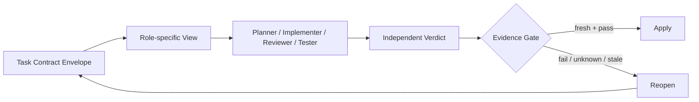
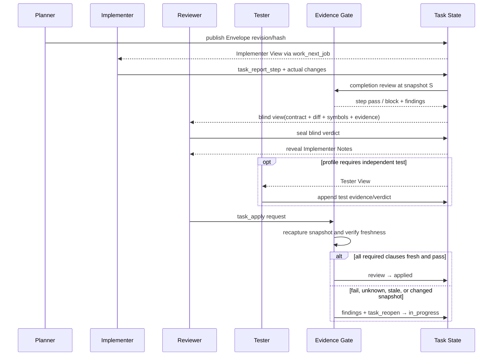

# 多 LLM 契约驱动协同设计

> **状态**：目标设计（分阶段落地，非现有能力声明）  
> **日期**：2026-07-31  
> **Feature**：`multi-llm-contract-collaboration`  
> **适用范围**：Call Warden task 协同层

## Overview

核心定位：**不同 Agent 不共享推理历史，只共享版本化契约、代码事实和可验证证据**。跨 Agent 协作不依赖复制聊天记录或思维链，而依赖同一 Task Contract Envelope 的角色投影、独立 verdict，以及绑定当前代码快照的 Evidence Gate。

## Architecture

本文将旧版“三层契约 + schema + `claimed_by/claimed_at` 两字段租约”重构为单一闭环：



Envelope 是协议，Role-specific View 是最小披露投影，Verdict 是独立判断，Evidence 是对特定契约与代码快照的不可变事实。`task_report_step` 的 completion review 是步骤完成门禁，独立 `task_apply` 是最终主门禁；`task_close` 不是主门禁。

## 2. 阅读约定：现有与拟新增

本文使用以下标记，避免把目标设计误写成当前实现：

- **[现有]**：代码中已经存在并可直接复用。
- **[拟新增 P1-P4]**：对应阶段才引入的能力。
- **[拟新增 D0]**：跨平台 daemon 化前置阶段才引入的能力（P1 的前置条件，见 13.5 与第 14 章 D0）。
- **[P0 实验]**：不改 schema 的流程实验，不承诺产品化。

## 3. 目标、原则与非目标

### 3.1 目标

1. 用版本化、可哈希的 Envelope 作为角色间唯一工作协议。
2. 为 Planner、Implementer、Reviewer、Tester 生成不同的最小视图。
3. 让 Reviewer 在读取实现者说明前完成 blind first pass。
4. 让每个硬门禁结论绑定契约 revision/hash 与当前代码快照。
5. 在契约、代码、符号图、测试或 verifier 变化后使旧证据变为 `stale`。
6. 复用现有 task scope、symbol change、quality finding 和状态机能力，渐进落地。

### 3.2 设计原则

- **契约优先于对话**：跨角色不传隐藏推理历史；必要说明进入结构化、可审计字段。
- **事实优先于自报**：实现者说明不替代实际 diff、文件/符号 hash、调用图和测试结果。
- **先独立判断，后解释**：首轮 verdict 封存后才揭示实现者说明。
- **证据追加，状态派生**：不覆盖旧 evidence；fresh/stale 由绑定关系计算或追加失效事件表达。
- **失败可恢复**：门禁失败进入 finding + Reopen，而不是绕过或复用旧 PASS。
- **身份、ownership、数据库锁分层**：逻辑授权不等同于 SQLite 写事务互斥。

### 3.3 非目标

- 通用 Jira 或项目管理平台；
- Agent 间实时通信、聊天或共享思维链；
- 多 Agent 中央调度器；
- 首版复杂 DAG；
- 首版 assignment/lease；
- 用 LLM verdict 冒充确定性证明；
- 证明任意自然语言 Markdown 都可机器验证。

## 4. 已核实的实现基线

| 能力/限制          | 当前事实                                                                                                                                                                                            | 本设计处理                                                                       |
| ------------------ | --------------------------------------------------------------------------------------------------------------------------------------------------------------------------------------------------- | -------------------------------------------------------------------------------- |
| `work_next_job`    | **[现有]** 返回目标源码、调用方/被调用方摘要、规则、检查项和 `allowed_edit_scope`                                                                                                                   | 作为 Implementer View 的主要投影入口，不另建平行上下文协议                       |
| `task_steps`       | **[现有]** 有 `target_file`、`target_symbol`                                                                                                                                                        | 作为 Envelope 编辑范围的结构化来源                                               |
| `task_report_step` | **[现有]** 写 `change_audit`，运行 check gate 与 `run_task_completion_review`                                                                                                                       | P1 接入步骤级 Evidence Gate；不废弃现有 completion review                        |
| completion review  | **[现有]** 检查 scope、symbol attribution、file health、i18n、signature mismatch，并生成 quality findings                                                                                           | 保留为操作性 finding/gate；新增快照绑定 evidence ledger，不把 finding 当历史证明 |
| 变更事实           | **[现有]** 有 `change_audit`、`task_symbol_changes`、capture-diff 事实                                                                                                                              | Gate 交叉核对实现者自报、实际 diff 与符号变化                                    |
| scope 检查         | **[现有]** `_check_scope_violations` 根据 `target_file` 检查 changed files                                                                                                                          | P1 扩展为 Envelope scope 聚合，但复用现有检查器与路径规范化                      |
| 状态机             | **[现有]** 实现者完成后进入 `review`；叶子任务由其他会话 `task_apply`；父任务可级联                                                                                                                 | 最终门禁接入 `task_apply`；父任务使用子任务 gate 结果聚合                        |
| Reopen             | **[现有]** `task_reopen` 支持 `review/applied/closed → in_progress`                                                                                                                                 | review 失败、证据 stale 或应用后发现问题时进入返工闭环                           |
| `task_close`       | **[现有]** 负责 `applied → closed` 或级联收尾                                                                                                                                                       | 不作为主要正确性门禁，不重复一套证据逻辑                                         |
| `test_runs`        | **[现有]** 保存测试状态、时间、`ci_run_id`，但没有 contract/code snapshot 绑定                                                                                                                      | 历史 PASS 仅作参考；P1 产生 snapshot-bound test evidence                         |
| `active_task_id`   | **[现有]** workspace 上的单值，多个 IDE 可互相覆盖                                                                                                                                                  | 仅作 UX 提示，不作为 ownership、授权或租约依据                                   |
| SQLite             | **[现有]** WAL 与 busy timeout 降低冲突，写操作仍串行竞争                                                                                                                                           | 写锁只保护短事务，不证明谁拥有任务                                               |
| identity/lease     | 当前 `tasks` schema 没有安全租约；`task_apply(reviewer=...)` 主要依赖调用约定                                                                                                                       | P3 增加可证明身份，P4 再增加 assignment/lease                                    |
| daemon 服务端      | **[现有]** `rust_ext/src/daemon/server.rs` 顶部为 `#![cfg(unix)]`，Windows 上整个模块不编译、daemon 不启动                                                                                          | D0 补齐 Windows 命名管道传输与服务化；在此之前 Windows 不支持本文协同能力        |
| 对端身份           | **[现有]** `rust_ext/src/daemon/peercred.rs` 实现 Linux `SO_PEERCRED` 与 macOS `LOCAL_PEERCRED`（`PeerCred.pid = 0`，无 pid）；`daemon_query.rs` 的 `peercred_is_available()` 在 Windows 返回 false | D0 定义三平台 Peer_Credential → Peer_Identity 派生规则；macOS 明确排除 pid       |
| 路径 ACL           | **[现有]** `rust_ext/src/daemon/workspace.rs` 的 `_validate_owned_path` 在 `#[cfg(not(unix))]` 分支跳过 UID ACL 检查（注释标注"开发测试用，生产部署 Linux"）                                        | D0 要求 Windows 用命名管道对端令牌 SID 做等强度 ACL，不得沿用开发期跳过行为      |
| FD 传输            | **[现有]** SCM_RIGHTS FD 传输（`protocol.rs`）仅 Unix 支持                                                                                                                                          | Windows 走既有 `canonical_bytes_b64` 参数路径，并补尺寸上限与内容摘要校验        |
| 权威时钟           | 当前没有统一服务端时间源，时间语义散落在各调用方                                                                                                                                                    | D0 引入 daemon Authoritative_Clock；客户端时间戳降级为参考元数据                 |

macOS 侧 daemon 已可编译，缺口主要是 launchd 打包与验收；Windows 侧缺口是结构性的（传输、对端身份、服务化、ACL 模型）。上表列出的是**当前代码事实与目标处理方式**，不表示 daemon 跨平台能力已经实现。

### 4.1 当前缺口

1. `task_apply` 当前主要检查状态，尚不验证 blind verdict、contract revision 或当前快照证据。
2. `task_report_step` 的检查结果未统一绑定 contract hash、workspace snapshot 和 verifier version。
3. `run_task_completion_review` 会清理旧 `check_gate` findings；这适合操作性状态，不满足追加式证据审计。
4. `test_runs` 没有代码快照字段，因此“最近一次 passed”不蕴含“当前变更 passed”。
5. “其他会话审核”已有流程约束，但缺少 agent/session/model 层面的独立审核证明。
6. workspace 单值 `active_task_id` 可能被并行 IDE 覆盖，不能承担 assignment。
7. Windows 上 daemon 不启动（`server.rs` 的 `#![cfg(unix)]`），因此 Windows 当前不具备本文任何 daemon 依赖能力。
8. Windows 上 `_validate_owned_path` 跳过 UID ACL 检查，没有等强度的对端身份授权模型。
9. macOS `LOCAL_PEERCRED` 不提供 pid，`PeerCred.pid = 0`，身份派生不能依赖 pid。
10. 缺少统一权威时钟：lease 过期、verdict/reveal 顺序、evidence 产生时间当前没有单一时间源。
11. 缺少统一串行化点：Protected_Mutation 目前依赖 SQLite 写锁串行竞争，而写锁不表达授权语义。

## 5. 统一对象模型：声明性契约、可执行契约、证据

### 5.1 三分法

| 对象       | 定义                                                               | 示例                                                             | 能否单独形成 hard gate                     |
| ---------- | ------------------------------------------------------------------ | ---------------------------------------------------------------- | ------------------------------------------ |
| 声明性契约 | 表达目标、边界、风险、质量判断或人工标准                           | “不改变公开行为”“方案可维护”                                     | 否；需要 Reviewer/Tester verdict           |
| 可执行契约 | 有确定 subject、operator、expected、verifier 和 freshness 规则     | `symbol_exists`、`scope_subset`、`test_pass@current_snapshot`    | 是；前提是 evidence fresh 且 verifier 可信 |
| 证据       | verifier 对特定 contract revision 和代码快照执行后产生的不可变事实 | diff manifest、符号 hash、JUnit run、静态检查报告、blind verdict | 证据本身不等于通过；Gate 按条款解释证据    |

声明性条款只有在定义了稳定 verifier、输入与 freshness 后，才能通过新 revision 升级为可执行条款。Reviewer verdict 证明“某独立身份基于某视图作出判断”，不证明代码必然正确。

### 5.2 可执行条款结构

```json
{
  "clause_id": "AC-3",
  "kind": "executable",
  "subject": "tests/test_auth.py::test_login_success",
  "operator": "test_pass",
  "expected": true,
  "verifier": {"name": "pytest-junit", "version": "8.x", "config_hash": "sha256:..."},
  "freshness": "same_contract_and_current_change_snapshot",
  "severity": "block"
}
```

若缺少 verifier 或 freshness，条款降级为声明性，不得被自动 hard gate 当作 PASS。

## Data Models

Envelope 是任务在一个 revision 下的完整、规范化协议。Role-specific View 必须由 Envelope 投影生成，不能各自维护可漂移副本。

### 6.1 规范结构

```yaml
contract_id: T-123
revision: 4
contract_hash: sha256:<canonical-envelope-without-hash>
profile: code_change
created_at: 2026-07-31T10:00:00Z
created_by: planner-session-A

objective:
  goal: "修复登录失败时泄露账户存在性的差异"
  non_goals:
    - "不更换认证协议"
    - "不迁移用户表"

interfaces:
  inputs: ["Credentials(username, password)"]
  outputs: ["AuthResult"]
  invariants:
    - "未知用户与错误密码返回相同外部错误"

allowed_edit_scope:
  files: ["src/auth/service.py", "tests/test_auth.py"]
  symbols: ["auth.service.authenticate"]
  generated_from:
    - "task_steps.target_file"
    - "task_steps.target_symbol"

acceptance_clauses:
  - clause_id: AC-1
    kind: declarative
    statement: "外部错误不暴露账户是否存在"
    severity: block
  - clause_id: AC-2
    kind: executable
    subject: "tests/test_auth.py::test_unknown_user_matches_bad_password"
    operator: test_pass
    expected: true
    freshness: same_contract_and_current_change_snapshot
    verifier: pytest-junit
    severity: block

risks:
  - risk: "改变审计日志内容"
    mitigation: "保留内部 reason code，仅统一外部响应"
rollback:
  strategy: "还原本 revision 对应的实际 diff"
  verification: "在回滚后快照重跑认证测试"

dependencies:
  requires_existing: ["auth.repository.find_user"]
  requires_artifact: []
  provides_interface: ["auth.service.authenticate"]
  requires_interface: ["auth.repository.UserLookup"]
```

### 6.2 Revision 与 canonical hash

- 同一 `contract_id` 的 `revision` 单调递增；语义字段不得原地覆盖。
- `contract_hash` 对规范化 Envelope 计算：字段排序、统一 UTF-8/路径格式、稳定数组规则，并排除 hash 自身及纯展示字段。
- 修改目标、非目标、接口、编辑范围、验收、风险/回滚或依赖，必须产生新 revision/hash。
- verdict 与 evidence 必须同时绑定 `contract_id + revision + contract_hash`。
- 新 revision 发布后，旧 evidence 仍可审计，但对新 revision 派生为 `stale`。
- Gate 不接受“revision 相同但 hash 不同”或“hash 相同但 revision 关系异常”的记录。

### 6.3 Profiles

| Profile       | 必填重点                                          | 默认角色与门禁                                   |
| ------------- | ------------------------------------------------- | ------------------------------------------------ |
| `research`    | 问题、来源边界、结论、不确定性、不可验证项        | Planner + Reviewer；来源可追溯，通常无代码测试   |
| `design`      | 目标/非目标、接口、权衡、风险、迁移/回滚          | Planner + blind Reviewer；声明性 verdict 为主    |
| `code_change` | scope、接口不变量、diff、符号变化、测试、静态检查 | Implementer + blind Reviewer；当前快照证据必需   |
| `high_risk`   | 威胁/故障模型、强回滚、关键证据、双独立审核       | Reviewer + Tester；任一 blocker/stale 禁止 apply |
| `review`      | 被审对象、review scope、blind view、verdict 格式  | 必须先封存 blind verdict，之后才能揭示说明       |

Profile 定义必填字段和默认政策，不要求所有任务使用同一证据集合。

### 6.4 Profile_Policy_Matrix

**[拟新增 P1]** 上表描述必填重点，不足以让 gate 判定"这个 profile 到底需要哪些 verdict"。因此 P1 额外维护一张可判定的 Profile_Policy_Matrix（Requirements 5.6–5.11），它是 Requirement 1.5 与 8.3 解析 profile 要求时的唯一真相源：

| Profile       | 必需 sealed Reviewer blind verdict   | 必需独立 Tester verdict                | 要求 Independent_Review       | 必需当前快照 Evidence               | Session 数量约束                                     |
| ------------- | ------------------------------------ | -------------------------------------- | ----------------------------- | ----------------------------------- | ---------------------------------------------------- |
| `research`    | 是（覆盖来源可追溯与不确定性声明）   | 否                                     | 是                            | 否（不要求 executable test）        | Reviewer ≠ Implementer                               |
| `design`      | 是（覆盖目标/非目标/接口/风险/回滚） | 否                                     | 是                            | 否                                  | Reviewer ≠ Implementer                               |
| `code_change` | 是                                   | 否，除非某条款显式指定 Tester verifier | 是                            | 是（每个 executable blocking 条款） | Reviewer ≠ Implementer                               |
| `high_risk`   | 是                                   | 是                                     | 是（Reviewer 与 Tester 均需） | 是                                  | Reviewer、Tester、Implementer 为**三个不同 Session** |
| `review`      | 是（必须在 Reveal_Event 前提交）     | 否                                     | 是                            | 否（以被审对象事实为准）            | Reviewer ≠ Implementer                               |

判定规则：

- gate 不自行推断 profile 政策，只查表；Envelope 声明的 profile 不在表中时，返回 Structured_Reason 并拒绝评估，不按最宽松或最严格默认处理（5.11）。
- `high_risk` 的三 Session 约束是可判定条件，不是建议：只要 Reviewer、Tester、Implementer 中任意两者 Session 相同，Independent_Review 即不成立（5.9）。
- `code_change` 默认不要求独立 Tester；只有 Envelope 条款显式命名 Tester verifier 时才升格为必需（5.8）。
- 表中"必需当前快照 Evidence"为否，不代表允许历史 unbound PASS 满足条款，只代表该 profile 默认不含 executable test blocking 条款。

**"要求 Independent_Review"列的解析（Requirement 5.12）**：该列不是终值。Requirement 1.5 与 8.3 判断"这个 profile 是否**要求** Independent_Review"时，由 Profile_Policy_Matrix 与生效的 Independence_Policy **共同**解析，这是 5.11 查表解析中关于 Independent_Review 的那一部分：

| 生效 Independence_Policy | `research` | `design` | `code_change` | `high_risk`        | `review` |
| ------------------------ | ---------- | -------- | ------------- | ------------------ | -------- |
| `required`（默认）       | 要求       | 要求     | 要求          | 要求               | 要求     |
| `solo`                   | 不要求     | 不要求   | 不要求        | **不可用**（拒绝） | 不要求   |

即：`solo` 生效时该 profile 不再要求 Independent_Review，因此 Requirement 1.5 的前件为假；`high_risk` 在任何情况下都不接受 `solo`（5.14）。Independence_Policy 只改"是否要求"，不改"未证明的独立性能否满足条款"——机制、动机与边界见 8.2.1。

## Components and Interfaces

本节定义 Role-specific View 与各角色接口边界。

Role View 是带 `view_type`、`view_version`、`contract_hash` 和 `view_manifest_hash` 的只读投影。它只披露角色完成职责所需事实，不携带其他 Agent 的推理历史。

### 7.1 Planner View

可见：业务目标、非目标、现有接口/符号、约束、依赖、风险、历史事实摘要。职责是形成 Envelope、拆分可验收边界并声明未知项。不可把猜测写成 executable clause，也不需要看到后续 Implementer/Reviewer 私有草稿。

### 7.2 Implementer View

可见：完整执行相关 Envelope 字段、目标源码、接口、依赖、验收、风险/回滚，以及 **[现有]** `work_next_job` 提供的最小上下文、`target_file/target_symbol`、`allowed_edit_scope`、callers/callees 摘要和项目规则。

不可见：Reviewer 草稿、其他 reviewer verdict 或用于盲评的提示。Implementer 说明必须在实现完成后作为结构化说明提交，至少包含“实际改动、偏离契约、未验证事项、建议验证”，但这些字段不是事实证据。

### 7.3 Reviewer Blind-first-pass View

首轮**只允许**看到：

1. 当前 Envelope（目标、非目标、接口、scope、验收、风险/回滚）；
2. 基于当前 snapshot 计算的实际 diff，而非实现者摘要；
3. `task_symbol_changes` 与符号签名变化；
4. 当前 snapshot 的测试和静态 evidence；
5. 必要的目标源码/调用关系事实及 evidence freshness 状态。

首轮**不得**看到：实现者计划、解释、实现推理、信心陈述、建议 reviewer 关注点、既有 reviewer verdict。Reviewer 必须先提交不可覆盖的 `blind_first_pass` verdict，系统封存后才可揭示 Implementer Notes。

揭示后允许提交一条关联原 verdict 的 `post_reveal_amendment`。首轮记录永不覆盖；若结论改变，必须说明由哪条新事实或误解修正导致。最终 Gate 使用最新有效结论，但保留首轮与修订的差异以测量锚定效应。

### 7.4 Tester View

可见：executable clauses、受影响文件/符号/接口、当前 snapshot identity、要求的测试选择、风险与回滚验证、已有测试 evidence。默认不见实现者推理和 Reviewer 结论，先独立选择/运行验证；需要解释失败时再按策略揭示最小实现说明。

### 7.5 最小披露矩阵

| 信息                 |    Planner |  Implementer |  Reviewer 首轮 |     Tester 首轮 |
| -------------------- | ---------: | -----------: | -------------: | --------------: |
| Envelope             |       编写 | 执行相关字段 |   完整审核字段 | 可执行/风险字段 |
| 实际 diff / 符号变化 |   可选事实 |     自身产出 |           必需 |            必需 |
| 实现者说明           |         否 |         编写 | verdict 后揭示 |          默认否 |
| 其他 verdict         |         否 |           否 |             否 |              否 |
| 当前快照 evidence    | 规划时可选 |         可见 |           必需 |            必需 |
| 隐藏推理历史         |         否 |           否 |             否 |              否 |

### 7.6 披露 allowlist 的版本化绑定

**[拟新增 P1]** 上面的矩阵是人读摘要；机器判定使用**版本化 allowlist 定义**。Role View 生成器采用 allowlist 而非 denylist（见 17.2），因此 allowlist 本身必须可版本化、可追溯（Requirements 3.9–3.11）：

- allowlist 由 `(view_type, view_version, 披露阶段)` 三元组唯一标识；披露阶段区分 `pre_reveal` 与 `post_reveal`，同一 view_type 在两个阶段使用不同 allowlist。
- 该版本化定义是 Requirement 3.7 递归披露判定的**唯一真相源**；生成器不得在代码里内联第二份字段清单。
- allowlist 条目的新增、删除或修改，必须为受影响 view_type 发布**更高的 view_version**；不允许原地改写既有版本的定义。
- View_Manifest 记录 allowlist 定义的 hash，使"这条 verdict 基于哪套披露规则产生"可事后验证。
- 若 Role View 引用的 view_version 没有已注册的 allowlist 定义，则拒绝生成 Role View 并返回 Structured_Reason；已绑定该 Role View 的 verdict 判为 invalid，而不是降级为"按最新定义重新解释"。

这条规则的作用是让盲评证明可复算：只要 View_Manifest 里的 allowlist hash 与注册定义一致，就能重放当时的披露边界；hash 不一致即说明披露规则漂移，相关 verdict 不再可信。

## 8. Independent Verdict

### 8.1 Verdict 结构

```json
{
  "verdict_id": "V-...",
  "phase": "blind_first_pass",
  "contract": {"id": "T-123", "revision": 4, "hash": "sha256:..."},
  "view_manifest_hash": "sha256:...",
  "snapshot_id": "wsnap:...",
  "reviewer_identity": {"agent_id": "...", "session_id": "...", "model_id": "..."},
  "clause_results": [
    {"clause_id": "AC-1", "decision": "satisfied", "evidence_ids": ["E-1"]},
    {"clause_id": "AC-2", "decision": "unknown", "reason": "missing current-snapshot test"}
  ],
  "findings": [{"severity": "block", "subject": "...", "fact": "..."}],
  "overall": "request_changes",
  "submitted_at": "...",
  "attestation": "sha256-or-signature:..."
}
```

`overall ∈ {pass, request_changes, block, abstain}`；条款判断使用 `satisfied/unsatisfied/unknown/not_applicable`。`unknown` 对 block 条款采用 fail-closed。只保存简洁事实、依据与决定，不要求或存储思维链。

### 8.2 独立性规则

- **P0/P1**：流程上要求 Implementer 会话与 apply/reviewer 会话不同，沿用当前跨会话约束并记录可用标识。
- **P3**：强制记录 `agent_id/session_id/model_id`；Reviewer 的 `session_id` 必须不同于 Implementer。
- `high_risk` 默认还要求独立 Tester；策略可要求不同 agent 或不同 model family。
- 若无法证明独立性，verdict 状态为 `unproven_independence`，不能满足要求独立审核的条款。
- Blind 证明由“view manifest 中不含禁止字段 + 首轮提交时间早于 reveal 事件 + attestation”共同构成。

#### 8.2.1 Independence_Policy：豁免落在前件，不落在后件

**[拟新增 P1]** 上面的规则要求"不同 Session"，但没有回答"Session marker 根本拿不到时怎么办"。Independence_Policy（Requirements 5.12–5.17）就是这个缺口的答案，取值为默认的 `required` 与非默认的 `solo`。

**常规解法是换会话，不是换 Agent**：Requirements 5.1 与 5.9 要求的是不同 **Session**，不是不同 Agent 产品或不同模型族。同一个 Agent 产品新开一个会话就产生不同 session_id，因此单 Agent 独立开发者的常规路径是"会话 A 实现 → 新会话 B 盲评 → apply"，完全走 `required`。不同 `agent_id` 或不同 model family 只在 P3 Requirement 10.4 显式配置时才要求。**`solo` 不是给单 Agent 的默认便利**。

**真正的死锁场景**：Agent 或 IDE 无法暴露可区分的 session marker 时，Requirement 5.2 判定 `unproven_independence`，`task_apply` 永久被拒且**没有合法出路**——再开多少会话都无法产生可区分标识。`solo` 只服务于这个场景。

**为什么必须落在前件**：豁免有两种实现方式，只有一种是安全的。

| 实现方式                                     | 后果                                                                                        |
| -------------------------------------------- | ------------------------------------------------------------------------------------------- |
| 改**后件**：允许未证明的独立性满足条款       | Requirement 1.5 与 Property 5 立即失效——"需要独立审核时未证明必须拒绝"这条保证被直接推翻    |
| 改**前件**：该 profile 不再**要求** 独立审核 | Property 5 的前件为假，属性本身依然成立；需要独立审核的场合（含 `high_risk`）保证仍然是硬的 |

这是本次修正的核心判据：保证不能在"需要它的场合"失效。落在前件时，`solo` 缩小的是"哪些任务要求独立审核"的集合，而不是削弱"要求时的判定强度"；Requirement 5.2 对 `unproven_independence` 的标记语义完全不变。

**存储与可审计性**：Independence_Policy 存放在 daemon 拥有的配置存储中，与 13.3 的 Stage_Toggle 同源，默认 `required`（5.13）。它**不得**由单次请求参数或客户端自报字段设置——否则任何调用方都能在一次调用里自我豁免。每次变更记录发起者 Peer_Identity 与 Authoritative_Clock 时间，因此开启豁免是一次可审计的管理动作，而不是静默绕过。

**范围限制**：

- `high_risk` 禁用 `solo`：请求时以 Structured_Reason 拒绝并保留原有取值（5.14）。双独立审核是该 profile 的定义性要求，不接受豁免。
- `solo` **不放宽**blind 封存与 reveal 顺序（1.4）、每个 Blocking_Clause 的 Evidence freshness（1.8）、scope 封闭性（1.6）（5.16）。豁免的只是"是否要求由另一个 Session 来评"，不是"评得可以更松"。

**结论必须如实表述**：`solo` 生效时，gate decision 记录"独立审核按政策豁免"以及当时的政策取值（5.15），**不得**表述为"独立性已证明"；相关 verdict 仍带 Requirement 5.2 赋予的 `unproven_independence` 标记。审计因此能把"豁免通过"与"证明通过"分开。

**政策改回后不可复用**：`solo` → `required` 后，`solo` 期间产生的 gate decision 一律不可复用，受影响任务必须在当前政策下重新评估（5.17）。这与 13.3 对 Stage_Toggle 集合变化的处理一致（13.16）：判定前提变了，旧结论就不继承。

## 9. Snapshot-bound 追加式 Evidence

### 9.1 Evidence 绑定

每条 evidence 至少绑定：

```yaml
evidence_id: E-123
evidence_type: test_run | static_check | diff_manifest | symbol_change | reviewer_verdict
contract_id: T-123
contract_revision: 4
contract_hash: sha256:...
commit_hash: <HEAD commit or empty for unborn repo>
workspace_snapshot_id: wsnap:...
file_hashes:
  src/auth/service.py: sha256:...
symbol_hashes:
  auth.service.authenticate: sha256:...
graph_refresh_version: graph:<monotonic-version-or-snapshot>
test_run_id: run:<id-or-empty>
verifier:
  name: pytest-junit
  version: 8.x
  config_hash: sha256:...
producer_identity: <agent/session/tool>
produced_at: <timestamp>
payload_hash: sha256:...
```

`workspace_snapshot_id` 不是时间戳，而是规范化快照摘要，至少包含 HEAD、dirty diff、相关 tracked/untracked 文件内容 hash。仅有 commit hash 不能表示未提交工作区；仅有文件 mtime 也不可靠。

### 9.2 追加与 stale

- evidence 记录不可原地覆盖或删除；重跑 verifier 追加新记录。
- `fresh/stale/invalid/superseded` 是查询时派生状态。若需持久化失效原因，追加 `evidence_invalidated` 事件，不修改原 evidence。
- 以下任一变化使相关 evidence 变为 `stale`：contract revision/hash、workspace snapshot、相关 file/symbol hash、graph refresh version、测试选择或 verifier version/config 变化。
- graph evidence 只有在 graph refresh 对应当前相关文件 hash 时才 fresh；旧图不能证明当前调用关系。
- evidence payload 校验失败、引用不存在或 verifier 不受信任时为 `invalid`，不是 `stale`。
- 操作性的 `task_quality_findings` 可继续解决/清理；不可变 evidence ledger 与其分离，finding 只引用 evidence ID。

#### 9.2.1 `superseded` 与状态优先级

**[拟新增 P1]** `stale` 描述"绑定维度变了"，不足以描述"契约本身已经向前走了"。因此 Freshness_Status 增加 `superseded`（Requirements 6.14、6.15）：

- 产生条件：同一 `contract_id` 发布了**高于该 evidence 绑定 revision** 的新 revision。此时该 evidence 判为 `superseded`，不参与条款满足，但作为可审计历史保留。
- 与 `stale` 的区别：`stale` 由快照、hash、graph version、测试选择或 verifier 变化触发；`superseded` 只由契约 revision 前进触发。两者可同时成立。
- **优先级（确定性、全序）**：`invalid` > `superseded` > `stale` > `fresh`。多个条件同时成立时只报告优先级最高的状态，并在 Structured_Reason 中同时给出所选状态与生效的优先级规则，使同一输入总得到同一结论。

#### 9.2.2 Verifier_Registry 与撤销传播

**[拟新增 P1]** "verifier 是否可信"不能靠调用方自述。P1 引入 Verifier_Registry（Requirements 6.11–6.13、6.20–6.24），登记 `name + version + config_hash + trust_status + 注册时间`，作为"可信 verifier"的唯一真相源：

- 可执行条款引用 verifier、或 verifier 产出 evidence 时，必须存在对应 registry 条目。
- 无 registry 条目，或 `trust_status ≠ trusted`，则该 verifier 视为不可信：相关 evidence 判为 `invalid`（不是 `stale`），Structured_Reason 携带 verifier 名称与版本。
- `trust_status` 变为 `revoked` 时，只追加**一条**不可变的 `Verifier_Revocation_Record`（6.13、6.20），字段包含 Verifier 三元组 `(name, version, config_hash)`、撤销原因、发起者身份，以及按 Authoritative_Clock 记录的撤销时间（见 13.5.4）。撤销**不**逐条写入失效事件。
- **失效由查询时派生**：由该三元组产出的每条 evidence 在查询时按三元组匹配派生为 `invalid`（6.13），不物化 N 条失效事件。
- **派生确定性**：同一 evidence 加同一撤销记录集合，重复派生结果恒定（6.21）；撤销派生出的 `invalid` 服从 9.2.1 的全序 `invalid > superseded > stale > fresh`。
- **时点可重算性**：gate decision 记录其所用每条 evidence 的 Verifier 三元组，以及按权威时钟记录的判定时间（6.22）。把该三元组与判定时间同匹配的撤销记录的撤销时间比较，即可回答"这条 evidence 在那次判定时刻是否已被撤销"，不需要历史失效事件。
- **不改既有 payload**：撤销不修改任何既有 evidence 记录，payload 逐字节保留（6.23），9.2 的追加性与 Requirement 1.7 不受影响。
- **个体失效仍走事件**：某条 evidence 自身失效（如 payload 校验失败、引用不存在）时，仍按 9.2 与 Requirement 6.6 追加个体 `evidence_invalidated` 事件（6.24）。被取消的只是"撤销 Verifier 时必须逐条写事件"这一条，不是失效事件机制本身。
- 因此"曾经 PASS 过"不构成豁免。撤销后要恢复条款满足，只能用可信 verifier 重跑并追加新 evidence。

**为什么改成查询时派生**：

- **写放大**：被广泛引用的 verifier 一旦撤销，逐条写是 O(N) 行写入。在大型仓库上这会造成 WAL 膨胀与长时间写锁占用，而撤销本身是低频管理动作——为一个低频动作付高基数写入的代价不成比例。
- **一致性**：9.2 本就确立"freshness 是查询时派生状态，**若需**持久化失效原因才追加事件"。原来的"撤销必须逐条写"是这套原则里的一个例外；改为派生反而回归了本文自己的原则，而不是引入新机制。
- 可审计性没有下降：它由"单条不可变撤销记录"与"gate decision 记录的三元组 + 权威时钟判定时间"共同保证，两者相比即可复算任一时点的撤销状态。

#### 9.2.3 保留窗口与归档

**[拟新增 P1]** 追加式账本要能被审计，就必须活得足够久（Requirements 6.16、6.17）：

- evidence、失效事件、verdict 与 gate decision 在**保留窗口内保持在线可查**，默认窗口 365 天，按 daemon 的 Authoritative_Clock 计量（见 13.5.4），不按客户端时间。
- 超窗记录可归档，但归档**逐字节保留原始 payload**，保持按标识符可解析，并记录归档位置。
- 归档因此不构成对 Requirement 1.7 追加性的破坏：归档是搬迁而非改写，任何路径都不允许原地修改或删除既有 payload。

### 9.3 `test_pass` 的严格语义

`test_pass` 只有同时满足以下条件才为真：

1. test evidence 绑定当前 contract revision/hash；
2. `workspace_snapshot_id == gate_snapshot_id`；
3. 测试覆盖条款指定的 test selector，且状态为 passed；
4. test run ID 唯一且结果可解析；
5. verifier version/config 满足条款；
6. 测试结束后没有相关文件或符号变化。

因此 **[现有]** `test_runs` 中未绑定代码快照的历史 PASS 只能显示为 `historical_unbound`，不能满足硬门禁。P1 可通过适配器把新测试运行同时关联 `test_runs` 与 evidence；不得反向猜测旧记录对应当前代码。

### 9.4 TOCTOU 防护

Gate 开始捕获 `S0`，完成验证后、状态转换前再捕获 `S1`。只有 `S0 == S1` 才可提交 gate decision；否则追加 `snapshot_changed_during_gate`，所有本轮结论按 stale 处理并要求重跑。SQLite 事务只能原子提交记录，不能锁住工作区文件，因此必须进行双快照比较。

## 10. Evidence Gate 与状态机接入

### 10.1 主流程



### 10.2 `task_report_step` completion gate

**[现有]** `task_report_step` 已写 `change_audit`、运行 check gate 和 completion review，并可阻断 step。P1 在该路径增加：

1. 从 `target_file/target_symbol` 与 Envelope 计算有效 scope；
2. 从磁盘捕获实际 diff/file hash，而不是只信任 `changes` 参数；
3. 复用 `task_symbol_changes`，核对符号归因与实际 symbol hash；
4. 复用 `_check_scope_violations`，将越界 finding 关联到 snapshot evidence；
5. 运行该 step 所需 executable clauses，追加 evidence；
6. block/stale 时保持或置为 blocked，插入修复步骤；全部满足才允许进入 done/review。

现有 completion review 仍负责快速操作反馈；新增 Evidence Gate 负责契约和快照一致性。两者冲突时采用更严格结论。

### 10.3 独立 `task_apply` 最终 gate

`task_apply` 是最终主门禁。P1/P3 逐步增加以下前置条件：

- task 当前为 `review`，且 Envelope revision 是当前 revision；
- 存在已封存的 blind-first-pass verdict；
- profile 要求的 Reviewer/Tester verdict 均存在且独立性可证明（要求按 6.4 的 Profile_Policy_Matrix 查表解析，不由 gate 自行推断）；
- 所有 block 条款为 satisfied，且引用 evidence 全部 fresh；
- 无 open `error/block` quality finding；
- 实际 diff、scope、symbol changes 和 Evidence manifest 一致；
- Gate 前后 snapshot 相同；
- apply 调用会话不是 Implementer 会话（P3 强制证明）。

任一条件失败，`task_apply` 不改变为 applied，返回结构化原因并触发/建议 `task_reopen`。若只是 verifier 暂不可用，结论为 unknown，block 条款仍 fail-closed。

### 10.4 `task_close` 与父任务

- `task_close` 只负责 applied 后关闭和现有级联，不承担另一套正确性判断。
- 叶子任务只有通过 `task_apply` gate 才能成为 applied。
- 父任务的 gate 默认聚合所有子任务已 applied 且 evidence decision 仍有效；若父 Envelope 有自身验收条款，还需先满足父级条款。
- 自动级联不得绕过父级 blocker。P1 可先只支持叶子 Envelope，父级沿用“所有叶子已 gated”的聚合语义。
- apply/close 后发现缺陷或 evidence 因新变化失效，使用 **[现有]** `task_reopen` 返回 `in_progress`，新 revision/evidence 再次过 Gate。

### 10.5 Gate 判定伪代码

```pascal
PROCEDURE evaluate_gate(task, requested_transition)
  envelope ← current_envelope(task)
  S0 ← capture_workspace_snapshot(envelope.relevant_scope)
  evidence ← evidence_bound_to(envelope.id, envelope.revision, envelope.hash)

  REQUIRE envelope IS canonical AND hash_matches(envelope)
  REQUIRE actual_changes(S0) SUBSET_OF envelope.allowed_edit_scope
  REQUIRE no_open_blocking_findings(task)
  REQUIRE required_blind_verdict_exists(task, envelope, S0)
  // 「是否要求独立审核」由 Profile_Policy_Matrix 与生效 Independence_Policy 共同解析（见 6.4、8.2.1）
  IF requires_independent_review(profile_policy_matrix[task.profile], independence_policy(task)) THEN
    REQUIRE independence_is_proven(task)
  END IF

  FOR EACH blocking_clause IN envelope.acceptance_clauses DO
    REQUIRE decision(blocking_clause, evidence, S0) = satisfied
  END FOR

  S1 ← capture_workspace_snapshot(envelope.relevant_scope)
  IF S1 ≠ S0 THEN
    APPEND evidence_event("snapshot_changed_during_gate", S0, S1)
    RETURN stale
  END IF

  APPEND gate_decision(task, envelope, S1, requested_transition, pass)
  RETURN pass
END PROCEDURE
```

## 11. Scope 与代码事实复用

### 11.1 单一 scope 来源链

```text
task_steps.target_file / target_symbol
        ↓
Task Contract Envelope.allowed_edit_scope
        ↓
work_next_job.allowed_edit_scope
        ↓
actual diff + change_audit + task_symbol_changes
        ↓
_check_scope_violations + Evidence Gate
```

- `target_file/target_symbol` 是已有结构化输入，Envelope 记录其来源与 contract-time 值。
- `work_next_job.allowed_edit_scope` 是 Implementer 的执行投影，不是新的真相源。
- `changes` 自报仅作归因提示；actual diff/file hash 是事实。
- `task_symbol_changes` 用于证明变更影响了哪些符号，并与 file hash、graph refresh version 交叉核对。
- scope 扩大必须发布新 contract revision，不能由 Implementer 在说明中自行批准。

#### 11.1.1 空 Allowed_Edit_Scope 的三个分支

**[拟新增 P1]** 从 `target_file/target_symbol` 聚合出的 scope 可能为空集。空集不能一律当作"任何改动都越界"，也不能当作"任何改动都允许"，否则 `research`/`design` 任务会被误判，`code_change` 任务又会失去封闭性。因此按 Requirements 7.11–7.14 分三支处理：

| 情形                                                  | 处理                                                                                                                                                          | 依据      |
| ----------------------------------------------------- | ------------------------------------------------------------------------------------------------------------------------------------------------------------- | --------- |
| profile 为 `code_change` 或 `high_risk`，scope 为空集 | **拒绝发布该 Envelope**，Structured_Reason 指明空 scope，并保留上一个已接受的 revision                                                                        | 7.11      |
| profile 为 `research`/`design`/`review`，scope 为空集 | 记为 `unscoped`；Requirements 1.6 与 7.6 的 scope 比较判为 `not_applicable`；仅当 Actual_Changes 也为空才算"在 scope 内"                                      | 7.12, 1.6 |
| P1 启用时既有 step 完全没有 target_file/target_symbol | 记为 `scope_migration_pending`：Apply_Gate 评估 scope 封闭性前必须先发布带显式 file 或 symbol scope 的新 revision；迁移 revision 之前记录的改动不参与越界判定 | 7.13      |

`scope_migration_pending` 期间，`task_apply` 一律以 Structured_Reason 拒绝（指明待迁移的 scope），任务状态保持请求前状态（7.14）。这样存量任务不会因为"历史上没填 target"而被静默放行，也不会被误判为大面积越界。

**发布期防呆：空 scope 的非阻断警告（Requirements 7.15–7.17）**

上表覆盖了判定逻辑，但缺一条发布期提示。`research`/`design`/`review` 发布时若派生 scope 为空集，**接受发布**（7.12 的语义不变），同时返回一条**非阻断** Structured_Warning（7.15）：

- 说明当前 Envelope scope 为 `unscoped`；
- 说明任何磁盘文件改动都会让 Completion_Gate 与 Apply_Gate 按 1.6 与 7.12 阻断该任务；
- 提示在 task step 上声明 `target_file` 或 `target_symbol` 即可建立显式 scope。

该警告携带一个来自已发布码目录的稳定**警告码**，以及一个可在 `zh_CN` 与 `en_US` 两个 catalog 中解析的 i18n message key（7.16，与 1.12 一致）；文案变化不改变警告码。警告同时出现在**发布返回值与 CLI 输出**两处（7.17），使 Agent 调用方与人类操作者都能看到——只放返回值，人在终端里看不到；只放 CLI 输出，Agent 拿不到结构化字段。

**Structured_Warning 与 Structured_Reason 的差别**：Structured_Warning 非阻断，**不改变操作的接受或拒绝语义**，只在返回值与 CLI 输出上附加提示；Structured_Reason 是失败原因，必然伴随拒绝并保持请求前状态。因此本条不构成对 7.12 的收紧：发布照样成功，Envelope 照样记为 `unscoped`。

**设计动机**：`design` 任务通常要产出设计文档（新建或修改 Markdown）。Implementer 若忘记在 step 声明 target，改动会在后续 gate 被硬阻断，而那时纠正代价最高——契约已发布、工作已完成、只能回头补 revision。把提示放在**发布期**而不是 gate 期，是在代价最低的时刻纠正：此时改一个 step 字段即可，尚无已完成工作需要重做。

### 11.2 符号与调用方

签名变化检查复用现有 completion review。默认情况下，provider task 负责 `provides_interface` 的实现与接口不变量；广泛 callers 验证通常归入独立集成任务，避免把每个调用方都塞进局部修改 scope。仅在以下情况将 caller 检查留在当前任务：

- caller 本就在 allowed edit scope；
- `high_risk` profile 要求同步验证；
- 接口变化无法在独立集成任务前保持兼容。

## 12. 依赖模型与 P2 图检查

### 12.1 四种依赖

| 类型                 | 语义                                  | Gate/调度规则                                          |
| -------------------- | ------------------------------------- | ------------------------------------------------------ |
| `requires_existing`  | 任务开始前仓库中必须已存在的符号/资源 | 在 planning/start 时验证存在与可解析性，不表示任务间边 |
| `requires_artifact`  | 依赖另一任务产生的具体 artifact       | provider artifact fresh 后 consumer 才可完成相关条款   |
| `provides_interface` | 本任务声明并提供的稳定接口            | 记录 interface identity/hash，供 consumer 绑定         |
| `requires_interface` | 本任务编译/运行所需接口契约           | 必须匹配某 existing/provided interface version/hash    |

### 12.2 图构建与环检测

P2 只为显式 `requires_artifact` 和可解析的 `requires_interface → provides_interface` 建边；`requires_existing` 不自动创建任务边。发布/更新 Envelope 时对硬依赖图执行环检测：

- 无环：接受 revision；
- 有硬环：拒绝发布并返回最小 cycle path；
- 仅信息性关系：不阻塞，但不得用于排序保证；
- 接口有多个 provider：Planner 必须显式选择，不做隐式中央调度。

首版只需支持简单有向无环依赖与 cycle diagnostics，不实现复杂 DAG 调度、资源优化或自动任务分派。

## 13. Identity、ownership、SQLite 锁与后置 lease

### 13.1 四个概念必须分离

| 概念                            | 回答的问题                            | 不提供什么                                             |
| ------------------------------- | ------------------------------------- | ------------------------------------------------------ |
| identity                        | 谁以哪个 agent/session/model 执行动作 | 不代表获准拥有任务                                     |
| assignment/ownership            | 谁被授权处理哪个 task/role            | 不保证持有者仍在线                                     |
| lease                           | 授权在有限时间内是否仍有效            | 不替代数据库事务                                       |
| SQLite 写锁                     | 当前哪一个事务可写数据库              | 不证明业务 ownership 或 reviewer 独立性                |
| daemon 串行化点 **[拟新增 D0]** | Protected_Mutation 以什么全序被应用   | 不代表授权、不代表 ownership、不替代 SQLite 事务原子性 |

`active_task_id` 仍仅作 UX 光标。多个 IDE 覆盖该值不会转移 ownership。

### 13.2 `claimed_by + claimed_at` 不是安全租约

两字段方案无法处理过期、续租、主动释放、token 泄露、旧持有者复活和 ABA 问题，因此从核心设计中移除。P4 真正 lease 至少包含：

```yaml
lease_id: L-123
task_id: T-123
role: implementer
holder_identity: agent/session
lease_token_hash: sha256:...
acquired_at: ...
expires_at: ...
renewed_at: ...
released_at: ...
fencing_counter: 42
```

- acquire 以事务原子比较当前 lease；renew/release 必须提交 token。
- 每次受保护写操作携带 token 与 fencing counter。
- 新 lease 递增 fencing；存储层拒绝旧 counter，即使旧进程仍存活。
- `acquired_at`、`expires_at`、`renewed_at`、`released_at` 一律从 daemon 的 Authoritative_Clock（见 13.5.4）读取；expiry 判定只使用 Authoritative_Clock，不使用客户端时间戳。release 幂等并追加审计事件。
- assignment 可以没有 lease；lease 也不能绕过角色权限和 Evidence Gate。

P4 之前不把任何 claimed 字段称为安全租约，也不以 lease 为由引入中央调度器。

**Lease 的边界（正面陈述，Requirements 14.32、11.13）**：Lease 保证的是**daemon 在线期间的并发正确性**——同一 task/role 在任一时刻只有一个有效持有者，旧持有者在新 lease 生效后无法再写入（fencing）。**防篡改保证不属于 Lease**，它归属于 Attestation 校验与追加式 Evidence_Ledger：无有效 daemon 签发 Attestation 的记录判为 invalid（见 13.5.7 第三级），既有 payload 不可原地改写（见 9.2）。因此文档、CLI 输出与 gate 原因中**不得**把 Lease 描述为"能防止离线直接改库"或"不可绕过"；正确表述是"Lease 在 daemon 在线时保证并发正确性，篡改抵抗由 Attestation 与账本追加性提供"。

### 13.3 Stage_Toggle：阶段启用的可判定表达

**[拟新增 D0]** 本文全篇使用 `WHERE Pn is enabled` 作为条件，因此"某阶段是否启用"必须是可判定的存储状态，而不是文档口头约定（Requirements 13.11–13.21）。

**存储与作用域**：

- P0 至 P4 各有一个 Stage_Toggle。**daemon 拥有的配置存储可用时**，全部 Stage_Toggle 持久化在该存储中（因此启用状态与 Authoritative_Clock、串行化点同源，见 13.5）（13.11）。
- 每个 Stage_Toggle 支持三级作用域：`global`、`workspace`、`task`。
- 每次变更记录发起者 Peer_Identity 与 Authoritative_Clock 时间，使"谁在何时打开了哪个阶段"可审计。
- daemon 配置存储**尚不存在**的窗口（P0 独占期）由 13.3.1 单独定义，不属于本段的目标状态。

**解析优先级**：

```pascal
FUNCTION resolve_toggle(stage, task)
  IF has_value(task_scope, stage)      THEN RETURN value(task_scope, stage)
  IF has_value(workspace_scope, stage) THEN RETURN value(workspace_scope, stage)
  IF has_value(global_scope, stage)    THEN RETURN value(global_scope, stage)
  RETURN disabled                       // 全局默认关闭
END FUNCTION
```

即 task > workspace > global；某级缺值即继承更宽作用域，最终默认 disabled（13.12）。

**前置阶段约束**：

- P2、P3、P4 在任一作用域启用，都要求同一生效作用域的 P1 已启用；
- P4 额外要求 P3 已启用（13.13）；
- 若一次变更会造成"高阶段仍启用而前置阶段被关闭"，则**拒绝该变更**，Structured_Reason 指明缺失的前置阶段，并保留变更前的全部 Stage_Toggle 值（13.14）。这是拒绝语义，不是自动级联关闭。

**混合状态下的评估**：

- gate、投影与发布只评估 `WHERE <stage> is enabled` 解析为启用的验收条款；未启用阶段的条款不参与判定，也不因"未来会启用"而提前生效（13.15）。
- 每个 gate decision 与每个 Envelope revision 都记录当时解析出的 Stage_Toggle 集合。
- 两次 gate 评估之间 Stage_Toggle 集合发生变化时，**先前的 gate decision 不可复用**，必须在当前开关集合下重新评估（13.16）。因此打开新阶段不会让旧 PASS 自动继承新阶段的语义。

**P0 的独立性**：P0 独立于 P1–P4，不以任何产品化阶段为前置（13.17）。这与第 14 章"D0 与 P0 相互独立"一致：P0 是流程实验，不依赖 daemon 基座。

#### 13.3.1 存储过渡：P0 独占期与迁移后真相源

**[P0 实验] + [拟新增 D0]** 上一节把 daemon 配置存储写成 Stage_Toggle 的落点，但实施顺序是 `P0 → D0 → P1…`（见第 14 章），**D0 才交付 daemon**。因此存在一段 daemon 配置存储根本不存在的窗口，而 P0 恰好在这段窗口内运行、并且需要一个可判定的开关。Stage_Toggle 据此分两段存储（Requirements 13.18–13.21）。

**存储选择与迁移判定**：

| 时间窗口                            | P0 Stage_Toggle 落点                      | 三级作用域     | 变更记录的发起者与时间                                                | P1–P4 Stage_Toggle            |
| ----------------------------------- | ----------------------------------------- | -------------- | --------------------------------------------------------------------- | ----------------------------- |
| P0 独占期（daemon 配置存储不可用）  | `Experiment_Batch_Config`（本地文件配置） | 支持           | 发起者 session marker + **客户端时钟**时间                            | 不存在（阶段尚未交付）        |
| 迁移瞬间（daemon 配置存储首次可用） | 从 `Experiment_Batch_Config` 迁入         | 按原作用域保留 | 迁移动作本身记为一次可审计变更：发起者 + **Authoritative_Clock** 时间 | 开始由 daemon 配置存储承载    |
| 迁移完成后                          | daemon 配置存储                           | 支持           | 发起者 Peer_Identity + Authoritative_Clock 时间                       | daemon 配置存储（唯一真相源） |

`Experiment_Batch_Config` 是 P0 实验工具链自身的本地文件配置，属 Requirement 12.1 允许的**无 schema 变更**文件记录，因此承载 P0 开关不破坏"P0 不改 schema"这条约束（13.18）。P0 独占期没有 Authoritative_Clock，只能记录客户端时钟时间——这是事实陈述，不是精度让步：该窗口内不存在需要权威定序的 Governance_Write。

**迁移语义**（13.19–13.21）：

```pascal
PROCEDURE resolve_stage_toggle_storage(stage, scope)
  IF daemon_config_store_available() THEN
    IF migration_pending(scope) THEN
      // 保值迁移：逐作用域搬迁，不重置为默认关闭
      FOR EACH (s, value) IN recorded_p0_toggles(experiment_batch_config) DO
        write(daemon_config_store, scope_of(s), value)          // 13.19 保留原值
        APPEND stage_toggle_change_event(
          actor        ← migration_actor,
          at           ← authoritative_clock(),                  // 13.19 权威时钟
          kind         ← "migration",
          from_storage ← "experiment_batch_config",
          to_storage   ← "daemon_config_store")
      END FOR
      mark_migration_done(scope)
    END IF
    RETURN daemon_config_store            // 13.20 迁移后唯一真相源
  ELSE
    REQUIRE stage = P0                    // 13.18：该窗口内只有 P0 存在
    RETURN experiment_batch_config
  END IF
END PROCEDURE
```

- **保留原值而非重置**：迁移把每个已记录取值按其原作用域写入 daemon 配置存储；已开启的 P0 不因迁移变回默认关闭（13.19）。若允许重置，正在跑的实验批次会在 daemon 首次启动时被静默中断，样本有效性无从解释。
- **迁移是可审计变更**：迁移动作本身记为一次 Stage_Toggle 变更，带发起者与 Authoritative_Clock 时间（13.19），因此"取值为何从文件跳到 daemon"在审计线上可解释，而不是凭空出现。
- **迁移后真相源唯一**：迁移完成后，daemon 配置存储是 P0–P4 三级 Stage_Toggle 的**唯一真相源**；`Experiment_Batch_Config` 中残留的 P0 取值只作审计历史，**不再参与解析**（13.20）。这条排除了"两处都读、取值分歧"的二义状态。
- **P0 解析独立性不变**：两种存储下 P0 的解析都不读取任何 P1–P4 开关（13.21），与 13.17 一致。因此换存储不改变 13.3 的解析优先级语义，只改变取值从哪里读。

**为什么不能反过来**：不能要求 P0 等 daemon 就绪后再启用。P0 是不改 schema 的流程实验，其目的正是在投入 D0 与 P1 基座建设**之前**取得 blind-review 的收益证据（见第 14 章 P0 与 D0 的独立关系）。若把 daemon 就绪设为 P0 的前置，P0 与 D0 的独立性即被破坏：实验会被基座工期挡住，而基座又要靠实验结论来决定是否值得建，形成互为前置的死锁。因此过渡方向只能是"先文件、后迁入 daemon"。

### 13.5 跨平台 daemon 与并行协作基座

**[拟新增 D0]** 本节定义协同层的运行基座，对应 Requirement 14。原始驱动动机是多个 Agent 会话并行工作时出现的 SQLite 锁竞争与"串行接力"：写请求互相阻塞，参与者只能退化为一次一个会话推进。解决方式不是加大 busy timeout，而是把 Protected_Mutation 收敛到一个进程内串行化点，并由该进程提供权威时钟与对端身份。

**编号约定**：本节作为第 13 章的子节 `13.5`（与 13.1–13.3 同级，紧接在其后），第 14 章及其后的章节编号保持不变；全文交叉引用统一使用 `13.5.x`，不存在并行的"第 15 章 daemon"编号。

**与 P1 的前置关系**：Requirements 6.19、11.2、11.4、11.9、11.10 都直接引用 daemon 串行化点与 Authoritative_Clock，因此 daemon 化（第 14 章的 D0 阶段）是 P1 的前置条件，而不是 P1 的可选增强。

本节描述的是目标能力。当前 daemon 仅在 Unix 编译（见第 4 章），因此**不得据此声称跨平台 daemon 能力已实现**。

#### 13.5.1 三平台端点与传输

| 平台    | Daemon_Endpoint    | 传输能力                                         | 状态                                                  |
| ------- | ------------------ | ------------------------------------------------ | ----------------------------------------------------- |
| Linux   | Unix domain socket | 支持 SCM_RIGHTS FD 传输                          | **[现有]** 服务端已编译并运行                         |
| macOS   | Unix domain socket | 支持 SCM_RIGHTS FD 传输                          | **[现有]** 可编译；**[拟新增 D0]** launchd 打包与验收 |
| Windows | 命名管道           | 无 SCM_RIGHTS，走 `canonical_bytes_b64` 参数路径 | **[拟新增 D0]** 传输、服务化、ACL 全部待补齐          |

三平台必须暴露**等价的协同 RPC 方法集**。若某平台 daemon 不启动，该平台即视为不支持本文协同能力，而不是"降级支持"。

Windows 因缺少 FD 传输，客户端通过 `canonical_bytes_b64` 参数直接提交规范化字节。该路径必须在使用前校验：

1. 载荷尺寸不超过配置上限；
2. 实际内容摘要等于请求声明的摘要。

任一校验失败返回 Structured_Reason 并拒绝请求，不得按"尽力解析"处理。

##### 13.5.1.1 Windows 端点选型论证

**[拟新增 D0]** Windows 端点的判据只有一条：**操作系统是否为该连接提供不可伪造的对端身份**。传输实现的便利程度不参与决策，因为 Requirement 14.5 要求 Peer_Identity 只由 OS 凭证派生，一旦 OS 不提供凭证，上层无论怎么补都只能回到"客户端自报 + 自造校验"，即本设计明确排除的路径。

**结论：命名管道**（Requirements 14.2、14.18–14.21）。命名管道提供内核可证明的对端身份：

```pascal
PROCEDURE derive_windows_peer_identity(pipe_connection)
  ImpersonateNamedPipeClient(pipe_connection)        // 内核切换到对端安全上下文
  token ← OpenThreadToken(current_thread)
  user  ← GetTokenInformation(token, TokenUser)      // 得到对端用户 SID
  RevertToSelf()
  // 可选审计信息：GetNamedPipeClientProcessId(pipe_connection)
  RETURN peer_identity(sid: user.Sid)
END PROCEDURE
```

这是 `SO_PEERCRED` 的直接对等物：身份由内核在连接上下文里给出，客户端无法覆写。另有 `GetNamedPipeClientProcessId` 可取对端 pid 作审计元数据（不进入授权判定，与 13.5.2 的 pid 约定一致）。命名管道是 Requirement 14.5「身份只由 OS 凭证派生」在 Windows 上唯一成立的机制，因此选它。

**排除 Windows AF_UNIX**（14.21）。Windows 10 1803+ 确实支持 `AF_UNIX` SOCK_STREAM，传输层甚至可以与 Unix 侧共用同一套抽象，迁移成本最低。但它不提供 peer credential，也不支持辅助数据（无 `SCM_RIGHTS` 等价物）。也就是说：省下的是传输代码，换来的是身份无法证明。这个交换不可接受——Requirement 14.5 在该端点上根本无法成立，后续 Attestation、workspace ACL、Independent_Review 全部失去根基。

**排除 localhost TCP 与本机 HTTPS 端点**（14.20）。本机任何用户的任何进程都能连 `127.0.0.1`，OS 不提供对端身份，因此必须自造 token 或客户端证书体系；而这套凭据本身又要落盘保护，于是回到"用文件 ACL 保护凭据"，等价于绕一圈回到命名管道的 ACL，安全性反而更差（多了一个可窃取的中间凭据）。成本侧还额外背上：证书/密钥的生成与轮换、端口占用与冲突、防火墙与杀软对本机监听端口的干扰、以及企业环境对"本机监听端口"的合规审查。更差的安全性配更高的成本，因此排除。跨机访问是独立议题，不在本文范围。

**端点命名与 ACL**（14.18、14.3）：管道名为 `\\.\pipe\callwarden-<user-sid>`，按用户 SID 隔离；安全描述符只授权 owner SID 的 connect 与读写权限（可选附加 local administrators），其他任何 SID 不授权。其访问范围与 Unix domain socket 的 owner + 0660 等价，因此两平台的授权面是同一条语义，而不是两套强度。

**必须写明的实现陷阱**（14.19）：命名管道的语义与 `UnixListener::accept` 不同。Unix 监听套接字在 accept 之后仍然存在，而命名管道的每个实例在被连接后即被占用，若不预先准备替换实例，两次 accept 之间就存在客户端拿到 pipe-busy 或端点不存在的竞态窗口。因此：

```pascal
PROCEDURE serve_named_pipe_endpoint(name, sddl)
  // 预创建多个实例（至少 2 个），使监听期间始终有空闲实例
  instances ← create_pipe_instances(name, sddl, count ≥ 2)

  WHILE listening DO
    conn ← wait_for_connection(any_free_instance(instances))
    // 在处理本连接之前补建替换实例，消除 accept 间隙
    instances ← instances + create_pipe_instance(name, sddl)
    spawn handle_connection(conn)
  END WHILE
END PROCEDURE
```

**先补建、后服务**是硬要求，不是优化项；顺序颠倒即重新引入竞态窗口。

**依赖影响**：`rust_ext/Cargo.toml` 当前**没有** `windows` / `windows-sys` 依赖，Windows 侧不需要任何平台 API。命名管道端点需要新增：

```toml
[target.'cfg(windows)'.dependencies]
windows-sys = { version = "...", features = [
  # 仅按需裁剪：命名管道、访问令牌、安全描述符相关模块
] }
```

写法与现有 `[target.'cfg(unix)'.dependencies] signal-hook` 对称：平台依赖只在对应 target 引入，并按 feature 裁剪到 NamedPipe、Token、SecurityDescriptor 三类模块，不引入整包。

#### 13.5.2 Peer_Credential → Peer_Identity 派生

Peer_Identity **只**由操作系统内核提供的 Peer_Credential 派生。客户端自报的 agent 名、session 名、请求体身份字段一律不参与授权判定，只能作为审计元数据。

| 平台    | Peer_Credential 来源 | 可用字段                                   | Peer_Identity 组成        |
| ------- | -------------------- | ------------------------------------------ | ------------------------- |
| Linux   | `SO_PEERCRED`        | UID、GID、pid                              | UID + GID（pid 可作审计） |
| macOS   | `LOCAL_PEERCRED`     | UID、GID（**无 pid**，`PeerCred.pid = 0`） | UID + GID，明确排除 pid   |
| Windows | 命名管道对端访问令牌 | 令牌 SID                                   | 对端令牌 SID              |

因此身份派生逻辑不得把 pid 作为必需字段，否则 macOS 会退化为"无身份"。macOS 的正确行为是仅凭 UID/GID 得出有效 Peer_Identity。

Windows 侧的 ACL 模型必须与 Unix 等强度：**Unix build 中每一个由 UID ACL 保护的路径校验点，Windows 都要用对端令牌 SID 与注册的 workspace owner SID 做等价比较**，不匹配即返回 Structured_Reason 并拒绝。当前 `_validate_owned_path` 在非 Unix 分支跳过检查属于开发期行为，D0 不得沿用。

#### 13.5.3 唯一串行化点与 SQLite 写锁的分层

分层关系（与 13.1 的四概念分离表一致）：

```text
Peer_Identity        →  谁在发起动作（授权输入）
role / assignment    →  是否被授权处理该 task/role
lease + fencing (P4) →  授权在时间上是否仍有效
daemon 串行化点      →  Protected_Mutation 以什么全序被应用
SQLite 写事务        →  这一批记录是否原子提交
```

- Protected_Mutation 的串行化点**唯一且位于 daemon 进程内**；系统不得暴露第二个串行化点。
- SQLite 写锁在 P0 至 P4 **全阶段仅作事务互斥**，不承担授权、ownership、lease 或独立审核判定。
- 串行化点保证顺序，事务保证原子性；两者不互相替代。

#### 13.5.4 Authoritative_Clock

daemon 进程时钟是以下判定的唯一权威时间源：

1. Lease 获取与过期（P4）；
2. Blind_First_Pass_Verdict 与 Reveal_Event 的先后顺序；
3. Evidence 产生时间；
4. Attestation 签发时间与有效期窗口；
5. gate decision 时间。

客户端提供的时间戳只作为参考元数据记录，不参与上述任何判定。因此客户端时钟超前、滞后或乱序都不改变 lease 过期与 verdict-before-reveal 结论。Evidence ledger 的保留窗口（默认 365 天）同样按 Authoritative_Clock 计量。

#### 13.5.5 daemon 侧 Attestation 签发

Attestation 由 daemon 签发，不接受客户端自签：

```pascal
PROCEDURE issue_attestation(connection, record)
  peer ← peer_credential(connection)          // OS 提供，不可伪造
  identity ← derive_peer_identity(peer)       // 见 13.5.2
  now ← authoritative_clock()                 // 见 13.5.4

  binding ← {
    identity,
    record_id: record.verdict_id OR record.evidence_id,
    view_manifest_hash: record.view_manifest_hash,
    contract_hash: record.contract_hash,
    issued_at: now,
    valid_until: now + attestation_ttl
  }
  RETURN sign(binding, daemon_signing_key)
END PROCEDURE
```

P3 校验侧的衔接：verdict 或 Evidence 的 Attestation 必须由 daemon 签发、绑定 Peer_Identity 派生的 Identity、记录标识、View_Manifest hash 与 Contract_Hash，且签发时间落在有效期窗口内。客户端自签、issuer 非 daemon、绑定或签名校验失败、签发时间越窗，一律 fail closed，并把关联 verdict/Evidence 判为 invalid。

**issuer 或签名密钥撤销**（Requirements 10.10–10.18）：撤销只追加**一条**不可变的 `Attestation_Revocation_Record`，不逐条写入失效事件，受影响记录的 `invalid` 由查询时派生。这与 9.2.2 的 Verifier 撤销同构，但派生多一个维度——`Revocation_Mode`：

- **单条记录**：字段包含 Attestation issuer 标识、签名密钥标识、`Revocation_Mode`、撤销原因、发起者身份，以及按 Authoritative_Clock（见 13.5.4）记录的撤销时间；该记录不可变、只追加（10.10、10.11）。
- **模式必填且无默认值**：撤销请求未携带 `Revocation_Mode` 时以 Structured_Reason 拒绝，且**不追加任何撤销记录**；`compromised` 与 `rotated` 都不得作为该请求的隐式默认值（10.12）。
- **`compromised`（签名密钥泄露）**：真实签发与伪造签发不可区分，因此对匹配该 issuer/key 的每条记录**独立于 Attestation 签发时间**派生 `invalid`（10.13）。
- **`rotated`（例行密钥轮换）**：仅当记录的 Attestation 签发时间**晚于**撤销时间才派生 `invalid`；签发时间早于或等于撤销时间的记录保持原有有效性判定（10.14）。这一条是例行轮换不会把整个历史账本判死的原因。
- **派生确定性**：同一记录加同一撤销记录集合，重复派生结果恒定；撤销派生出的结论就是 10.9 的那个 `invalid`，不引入第二个状态值（10.15）。
- **时点可重算性**：gate decision 记录其所用每条 verdict/Evidence 的 issuer 标识、签名密钥标识与 Attestation 签发时间，以及按权威时钟记录的判定时间（10.16）。把它们与匹配撤销记录的撤销时间和 `Revocation_Mode` 比较，即可回答"这条记录在那次判定时刻是否已被撤销"，不需要历史失效事件。此处与 6.22 的 Verifier 撤销时点可重算性对称。
- **不改既有 payload**：撤销不修改任何既有 verdict/Evidence 记录，payload 逐字节保留（10.17），Requirement 1.7 的追加性不受影响。
- **个体失效仍走事件**：某条记录因自身原因失效（Attestation 绑定校验失败、payload 校验失败）时，仍按 Requirement 6.6 追加个体失效事件（10.18）。被取消的只是"撤销 issuer/key 时必须逐条写事件"，不是失效事件机制本身。

#### 13.5.6 并行协作的收益与边界

收益：

- 写请求在 daemon 内排队而不是在 SQLite 层互相撞锁；格式正确的并发读写请求在配置的请求超时内完成，且完成的请求不返回数据库锁错误。
- 并发 gate 判定各自绑定独立的 Gate_Snapshot、Current_Envelope 与 Evidence 集合，任一方未提交的中间态不进入另一方的快照与结论。
- 昂贵 verifier 在 SQLite 写事务之外执行，事务内只提交不可变记录与状态转换。

边界（与 3.3 非目标一致）：

- daemon 是串行化点与时间源，**不是中央调度器**。它不排序任务、不分派角色、不做抢占。
- daemon 不共享推理历史，也不为 Agent 提供互相通信通道。
- 写操作走 CLI 经 daemon；只读投影与查询（Role_View 获取、Evidence 查询、Freshness_Status 查询、gate decision 查询）走 MCP 只读工具。

#### 13.5.7 daemon 不可用时的处理：先唤起，再按操作分级

**[拟新增 D0]** 处理方式分三级：**先尝试自动唤起 daemon；唤起失败后按操作类别分流；最后由 Attestation 校验兜住自洽性**（Requirements 14.22–14.33）。判据是"该写入是否承载授权语义"，而不是"该写入是否重要"。

##### 第一级：自动唤起

客户端连不上 Daemon_Endpoint 时，先尝试启动 daemon，并在**有界等待窗口**内以指数退避重试连接；窗口内任一次重试成功即在该连接上继续执行原请求，调用方不感知中断（14.22）。窗口默认 10 秒，按**客户端时钟**计量——此处不使用 Authoritative_Clock，因为 daemon 尚未就绪，权威时钟不存在。

平台唤起方式（14.24–14.26）：

| 平台    | 唤起方式                                  | 要求                                  |
| ------- | ----------------------------------------- | ------------------------------------- |
| Windows | 启动**分离进程**                          | 客户端进程退出后 daemon 仍存活        |
| macOS   | 通过 **launchd** 激活已注册的 user agent  | 复用 13.5.1 表中的 launchd 打包交付物 |
| Linux   | 通过 **systemd 用户级服务**激活已注册单元 | 与现有 `systemd --user` 部署方式一致  |

**现状对照**：当前**没有任何自动唤起逻辑**。**[现有]** `cw-agent start`（`cli/main.py` 的 `run_agent_mode` → `_agent_start`）是前台运行的 watcher 主循环，由 `systemd --user` 之类的外部管理器托管；客户端连不上端点时不会尝试拉起 daemon，只会走 `server/daemon_client.py` 的只读回退。因此自动唤起是 **[拟新增 D0]** 能力，不是既有行为。

**单实例约束**（14.23）：并发唤起必须先取跨进程互斥——Windows 用命名互斥体，Linux/macOS 用文件锁——保证同一用户 Daemon_Endpoint 上**最多一个** daemon 进程：

```pascal
PROCEDURE ensure_daemon(endpoint, window)
  deadline ← client_now() + window

  WHILE client_now() < deadline DO
    conn ← try_connect(endpoint)
    IF conn ≠ NULL THEN RETURN conn END IF

    // 单实例：先取互斥，再决定是否启动
    IF try_acquire_cross_process_mutex(endpoint) THEN
      IF NOT daemon_running(endpoint) THEN
        start_daemon_platform_specific(endpoint)   // 14.24–14.26
      END IF
      release_cross_process_mutex(endpoint)
    END IF

    sleep(next_backoff())
  END WHILE

  RETURN NULL        // 进入 Degraded_Mode，见第二级
END PROCEDURE
```

没有这道互斥，N 个会话同时唤起就会产生 N 个 daemon 进程，也就产生 N 个串行化点，**直接违反 Requirement 14.6**（串行化点唯一）。这是本级设计里唯一的安全性要求，其余都是可用性考虑。

##### 第二级：按操作分级（Degraded_Mode）

等待窗口耗尽仍未建立连接时，进入 Degraded_Mode，并先把请求分类为只读查询、Index_Write 或 Governance_Write，再按类别分流（14.27）：

| 操作类别         | 内容                                                                                                                                | Degraded_Mode 行为                                                             | 理由                                                                           |
| ---------------- | ----------------------------------------------------------------------------------------------------------------------------------- | ------------------------------------------------------------------------------ | ------------------------------------------------------------------------------ |
| 只读查询         | Role_View 获取、Evidence 查询、Freshness_Status 查询、gate decision 查询等                                                          | **允许**直连只读 SQLite 执行并返回结果（14.28）                                | 不改状态，不承载授权语义                                                       |
| Index_Write      | 文件刷新、解析结果、符号图更新、图刷新版本记录                                                                                      | **允许**直连 SQLite 写入（14.29）                                              | 派生事实、可由当前工作区重算，不承载授权语义；且 daemon 不在时本来没有并发竞争 |
| Governance_Write | Envelope 发布、verdict 封存、Reveal_Event 追加、Evidence 追加、gate decision 提交、`task_apply`、`task_close`、Lease 获取/续租/释放 | **fail closed**：拒绝并返回 Structured_Reason，任务与步骤状态保持不变（14.30） | 承载授权语义；缺少串行化点与权威时钟时无法产生可信记录                         |

只读降级路径**已有基线**：**[现有]** `server/daemon_client.py` 的 `_sql_fallback_*` 方法与 `sql_fallbacks` 计数即 daemon 不可用时的只读 SQL 直连回退，14.28 以该路径为基线扩展。Index_Write 的分级、Governance_Write 的 fail-closed、Degraded_Mode 标记与自动唤起均为 **[拟新增 D0]**。

Governance_Write 被拒时的 Structured_Reason 必须携带稳定错误码、i18n message key 与**可执行的恢复指引**（14.30），并且不改变任务/步骤状态。恢复指引要给出具体拉起命令，而不是泛化的"数据库正忙"。

##### 第二级细化：跨类操作（Mixed_Class_Operation）按组成部分分级

**[拟新增 D0]** 上面的分级表隐含一个假设：一个操作只属于一个类别。这个假设对 `task_report_step` 不成立——**[现有]** 该入口在一次调用里同时做两件性质不同的事：刷新文件状态与 `task_symbol_changes`（Index_Write），以及运行 Completion_Gate 判定并追加 Evidence（Governance_Write）。若按整个入口分级，无论归到哪一类都会出错：归 Index_Write 等于让门禁在降级下静默通过，归 Governance_Write 等于让可重算的索引刷新也被无谓阻断。因此定义 **Mixed_Class_Operation**：单个用户可见入口同时含 Index_Write 与 Governance_Write 组成部分，**分级粒度是组成部分，不是整个入口**（14.34）。

`task_report_step` 是已知实例，其两个组成部分划分如下（14.39）：

| 组成部分                                                | 类别             | Degraded_Mode 行为            |
| ------------------------------------------------------- | ---------------- | ----------------------------- |
| 刷新文件状态、写 `task_symbol_changes` 记录             | Index_Write      | 按 14.29 直连 SQLite 执行     |
| 运行 Completion_Gate 判定、追加 Evidence、提交 decision | Governance_Write | 按 14.30 fail closed（14.35） |

新增用户可见入口一律按组成部分分类，不得因为"入口只有一个"就整体归类（14.39）。

**状态保证（关键）**：Governance_Write 组成部分被拒时，任务状态与步骤状态必须**等于请求前状态**——**不得因为索引部分成功就把 step 推进到 `done` 或把任务推进到 `review`**（14.36）。这是本小节唯一的安全性要求：索引刷新成功只说明"派生事实已重算"，它不承载授权语义，因此不能成为状态机前进的理由。返回的 Structured_Reason 要标识**哪些组成部分已执行、哪些被拒**，并携带稳定错误码、i18n message key 与可执行的恢复指引（14.36）。

**索引成功 ≠ 门禁通过**：Index_Write 组成部分成功不得被解释为门禁通过或条款满足；该情形**不产生任何 Evidence 与 gate decision**（14.37）。因此降级下的 `task_report_step` 在账本上留下的痕迹是"索引已刷新"，而不是"这一步已验收"。

**幂等要求**：daemon 恢复后重新执行同一入口时，Index_Write 组成部分重复执行后的索引状态必须**等于单次执行的结果**；Governance_Write 组成部分则在 14.6 串行化点与 14.11 Authoritative_Clock 下正常执行（14.38）。幂等成立的依据是 Index_Write 的定义本身：它是可由当前工作区重算的派生事实，重算两次与重算一次得到同一状态。

分流与状态保持的执行顺序：

```pascal
PROCEDURE execute_mixed_class_operation(op, task, step)
  before ← (state(task), state(step))          // 请求前状态，用于事后断言
  executed ← ∅
  rejected ← ∅

  FOR EACH part IN components(op) DO           // 14.34：按组成部分分流
    CASE class(part) OF
      read_only:
        run_readonly(part); executed ← executed ∪ {part}

      index_write:
        // 14.29 直连执行；14.38 幂等，可安全重放
        apply_index_write_idempotent(part)
        executed ← executed ∪ {part}

      governance_write:
        // 14.30 fail closed；不追加 Evidence、不提交 gate decision（14.37）
        rejected ← rejected ∪ {part}
    END CASE
  END FOR

  IF rejected ≠ ∅ THEN
    // 关键：先执行 Index_Write、再拒绝 Governance_Write，也不允许状态前进
    // 状态推进只发生在 Governance_Write 组成部分成功之后，故此处无需回滚，
    // 而是"从未写过状态"——索引写入与状态转换是两个不同的写目标
    ASSERT (state(task), state(step)) = before          // 14.36
    ASSERT no_evidence_appended(op) AND no_gate_decision(op)   // 14.37
    RETURN degraded_partial_reason(
             executed_components ← executed,
             rejected_components ← rejected,
             error_code, i18n_key, recovery_guidance)   // 14.36
  END IF

  RETURN ok
END PROCEDURE
```

顺序上的要点：**状态转换不是 Index_Write 组成部分的一部分**，它只挂在 Governance_Write 组成部分的成功路径上。因此"先执行 Index_Write 再拒绝 Governance_Write"时，状态保持不变靠的是**从未写入状态**，而不是先写后回滚——后者在崩溃窗口内会留下已推进但未验收的 step，正是 14.36 要排除的情形。

##### 第三级：兜底自洽——不需要物理写屏障

系统**不需要**物理阻止任何人直连写库。降级路径（以及绕过 CLI 直接开库）产生的 verdict/Evidence 天然缺少 daemon 签发的有效 Attestation：Attestation 只能由 daemon 基于连接的 Peer_Credential 与 Authoritative_Clock 签发（见 13.5.5），直连写入者拿不到。按 Requirements 10.8、10.9、14.13、14.31，这类记录一律判为 `invalid`，**永不满足任何 Blocking_Clause**。

因此安全性由 **Attestation 校验**承担，而不是由"阻止别人开库"承担。这条边界很重要：它把"防篡改"从一个做不到的目标（在单机上物理封锁 SQLite 文件）换成一个做得到的目标（无有效 Attestation 的记录不可用于门禁）。

##### 可观测性

Degraded_Mode 下执行的任何操作，都要随产出记录或查询结果记录 **Degraded_Mode 标记与降级原因**（14.33），使审计可以区分"经 daemon 路径产生"与"经降级直连路径产生"的记录。缺少该标记，降级记录与正常记录在事后无法区分，Property 27 的可审计部分也无法验证。

##### 代价与缓解

代价是明确的：**Governance_Write fail closed 意味着 daemon 起不来时，评审与 apply 会阻塞**。这不是可以粉饰的取舍——用户会看到"无法提交 verdict / 无法 apply"。

缓解手段有两条，都在 D0 范围内：

1. **自动唤起要足够可靠**：三平台的唤起路径都有自动化验收，等待窗口与退避参数可配置；绝大多数"daemon 不可用"应在第一级消化，不进入 Degraded_Mode。
2. **失败时给出具体拉起命令**：Structured_Reason 的恢复指引直接给出该平台的 daemon 启动命令与端点位置，让用户一步恢复，而不是抛一句泛化的"数据库正忙"让人无从下手。

#### 13.5.8 操作接口面：CLI 写 / MCP 只读

**[拟新增 D0]** 接口面划分沿用项目既有读写分离约定（写走 CLI，只读走 MCP），原因也一致：MCP 是 stdio 长连接，写操作与之并发会撞 SQLite 写锁。daemon 化不改变这条约定，只是把 CLI 的写路径从"各自开库"改为"经由 daemon 串行化点"（Requirement 14.17）。

| 操作                     | 接口面                    | 说明                                        |
| ------------------------ | ------------------------- | ------------------------------------------- |
| Envelope 发布            | **CLI 写命令**，经 daemon | 产生新 revision/hash，是 Protected_Mutation |
| verdict 提交（含封存）   | **CLI 写命令**，经 daemon | 需 daemon 权威时钟定序与 Attestation 签发   |
| Reveal（揭示实现者说明） | **CLI 写命令**，经 daemon | 追加 Reveal_Event，必须在 verdict 封存之后  |
| gate 触发                | **CLI 写命令**，经 daemon | S0/S1 捕获、verifier 执行与状态转换         |
| Role_View 获取           | **MCP 只读工具**          | 投影生成不改状态；view 事件由对应写路径记录 |
| Evidence 查询            | **MCP 只读工具**          | 读账本，不追加                              |
| Freshness_Status 查询    | **MCP 只读工具**          | 派生状态计算，不持久化                      |
| gate decision 查询       | **MCP 只读工具**          | 读历史判定                                  |

约束：

- 只读 MCP 工具不得触发任何写操作（含 workspace 激活一类的隐式 UPDATE），以免被写锁阻塞。
- 只读查询返回的 Freshness_Status 是**查询时刻**的派生值，不构成 gate 结论；gate 结论只由 CLI 写路径在串行化点产生并记录。
- 三平台暴露等价的 RPC 方法集（见 13.5.1）；某平台缺方法即视为该平台不支持协同能力，而不是"只支持只读"。

## 14. 分阶段落地

### P0：不改 schema 的 blind-review 对照实验

**目的**：先验证 blind first pass 是否提高缺陷发现质量，而不是先建设复杂基础设施。

**实现边界**：不改 schema；用现有 task 状态机、跨会话 `task_apply`、`task_reopen`、quality findings、`change_audit`、`task_symbol_changes` 和导出的 JSONL/评估脚本记录实验。实验记录不是产品级 evidence ledger，不得宣称已具备 P1 hard gate。

**实验设计**：

1. 纳入 `design/code_change/review` 且存在可复核 diff 或设计变更的任务；排除紧急人工直改、纯机械格式化和无法构造最小 blind view 的任务。
2. 按 profile、风险、diff 大小、语言和 reviewer/model pair 分层随机进入：
   - Control：Reviewer 先看到契约、事实与实现者说明；
   - Treatment：Reviewer 只看契约、实际 diff、符号变化、测试/静态证据，封存 verdict 后再揭示说明。
3. 两组都记录首轮 finding、最终 finding、verified true/false positive、review 时长/token、reopen、apply 后缺陷/回滚。
4. Treatment 额外记录 reveal 前后 verdict 是否改变及原因，不记录隐藏思维链。
5. 盲法无法保持、snapshot 在 review 中变化或 reviewer 与 implementer 会话相同的样本标记 invalid，不混入效果估计。
6. 运行至少 30 个有效任务且覆盖至少 10 个非平凡 code-change；若样本不足，只报告方向，不推进强门禁。

**成功指标（满足全部才进入 P1）**：

- verified blocker/defect recall 相对 Control 提升至少 15%，或在无 critical miss 增加的前提下额外发现至少 2 个经确认的高风险缺陷；
- false-positive rate 不比 Control 高 10 个百分点以上；
- median review latency 增幅不超过 25%，P90 不超过 50%；
- apply 后 reopen/rollback 率不高于 Control；
- 至少 90% Treatment 样本可证明 first verdict 早于 reveal，且 blind view 不含实现者说明。

**停止/回退指标（任一触发即暂停实验并复盘）**：

- Treatment 出现 Control 未出现的 critical miss，且根因是最小视图遗漏必要事实；
- 连续 10 个 Treatment 样本 false-positive rate 超过 Control 20 个百分点；
- median review latency 连续两周增加超过 50%，或有效样本不足率超过 30%；
- 发现实现者说明、既有 verdict 或敏感推理被泄露到 blind view；
- snapshot 漂移导致超过 20% 样本不可归因；
- 实验流程诱导 reviewer 为“通过门禁”伪造独立性或证据。

停止后保留实验记录，默认回到现有 review 流程；调整投影字段/样本规则后重新设定实验批次，不在原批次中移动目标线。

### D0：跨平台 daemon 化

**[拟新增 D0]**

**定位**：D0 排在 P0 之后、P1 之前，是 **P1 的前置阶段**。P1 的 Evidence 追加与 gate decision 提交必须经过 daemon 串行化点与 Authoritative_Clock（Requirement 6.19），P4 的 lease 时间语义与 Protected_Mutation 串行化引用同一基座（Requirements 11.2、11.4、11.9、11.10）；在 D0 交付前，这些语义没有落地载体。

**与 P0 的关系**：D0 与 P0 相互独立。P0 实验不依赖 daemon，也不以任何产品化阶段为前置（Requirement 13.17）；因此 P0 可以先于 D0 开展，D0 的进度不构成 P0 的阻塞条件。

**范围**：

1. Windows 命名管道传输与服务化，使 daemon 在 Windows 上可启动、可托管、可自恢复。
2. Windows 对端访问令牌 SID ACL：覆盖 Unix build 中所有由 UID ACL 保护的路径校验点，替换当前 `#[cfg(not(unix))]` 分支的跳过行为。
3. Windows `canonical_bytes_b64` 路径的尺寸上限与内容摘要校验（补 SCM_RIGHTS 缺失）。
4. macOS launchd 打包与验收；身份派生显式排除 pid，确认 `LOCAL_PEERCRED` 仅 UID/GID 也能得出有效 Peer_Identity。
5. 三平台等价的协同 RPC 方法集；任一平台缺方法即视为该平台不支持协同能力。
6. Authoritative_Clock：统一 lease 过期、verdict/reveal 顺序、Evidence 产生时间、Attestation 签发时间与 gate decision 时间。
7. daemon 侧 Attestation 签发：基于 Peer_Credential 与 Authoritative_Clock，拒绝客户端自签。
8. 唯一串行化点：Protected_Mutation 在 daemon 进程内串行；SQLite 写锁降为纯事务互斥。
9. 并发验收：多会话并发读写在请求超时内完成且不返回数据库锁错误；并发 gate 各自绑定独立 Gate_Snapshot 且互不可见未提交中间态。
10. 写操作走 CLI 经 daemon、只读投影与查询走 MCP 的调用面划分（Requirement 14.17，见 13.5.8）。
11. Stage_Toggle 存储：daemon 拥有的配置存储、三级作用域解析与前置阶段校验（Requirements 13.11–13.14，见 13.3）。
12. daemon 自动唤起：三平台唤起方式（Windows 分离进程、macOS launchd 激活、Linux systemd 用户级服务激活）、有界等待窗口与退避重试，以及保证单实例的跨进程互斥（Requirements 14.22–14.26，见 13.5.7）。
13. Degraded_Mode 分级：操作分类（只读 / Index_Write / Governance_Write）、Governance_Write fail closed 与恢复指引、Degraded_Mode 标记与原因记录（Requirements 14.27–14.31、14.33，见 13.5.7）。

**交付物清单（缺一不得宣称 D0 完成）**：

| 交付物                      | 验收方式                                                                                   | 对应需求           |
| --------------------------- | ------------------------------------------------------------------------------------------ | ------------------ |
| Windows 命名管道传输        | Windows daemon 可启动、可托管、协同 RPC 方法集与 Unix 等价                                 | 14.1, 14.2         |
| Windows SID ACL 等强度校验  | 每个 Unix UID ACL 校验点都有对应 SID 比较；不匹配返回结构化拒绝                            | 14.9               |
| macOS 端到端验收与打包      | launchd 打包 + 无 pid 身份派生 + ACL 拒绝路径自动化验收                                    | 14.3, 14.8         |
| 权威时钟 API                | 五类时间判定只读 daemon 时钟；注入异常客户端时间戳不改变结论                               | 14.11, 14.12       |
| daemon 侧 Attestation 签发  | 绑定字段完整、有效期窗口生效、客户端自签被拒                                               | 14.13              |
| 并发无锁失败验收            | 多会话并发读写在请求超时内完成且无数据库锁错误                                             | 14.14              |
| 并发 gate 隔离验收          | 两路并发 gate 各自绑定快照与 Evidence 集合，未提交中间态互不可见                           | 14.15              |
| 昂贵 verifier 出事务        | verifier 在写事务外执行；事务内只提交不可变记录与状态转换                                  | 14.16              |
| CLI 写 / MCP 只读接口面     | 写命令经 daemon；Role_View、Evidence、Freshness、gate 查询为只读工具                       | 14.17              |
| Windows 端点 ACL 与实例保活 | 管道名按 owner SID 派生；SDDL 只授权 owner（可选 administrators）；≥2 实例且服务前补建     | 14.18, 14.19       |
| 端点实现负向约束            | 无 Windows AF_UNIX 端点、无监听 TCP 端口、无本机 HTTPS 协同 RPC 入口                       | 14.20, 14.21       |
| daemon 自动唤起与单实例     | 三平台唤起路径可用；并发唤起后同一用户端点只有一个 daemon 进程                             | 14.22–14.26        |
| Degraded_Mode 分级          | 只读与 Index_Write 降级执行；Governance_Write fail closed 且状态不变；降级记录带标记与原因 | 14.27–14.31, 14.33 |

**不在范围**：中央调度、任务分派与抢占。

**验收前提**：Windows 与 macOS 的 daemon 启动、身份派生与 ACL 拒绝路径都有自动化验收；未通过前不得宣称该平台支持本文协同能力。

### P1：Envelope + Evidence

**前置**：D0 已交付。P1 的 Evidence 追加与 gate decision 提交都经由 daemon 串行化点与 Authoritative_Clock 完成；Attestation 由 daemon 签发。D0 未交付时，P1 不能宣称具备并行安全的证据绑定与门禁。

- 新增版本化 Envelope、canonical hash、role projection manifest。
- 新增 append-only evidence/verdict/gate decision 逻辑记录。
- 把 scope、diff、symbol changes、静态检查、测试绑定 contract + snapshot。
- 接入 `task_report_step` completion gate 与独立 `task_apply`；`task_close` 保持收尾职责。
- `test_pass` 只接受当前 snapshot evidence；旧 `test_runs` 标记为 unbound historical context。
- 支持 stale 派生与 Reopen，不引入 assignment/lease。

建议逻辑实体（物理表可合并，但语义不可丢失）：

- `task_contract_revisions`：不可变 Envelope revision/hash/payload；
- `task_role_view_events`：view manifest、披露阶段、reveal 顺序；
- `task_verdict_events`：blind verdict 与 amendment；
- `task_evidence_events`：append-only evidence/invalidation；
- `task_gate_decisions`：transition、snapshot、decision、reason。

### P2：Artifact/interface 依赖与环检测

- 实现四类依赖的结构化表达与解析。
- 对 hard task edges 做 cycle detection，返回 cycle path。
- 接口 provider/consumer 绑定 interface hash/version。
- callers 检查默认由集成任务承担；不做复杂 DAG 调度。

### P3：Agent/session/model identity 与独立审核证明

- 记录并校验 `agent_id/session_id/model_id` 与 role。
- 证明 blind view manifest、verdict-before-reveal 和不同 session。
- `high_risk` 可配置不同 agent/model family 与独立 Tester。
- 身份不可用或 attestation 失败时 fail closed，不回退到自由文本 reviewer 名称。

### P4：Assignment/lease

- 引入角色 assignment；与 workspace `active_task_id` 分离。
- 引入 token、expires、renew、release、fencing 的安全 lease。
- 每个受保护 mutation 验证 lease 和 fencing；SQLite 写锁仍只负责事务互斥。
- 在有真实并发冲突数据前，不实现中央调度或复杂抢占策略。

## Error Handling

| 场景                                                                                                  | Gate 结果                                                                                                                                                                       | 恢复                                                                                                               |
| ----------------------------------------------------------------------------------------------------- | ------------------------------------------------------------------------------------------------------------------------------------------------------------------------------- | ------------------------------------------------------------------------------------------------------------------ |
| contract hash 不匹配                                                                                  | invalid/block                                                                                                                                                                   | 拒绝动作，重新加载当前 revision                                                                                    |
| snapshot 在验证中变化                                                                                 | stale/block                                                                                                                                                                     | 追加失效事件，重捕获并重跑                                                                                         |
| test 只有历史 unbound PASS                                                                            | unknown/block（若条款阻断）                                                                                                                                                     | 在当前 snapshot 重跑测试                                                                                           |
| graph 未刷新到当前文件 hash                                                                           | stale                                                                                                                                                                           | 刷新相关文件/图后重跑静态 verifier                                                                                 |
| diff 超 scope                                                                                         | block finding                                                                                                                                                                   | Reopen；回退越界改动或发布新 revision                                                                              |
| symbol attribution 缺失/冲突                                                                          | warn 或 block，按 profile                                                                                                                                                       | 重建 attribution/evidence                                                                                          |
| Reviewer 不独立                                                                                       | unproven/block                                                                                                                                                                  | 新独立会话重新 blind review                                                                                        |
| verifier 故障                                                                                         | unknown，不伪造 PASS                                                                                                                                                            | 重试或人工降级为新 declarative revision                                                                            |
| apply 后发现问题                                                                                      | 已有状态不静默篡改                                                                                                                                                              | `task_reopen`，新 revision/evidence                                                                                |
| lease 过期/旧 fencing（P4）                                                                           | 拒绝 mutation                                                                                                                                                                   | 重新 acquire，旧持有者停止写入                                                                                     |
| daemon 不可用且自动唤起失败（等待窗口耗尽）                                                           | 进入 Degraded_Mode，按操作类别分流                                                                                                                                              | 只读查询与 Index_Write 直连执行；Governance_Write fail closed（见下一行）                                          |
| Degraded_Mode 下 Governance_Write 被拒                                                                | block，任务与步骤状态保持请求前状态                                                                                                                                             | Structured_Reason 携带稳定错误码、i18n key 与具体拉起命令；daemon 恢复后重新提交                                   |
| Degraded_Mode 下 Mixed_Class_Operation 的 Governance_Write 组成部分被拒（Index_Write 组成部分已执行） | block，任务与步骤状态保持请求前状态；不产生 Evidence 与 gate decision                                                                                                           | Structured_Reason 标识已执行与被拒的组成部分并给出恢复指引；daemon 恢复后重放，Index_Write 组成部分幂等            |
| daemon 配置存储不可用期间的 P0 Stage_Toggle 读写                                                      | **不视为错误**：由 `Experiment_Batch_Config` 承载                                                                                                                               | 无需恢复；daemon 配置存储可用后按 13.3.1 保值迁移                                                                  |
| Windows 命名管道 pipe-busy                                                                            | 连接失败，不改变任何状态                                                                                                                                                        | 属实现缺陷：daemon 必须预创建 ≥2 个实例并在服务前补建替换实例（14.19）                                             |
| 唤起互斥获取失败                                                                                      | 不启动第二个 daemon 进程                                                                                                                                                        | 在等待窗口内继续退避重试；窗口耗尽后进入 Degraded_Mode，不得放弃互斥直接启动                                       |
| 降级产物缺少有效 Attestation                                                                          | invalid，不满足任何 Blocking_Clause                                                                                                                                             | 恢复 daemon 后经串行化点重新产生 verdict/Evidence；不接受为降级记录事后补签                                        |
| Peer_Credential 不可获取                                                                              | block，且不得回退到客户端自报身份                                                                                                                                               | 拒绝连接或拒绝该请求并返回 Structured_Reason；排查端点权限与平台支持                                               |
| Attestation 签发失败                                                                                  | unknown/block，关联 verdict/Evidence 判为 invalid                                                                                                                               | 修复 daemon 签发链路后重新提交 verdict/Evidence；不接受客户端自签替代                                              |
| 请求超时内未完成                                                                                      | 返回超时 Structured_Reason，不改变任务状态                                                                                                                                      | 重试；持续超时按 daemon 容量或 verifier 时长排查，不得放宽为静默 pass                                              |
| 并发 gate 快照冲突（S1 ≠ S0）                                                                         | stale/block，仅影响冲突的那次判定                                                                                                                                               | 追加 `snapshot_changed_during_gate`，该 gate 重捕获重跑；另一并发 gate 结论不受影响                                |
| Windows `canonical_bytes_b64` 尺寸或摘要不符                                                          | invalid/block                                                                                                                                                                   | 拒绝请求并返回 Structured_Reason；客户端重新生成规范化字节                                                         |
| Windows 对端令牌 SID 与 workspace owner 不匹配                                                        | block，拒绝路径访问                                                                                                                                                             | 返回 Structured_Reason；核对 workspace owner 注册与调用账户，不得回退到跳过 ACL                                    |
| Attestation 越出有效期窗口                                                                            | invalid，关联 verdict/Evidence 判为 invalid                                                                                                                                     | 在窗口内重新签发并重新提交；不得延长窗口或事后补签                                                                 |
| Attestation issuer 或签名密钥被撤销                                                                   | invalid（仅以该 issuer/key 为唯一 Attestation 的记录），派生随 Revocation_Mode 而定：`compromised` 命中全部匹配记录且与签发时间无关，`rotated` 仅命中签发时间晚于撤销时间的记录 | 追加一条 `Attestation_Revocation_Record`（含 Revocation_Mode）；用有效 issuer/key 重新签发并重新提交；原记录不修改 |
| Attestation 撤销请求缺少 Revocation_Mode                                                              | block，请求被拒且不追加任何撤销记录                                                                                                                                             | 显式指定 `compromised` 或 `rotated` 后重试；不得让系统隐式取默认值                                                 |
| Verifier 未注册或 trust_status 非 trusted                                                             | invalid（优先于 stale）                                                                                                                                                         | 在 Verifier_Registry 登记并置为 trusted 后重跑；Structured_Reason 携带名称与版本                                   |
| Verifier trust_status 被 revoked                                                                      | 该三元组产出的全部 evidence 在查询时派生为 invalid                                                                                                                              | 追加一条 `Verifier_Revocation_Record`；用可信 verifier 重跑并追加新 evidence，不豁免历史 PASS                      |
| Evidence 被新 revision 取代                                                                           | superseded（优先于 stale，低于 invalid）                                                                                                                                        | 在当前 revision 下重新产生 evidence；旧记录保留为审计历史                                                          |
| Stage_Toggle 前置阶段缺失                                                                             | 拒绝该 Stage_Toggle 变更，保留变更前全部取值                                                                                                                                    | 先启用前置阶段（P2/P3/P4 需 P1，P4 另需 P3）后重试；不自动级联关闭高阶段                                           |
| 空 Allowed_Edit_Scope（`code_change`/`high_risk`）                                                    | 拒绝 Envelope 发布，保留上一个已接受 revision                                                                                                                                   | 补齐 target_file/target_symbol 后重新发布                                                                          |
| 空 Allowed_Edit_Scope（`research`/`design`/`review`）                                                 | 记为 `unscoped`，scope 比较 `not_applicable`                                                                                                                                    | 仅当 Actual_Changes 为空才算在 scope 内；出现实际改动需改用带 scope 的 profile                                     |
| `scope_migration_pending`                                                                             | `task_apply` 拒绝，任务状态保持请求前状态                                                                                                                                       | 发布带显式 file/symbol scope 的迁移 revision；迁移前的改动不参与越界判定                                           |
| `research`/`design`/`review` 空 scope 发布                                                            | **不是失败**：接受发布 + 非阻断 Structured_Warning                                                                                                                              | 无需恢复；如需显式 scope，在 task step 声明 `target_file` 或 `target_symbol` 后重新发布                            |
| `high_risk` 请求 `solo` 独立审核政策                                                                  | 拒绝该政策变更或该次评估，保留原 Independence_Policy 取值                                                                                                                       | Structured_Reason 指明 `solo` 对 `high_risk` 不可用；改用 `required` 并安排独立 Reviewer/Tester 会话               |
| `solo` 政策生效时 apply 通过                                                                          | **不是失败**：该 profile 不要求 Independent_Review（1.5 前件为假）                                                                                                              | 无需恢复；gate decision 必须如实记录"独立审核按政策豁免"与当时政策取值，verdict 仍带 `unproven_independence`       |

上表除三行明确标注为"不视为错误"／"不是失败"的条目外，其余都是失败路径。空 scope 发布行、daemon 配置存储不可用期 P0 Stage_Toggle 行与 `solo` 政策通过行的性质与其他行不同：它们不阻断操作、不改变接受语义，分别附加一条非阻断 Structured_Warning、选择另一处存储、以及在 gate decision 中如实记录豁免事实。

所有 fail-soft 的现有检查器在 hard clause 场景不能静默转为 pass；异常必须显式成为 `unknown` 或 finding。上表每一行的失败都返回 Structured_Reason，且每个 Structured_Reason 都必须携带一个来自已发布错误码目录的**稳定错误码**，以及一个可在 `zh_CN` 与 `en_US` 两个 catalog 中解析的 i18n message key（Requirement 1.12）；文案变化不改变错误码，错误码是脚本与自动化可依赖的契约。

## Testing Strategy

### 16.1 单元与属性测试

- Envelope canonicalization：字段顺序/展示格式不改变 hash，语义字段变化必改变 revision/hash。
- Role projection：Reviewer blind manifest 永不包含 Implementer Notes 或其他 verdict。
- Freshness：任一绑定维度变化均使相关 evidence stale。
- Scope：actual changed files/symbols 必须是 Envelope scope 子集。
- Gate：block/unknown/stale 条款不能 apply；全 fresh satisfied 才允许。
- Verdict ordering：first verdict 时间必须早于 reveal；amendment 不覆盖原记录。
- Dependency：P2 hard graph 有环必返回 cycle path。
- Lease：P4 旧 token/fencing 在新 lease 后始终被拒绝。
- Structured_Reason：每个失败路径的错误码稳定，且在 `zh_CN` 与 `en_US` catalog 中均可解析。
- 对端身份派生：Linux `SO_PEERCRED`、macOS `LOCAL_PEERCRED`（无 pid）、Windows 令牌 SID 三种输入都产生有效 Peer_Identity；客户端自报身份字段任意取值都不改变派生结果。
- Authoritative_Clock：lease 过期与 verdict-before-reveal 判定只读 daemon 时钟；注入超前/滞后/乱序客户端时间戳不改变结论。
- Attestation 签发校验：daemon 签发的绑定字段完整；客户端自签、issuer 不匹配、越窗签发时间一律被拒。
- `canonical_bytes_b64` 校验：超尺寸上限与摘要不符的载荷被拒绝并返回 Structured_Reason。
- Freshness 优先级：同时构造多个条件成立的 evidence，断言状态为 `invalid > superseded > stale > fresh` 中优先级最高者，且 Structured_Reason 报告所用优先级规则。
- `superseded` 产生条件：发布更高 revision 后，绑定旧 revision 的 evidence 判为 `superseded`，不参与条款满足且仍可查询。
- Verifier_Registry：未注册与 `trust_status ≠ trusted` 的 verifier 使相关 evidence 判为 `invalid`；置为 `revoked` 后断言账本中**只有一条** `Verifier_Revocation_Record`、**不产生** N 条失效事件、该 `(name, version, config_hash)` 的历史 evidence 在查询时派生为 `invalid`、既有 payload 逐字节不变、同一输入重复派生结果恒定，并断言按某次 gate decision 记录的 Verifier 三元组与判定时间可判定该 evidence 在当时是否已被撤销。个体 payload 校验失败仍追加个体失效事件。
- Attestation 撤销（10.10–10.18）：撤销 issuer 或签名密钥后断言账本中**只有一条** `Attestation_Revocation_Record`、**不产生** N 条逐记录失效事件；`compromised` 模式下匹配该 issuer/key 的全部记录判为 `invalid` 且结论与 Attestation 签发时间无关；`rotated` 模式下只有签发时间晚于撤销时间的记录判为 `invalid`，签发时间早于或等于撤销时间的记录有效性判定不变；缺少 `Revocation_Mode` 的撤销请求被拒并返回 Structured_Reason 且账本无任何新增；同一记录与同一撤销记录集合重复派生结果恒定，且派生结论与 10.9 使用同一个 `invalid`；既有 verdict/Evidence payload 逐字节不变；按某次 gate decision 记录的 issuer 标识、签名密钥标识、Attestation 签发时间与判定时间，可判定该记录在那次判定时刻是否已被撤销。个体绑定或 payload 校验失败仍追加 Requirement 6.6 的个体失效事件。
- allowlist 版本绑定：allowlist 条目变更必须升 view_version；View_Manifest 记录 allowlist 定义 hash；引用未注册 view_version 时拒绝生成 Role View 且绑定的 verdict 判为 invalid。
- Stage_Toggle：三级作用域按 task > workspace > global 解析且缺值继承、全局默认关闭；P2/P3/P4 缺 P1 或 P4 缺 P3 时变更被拒并保留原值；开关集合变化后旧 gate decision 不可复用。
- Independence_Policy：无记录时解析为默认 `required`；`solo` 生效时该 profile 不要求 Independent_Review（1.5 前件为假）而 Requirement 5.2 的 `unproven_independence` 标记语义不变；`high_risk` 请求 `solo` 被拒且保留原取值；`solo` 不放宽 1.4 的封存/reveal 顺序、1.6 的 scope 封闭性与 1.8 的 Evidence freshness 判定；每次政策变更都有带发起者与 Authoritative_Clock 时间的可审计记录，且任意请求参数或客户端自报字段取值都不改变生效取值；政策由 `solo` 改回 `required` 后 `solo` 期间的 gate decision 不可复用。
- 空 scope 三分支：`code_change`/`high_risk` 空 scope 拒绝发布并保留上一 revision；`research`/`design`/`review` 记为 `unscoped` 且比较结果为 `not_applicable`；无 target 的存量任务判为 `scope_migration_pending` 且 apply 被拒。
- 保留与归档：保留窗口按 Authoritative_Clock 计量；归档后 payload 逐字节一致、按标识符仍可解析，追加性不被破坏。
- 唤起单实例性（Property 25）：并发触发 N 路唤起后，同一用户端点只存在一个 daemon 进程；未取得跨进程互斥的会话不启动进程，只退避重试。
- Degraded_Mode 分流（Property 26）：构造 daemon 不可用场景，断言只读查询成功、Index_Write 成功、Governance_Write 全部被拒且任务/步骤状态不变；`class(op)` 对同一操作恒定。
- 降级产物不可过门禁（Property 27）：Degraded_Mode 下直连写入的 Evidence 判为 invalid，不满足任何 Blocking_Clause，且带 Degraded_Mode 标记与降级原因。
- 命名管道 accept 竞态（Property 28）：在两次 accept 之间发起连接，断言不返回 pipe-busy 或端点缺失错误；实例数与"服务前补建"顺序均被断言。
- Mixed_Class_Operation 分流（Property 29）：Degraded_Mode 下调用 `task_report_step`，断言索引组成部分（文件状态 + `task_symbol_changes`）成功、门禁判定与 Evidence 追加组成部分被拒、step 状态不变（不进入 `done`）、task 不进入 `review`，且无 Evidence 与 gate decision 产生；Structured_Reason 标识已执行与被拒组成部分。daemon 恢复后重放同一入口，断言索引组成部分幂等（重复执行后的索引状态等于单次执行结果），Governance_Write 组成部分在串行化点与 Authoritative_Clock 下正常执行。
- Stage_Toggle 存储迁移（Property 30）：daemon 配置存储不可用时，P0 三级作用域取值写入 `Experiment_Batch_Config` 且无 schema 变更，变更记录带 session marker 与客户端时钟时间；daemon 配置存储可用后触发迁移，断言取值保持（未被重置为默认关闭）、作用域保持、迁移事件带发起者与 Authoritative_Clock 时间；迁移后解析只读 daemon 存储，改写 `Experiment_Batch_Config` 残留值不影响解析结果；两种存储下 P0 解析都不读 P1–P4 开关。
- 空 scope 发布警告：`research`/`design`/`review` 三个 profile 的空 scope 发布都**发布成功**并返回一条非阻断 Structured_Warning；断言警告码稳定，且 i18n key 在 `zh_CN` 与 `en_US` 两个 catalog 中均可解析；断言警告同时出现在发布返回值与 CLI 输出两处；断言接受语义未变（Envelope 记为 `unscoped`，7.12 判定不受影响）。
- macOS 跨用户 ACL 可测性（两层策略）：**单元层**用 mock 伪造非当前 UID/GID 的 Peer_Credential，断言 owner 比较不匹配时走拒绝路径并返回 Structured_Reason；**集成层**用 `sudo -u` 创建临时测试用户，以该用户身份发起 Unix domain socket 连接，真实验证 macOS ACL 阻断。两层都需要：GHA macOS runner 默认单用户，无法天然构造跨用户连接，mock 覆盖的是判定逻辑（比较分支、错误码、状态不变），真实连接覆盖的是 `LOCAL_PEERCRED` 的实际行为与 socket 文件权限（0660 + owner）是否真的挡住其他用户——前者不能证明后者，因为 mock 绕过了内核凭证获取与文件系统权限检查这两个真正的执行点。
- Windows 管道 SDDL：安全描述符只授权 owner SID（可选 local administrators）；其他 SID 的连接尝试被拒。
- 负向验收：不存在 AF_UNIX 端点实现，也不存在监听 TCP 端口或本机 HTTPS 端点的协同 RPC 入口。

### 16.2 集成测试

1. `work_next_job → task_report_step → review → blind verdict → task_apply` 成功路径。
2. 报告后修改相关文件，使 test/static evidence stale，apply 被拒绝并 Reopen。
3. 历史 `test_runs=passed` 但无 snapshot binding，`test_pass` 不满足。
4. 越界文件被 actual diff 捕获，即使 Implementer 未在 `changes` 自报。
5. 签名变化由局部任务产生，callers 验证在依赖的集成任务完成。
6. Reviewer 先获取 Implementer Notes 或 session 与 Implementer 相同，独立审核证明失败。
7. 父任务含自身 blocker 时不因子任务级联而绕过。
8. Gate 验证过程中 workspace 改变，双快照比较阻止状态转换。
9. 多会话并发提交读写请求：全部格式正确的请求在配置超时内完成，且没有任何请求返回数据库锁错误。
10. 两个 gate 并发判定：各自绑定独立 Gate_Snapshot，一方未提交的中间态不影响另一方结论。
11. Windows：对端令牌 SID 与注册 workspace owner SID 不匹配时，越权路径访问被拒绝并返回 Structured_Reason。
12. macOS：`LOCAL_PEERCRED` 无 pid 场景下仍派生出有效 Peer_Identity，不退化为无身份或拒绝全部请求。
13. 三平台等价 RPC 方法集：同一协同操作在 Linux、macOS、Windows 上返回等价结果结构。
14. Windows SID ACL 等强度：枚举 Unix build 中所有 UID ACL 校验点，逐点验证 Windows 侧存在对应 SID 比较且拒绝路径生效；缺任一点即视为 D0 未完成。
15. 权威时钟单调性：并发提交的 verdict/reveal/evidence 时间戳按 daemon 时钟单调排序；注入超前、滞后、乱序的客户端时间戳不改变 lease 过期与 verdict-before-reveal 结论。
16. 客户端自签 Attestation：伪造 issuer 或自签签名提交 verdict/Evidence 一律被拒，关联记录判为 invalid，任务状态不变。
17. Verifier 撤销传播：先用可信 verifier 产生 PASS 并通过 gate，随后撤销该 verifier，重跑 gate 时相关 evidence 在查询时派生为 invalid、apply 被拒，且账本中只追加了一条 `Verifier_Revocation_Record`。
18. `superseded` 优先级：在旧 revision 有完整 fresh evidence 的前提下发布新 revision，apply 因 `superseded` 被拒而非因 `stale`，Structured_Reason 指明优先级。
19. Stage_Toggle 前置校验：混合开关状态下只评估已启用阶段条款；关闭 P1 而保留 P3 启用的变更被拒；开关变化后旧 gate decision 不被复用。
20. 空 scope 三分支端到端：三类 profile 分别走拒绝发布、`unscoped`/`not_applicable`、`scope_migration_pending` 三条路径，且状态与 Structured_Reason 均符合预期。
21. CLI 写 / MCP 只读接口面：写操作只经 CLI + daemon 生效；只读 MCP 工具在并发写场景下不触发写锁、不产生任何状态变化。
22. 并发唤起只产生一个 daemon（Property 25）：停掉 daemon 后同时发起多个会话请求，断言最终只有一个 daemon 进程、一个串行化点，且所有请求都在同一端点上完成。
23. Degraded_Mode 三类操作分流正确（Property 26）：在 daemon 无法启动的环境下，只读查询与 Index_Write 成功、Governance_Write 被拒且状态不变，Structured_Reason 含恢复指引。
24. 降级写入的 Evidence 不能满足 Blocking_Clause（Property 27）：Degraded_Mode 下直连追加 Evidence，恢复 daemon 后跑 gate，断言该 Evidence 判 invalid、apply 被拒，且审计可按 Degraded_Mode 标记区分来源。
25. 命名管道 accept 竞态窗口内连接不失败（Property 28）：Windows 上高频并发连接，断言无 pipe-busy 与端点缺失错误。
26. Windows 管道 SDDL 只允许 owner SID：以其他用户身份连接被拒并返回 Structured_Reason。
27. 端点实现负向验收：扫描实现与配置，断言不存在 Windows AF_UNIX 端点、监听 TCP 端口或本机 HTTPS 协同 RPC 入口（14.20、14.21）。
28. 大量引用下的 Verifier 撤销（6.13、6.20–6.23）：构造被大量 Evidence 引用的 verifier 并撤销，断言 apply 被拒、账本只增加一条撤销记录、**未产生逐条失效事件**、既有 payload 逐字节不变，并按撤销前某次 gate decision 记录的三元组与判定时间断言该次判定时刻尚未被撤销。
29. `solo` 政策端到端（5.12–5.17）：将 Independence_Policy 置为 `solo` 后，单个 Session 完成实现与盲评并成功 apply，断言 gate decision 记录"独立审核按政策豁免"与当时政策取值、verdict 仍带 `unproven_independence`，且 1.4/1.6/1.8 判定未被放宽；随后改回 `required`，断言同一任务的旧 gate decision 不被复用、必须重新评估；`high_risk` 任务请求 `solo` 被拒且保留原取值。
30. 密钥轮换端到端（10.10–10.18）：以同一组历史 verdict/Evidence 作为 fixture，先执行 `rotated` 撤销，断言轮换前签发的历史 verdict/Evidence 仍然有效、`task_apply` 结论不因轮换改变；再在同一 fixture 上执行 `compromised` 撤销，断言这些记录全部判为 `invalid`、`task_apply` 被拒；对比两次 `task_apply` 结论必须不同，并断言两种情形下账本各自只增加了**一条** `Attestation_Revocation_Record`。

### 16.3 P0 评估完整性

实验脚本必须固定分组、保留 invalid 样本原因、盲化标注人员可见信息，并同时报告绝对数、比例和置信区间；不得只报告更有利的指标。

## 17. 性能与安全

### 17.1 性能

- snapshot 只覆盖 Envelope relevant scope、actual diff 和声明的 verifier 依赖，**不默认 hash 全仓库**；全仓库 hash 只作为非默认的显式请求存在（Requirement 6.18）。
- file/symbol hash、graph refresh version 和 test run 可内容寻址复用，但必须重新做 freshness 判定。
- role projection 按 contract hash 缓存；reveal 只追加事件，不重写首轮 view。
- Gate 的 SQLite 写事务只提交 immutable records 与状态转换，昂贵 verifier 在事务外运行，并用 S0/S1 防 TOCTOU。
- **[拟新增 D0]** 昂贵 verifier 在 daemon 进程内、SQLite 写事务**之外**执行（Requirement 14.16）；写事务只在 verifier 完成后提交不可变记录与状态转换。这样长耗时验证不占用写锁，多会话并发请求可在 daemon 串行化点排队而不撞库锁，同时 S0/S1 双快照仍然承担 TOCTOU 防护。

### 17.2 安全与隐私

- 不持久化或交换 Agent 思维链；只存结构化决定、简短依据和事实引用。
- evidence payload 可保存摘要与受控 artifact URI，敏感日志需脱敏并受 workspace ACL 约束。
- identity attestation、verifier output 与 payload hash 防止自由文本冒充。
- blind view 生成器采用 allowlist，而不是从完整上下文做 denylist 删除。
- 高风险任务默认 fail closed；任何 stale/invalid/unproven independence 阻止 apply。

## Correctness Properties

对任意 task `T`、当前 Envelope `C`、gate snapshot `S`，以及以下对象：

- `D`：daemon 进程（Requirement 14），提供唯一 Protected_Mutation 串行化点；
- `clock(D)`：`D` 的 Authoritative_Clock，五类时间判定的唯一权威来源；
- `peer(c)`：连接 `c` 的 Peer_Identity，只由 OS Peer_Credential 派生；
- `toggles(T)`：`T` 解析后的 Stage_Toggle 集合（P0–P4，三级作用域，见 13.3）；
- `E`：Evidence_Ledger 中绑定 `C` 的 Evidence 集合；
- `R`：Verifier_Registry，`(name, version, config_hash) → trust_status` 的唯一真相源（见 9.2.2）；
- `Rev`：`Verifier_Revocation_Record` 集合，evidence 的撤销派生 `invalid` 只由 `Rev` 与该 evidence 的 Verifier 三元组匹配决定（见 9.2.2）；
- `policy(T)`：任务 `T` 生效的 Independence_Policy，`policy(T) ∈ {required, solo}`，存于 daemon 配置存储，默认 `required`（见 8.2.1）；
- `A(view_type, view_version, phase)`：版本化披露 allowlist 定义（见 7.6）；
- `degraded`：Degraded_Mode 谓词，为真表示 daemon 自动唤起在有界等待窗口内未成功（见 13.5.7）；
- `class(op)`：操作分类函数，`class(op) ∈ {read_only, index_write, governance_write}`，Governance_Write 等同 Protected_Mutation 全集（见 13.5.7 分级表）；
- `components(op)`：跨类操作 `op` 的组成部分集合；分级判定作用于每个 `part ∈ components(op)` 而非 `op` 整体（见 13.5.7 第二级细化）；
- `store(stage)`：阶段 `stage` 的 Stage_Toggle 当前存储，`store(stage) ∈ {experiment_batch_config, daemon_config_store}`（见 13.3.1）；
- `att(r)`：记录 `r` 的 Attestation 校验结果，仅当由 `D` 签发且绑定与有效期窗口均成立时为有效（见 13.5.5）；
- `ARev`：`Attestation_Revocation_Record` 集合，与 Verifier 侧的 `Rev` 相互独立；verdict/Evidence 的撤销派生 `invalid` 由 `ARev` 与该记录的 Attestation issuer 标识、签名密钥标识匹配，并按撤销模式决定（见 13.5.5）；
- `amode(x)`：撤销记录 `x ∈ ARev` 的 `Revocation_Mode`，`amode(x) ∈ {compromised, rotated}`，必填且无默认值；
- `issued(r)`：记录 `r` 的 Attestation 签发时间，按 `clock(D)` 记录；`rtime(x)`：撤销记录 `x ∈ ARev` 的撤销时间，同样按 `clock(D)` 记录（见 13.5.5）。

属性分组：

- Property 1–11：Requirement 1.1–1.11 的核心不变量。
- Property 12：Requirement 1.12 的 Structured_Reason 稳定性。
- Property 13–17：Requirement 14 的 daemon 基座不变量（串行化点唯一性、并发无锁、并发隔离、权威时钟、对端身份），并覆盖 Requirements 6.19、10.8–10.9、11.2–11.10 中引用同一基座的条款。
- Property 18–24：Requirements 3、6、7、12、13 新增的可判定性不变量（freshness 优先级、Verifier 撤销、空 scope、allowlist 版本化、阶段开关、保留归档、P0 schema 中立）。
- Property 25–28：Requirement 14 中 daemon 可用性相关的不变量（唤起单实例性、降级分级确定性、无 Attestation 不可过门禁、Windows 端点可连续性），对应 13.5.1.1 与 13.5.7 的两项已决策条款。
- Property 29–30：架构评审补入条款的不变量（跨类操作组成部分隔离、Stage_Toggle 存储迁移保值），分别对应 13.5.7 第二级细化与 13.3.1。
- Property 31：Independence_Policy 豁免的范围与可审计性（Requirements 5.12–5.17），对应 6.4 的解析规则与 8.2.1。
- Property 32：Attestation 撤销模式语义与时点可重算性（Requirements 10.10–10.18），对应 13.5.5，与 9.2.2 对 Verifier 撤销的对称处理互为参照。

Profile_Policy_Matrix（Requirements 5.6–5.11）本身是查表定义而不是全局不变量，仍由单元与集成测试覆盖，不单独建立属性。

### Property 1: 契约唯一性

**Validates: Requirements 1.1**

若 verdict/evidence 的 `(revision, hash)` 不等于 `C`，则它不能满足 `C` 的条款。

### Property 2: 当前快照性

**Validates: Requirements 1.2**

若 evidence 的 snapshot 或相关 file/symbol hash 不等于 `S`，则其状态不是 fresh。

### Property 3: 测试当前性

**Validates: Requirements 1.3**

`test_pass(C,S)` 为真，当且仅当存在覆盖目标 selector、绑定 `C,S` 且 verifier 有效的 passed run。

### Property 4: 盲评顺序

**Validates: Requirements 1.4**

有效 blind verdict 必须在 reveal event 前提交，且其 view manifest 不含禁止字段。

### Property 5: 独立性

**Validates: Requirements 1.5**

要求独立审核时，无法证明 reviewer session 与 implementer session 不同，则 apply 必须失败。

本属性的成立**不受 Independence_Policy 影响**：`policy(T) = solo` 改的是前件（该 profile 是否**要求** 独立审核），不是后件（未证明的独立性能否通过）。`solo` 生效时前件为假，本属性仍然成立；`policy(T) = required` 时本属性照原样约束。豁免的完整范围见 Property 31 与 8.2.1。

### Property 6: 范围封闭

**Validates: Requirements 1.6**

若 actual changes 不是 `allowed_edit_scope` 的子集，则 completion/apply gate 至少一个必须 block。

### Property 7: 追加性

**Validates: Requirements 1.7**

新 evidence、amendment 或 invalidation 不得修改既有 evidence/verdict payload。

### Property 8: 门禁完备性

**Validates: Requirements 1.8**

存在任何 blocking clause 的 `unsatisfied/unknown/stale/invalid` 时，`task_apply` 不得转为 applied。

### Property 9: Reopen 可恢复性

**Validates: Requirements 1.9**

失败后新 revision + 新 snapshot evidence 可重新参与 Gate，旧失败记录仍可审计。

### Property 10: 依赖无环性（P2）

**Validates: Requirements 1.10**

被接受的 hard dependency graph 必须无环。

### Property 11: fencing 安全性（P4）

**Validates: Requirements 1.11**

新 lease 发布后，任何较小 fencing counter 的 mutation 永远被拒绝。

### Property 12: 结构化原因可枚举性

**Validates: Requirements 1.12**

任意失败路径返回的 Structured_Reason 都携带稳定错误码，且该错误码在 `zh_CN` 与 `en_US` 两个 catalog 中均可解析。

### Property 13: 串行化点唯一性（P-D）

**Validates: Requirements 14.6, 14.7, 11.10, 6.19**

对任意并发 Protected_Mutation 序列，最终持久化顺序等价于经过 daemon 单一串行化点的某个全序；不存在绕过该串行化点成功提交的 Protected_Mutation；且对任意阶段 P0–P4，SQLite 写锁的获得与释放都不改变授权、ownership、lease 与 Independent_Review 的判定结果。Evidence 追加与 gate decision 提交同样只在该串行化点发生。

### Property 14: 并发无锁失败（P-D）

**Validates: Requirements 14.14**

任意数量会话并发提交格式正确的读写请求时，在请求超时内完成的请求都不会返回数据库锁错误。

### Property 15: 并发 Gate 快照隔离（P-D）

**Validates: Requirements 14.15**

两个并发 gate 判定的结论只依赖各自的 Gate_Snapshot、Current_Envelope 绑定与 Evidence 集合，任一方未提交中间态都不改变另一方结论。

### Property 16: 权威时钟单调与唯一（P-D）

**Validates: Requirements 14.11, 14.12, 11.2, 11.4, 11.9**

Lease 的 `acquired_at`/`expires_at`/`renewed_at`、过期判定与 verdict-before-reveal 顺序判定只依赖 `clock(D)`；`clock(D)` 在同一 daemon 生命周期内对已提交事件单调不回退。任意客户端时间戳取值（含超前、滞后、乱序）都不改变上述判定结果，客户端时间戳只作为参考元数据被记录。

### Property 17: 对端身份不可伪造（P-D）

**Validates: Requirements 14.5, 14.8, 14.9, 10.8, 10.9, 10.10, 10.11, 10.12, 10.13, 10.14, 10.15, 10.16, 10.17, 10.18**

对任意客户端自报身份字段取值，`peer(c)` 与由其派生的授权结论都只由 OS Peer_Credential 决定。macOS 上缺少 pid 时仍能派生有效 `peer(c)`（仅用 UID/GID），不退化为无身份；Windows 上每个 Unix UID ACL 校验点都有等价 SID 比较，不匹配即拒绝。客户端自签、issuer 非 daemon、绑定/签名校验失败或越窗签发的 Attestation 永不被接受为授权输入；issuer 或签名密钥被撤销时，仅以其为唯一 Attestation 的记录按 `amode(x)` 派生 `invalid`——`compromised` 独立于 `issued(r)`，`rotated` 只在 `issued(r) > rtime(x)` 时成立，完整撤销语义见 Property 32。

### Property 18: Freshness 状态优先级确定性

**Validates: Requirements 6.14, 6.15**

对任意 evidence `e ∈ E`，若多个 Freshness_Status 条件同时成立，则派生状态由全序 `invalid > superseded > stale > fresh` 唯一确定；相同输入总得到相同状态，且 Structured_Reason 同时报告所选状态与生效的优先级规则。契约 revision 前进必然使绑定旧 revision 的 evidence 至少为 `superseded`。

### Property 19: Verifier 信任可撤销

**Validates: Requirements 6.11, 6.12, 6.13, 6.20, 6.21, 6.22, 6.23**

只有在 Verifier_Registry `R` 中存在条目且 `trust_status = trusted` 的 verifier 才能使其产出的 evidence 参与条款满足。将某 `(name, version, config_hash)` 置为 `revoked` 时，`Rev` 中只追加**一条**不可变的 `Verifier_Revocation_Record`（含 Verifier 三元组、撤销原因、发起者身份与 `clock(D)` 撤销时间），此后由该三元组产出的每条 evidence 在查询时派生为 `invalid`；对同一 evidence 与同一 `Rev`，重复派生结果恒定。撤销记录不可变、只追加，且既有 evidence payload 逐字节不变。撤销前的历史 PASS 不构成豁免。给定某次 gate decision 记录的 Verifier 三元组与 `clock(D)` 判定时间，可判定该 evidence 在那次判定时刻是否已被撤销。

### Property 20: Scope 空集不误判

**Validates: Requirements 7.11, 7.12, 7.13, 7.14, 1.6**

当 Allowed_Edit_Scope 为空集时：若 profile 为 `code_change` 或 `high_risk`，Envelope 发布必被拒绝且上一已接受 revision 保持不变；若 profile 为 `research`/`design`/`review`，scope 比较判为 `not_applicable`，且仅当 Actual_Changes 为空才算在 scope 内；若任务因存量 step 缺少 target 而处于 `scope_migration_pending`，则 `task_apply` 必被拒绝且任务状态不变。空集在任何分支都不产生"任意改动均通过"的结论。

### Property 21: allowlist 版本绑定

**Validates: Requirements 3.9, 3.10, 3.11**

任意 Role_View 的披露判定只使用由 `(view_type, view_version, 披露阶段)` 标识的已注册 allowlist 定义；allowlist 条目的任何增删改都必然伴随更高的 view_version，且 View_Manifest 中记录的 allowlist 定义 hash 与所用定义一致。引用未注册 view_version 时 Role_View 生成失败，且绑定该 view 的 verdict 判为 invalid。

### Property 22: 阶段开关一致性

**Validates: Requirements 13.11, 13.12, 13.13, 13.14, 13.15, 13.16, 13.17**

对任意任务 `T`，`toggles(T)` 由 task > workspace > global 的优先级唯一解析，缺值继承更宽作用域，全局默认关闭。不存在"P2/P3/P4 启用而同一生效作用域 P1 关闭"或"P4 启用而 P3 关闭"的可达状态：任何会造成该状态的变更被拒绝且保留变更前取值。gate/投影/发布只评估 `toggles(T)` 中已启用阶段的条款；`toggles(T)` 变化后先前的 gate decision 不可复用。P0 的解析结果不依赖任何 P1–P4 开关。

### Property 23: 保留与追加性共存

**Validates: Requirements 6.16, 6.17, 1.7**

在保留窗口（默认 365 天，按 `clock(D)` 计量）内，每条 evidence、失效事件、verdict 与 gate decision 都在线可查。超窗归档后，原始 payload 逐字节保留、按标识符仍可解析且归档位置有记录。因此不存在任何路径通过归档或清理修改、删除既有 payload，追加性不变量在保留与归档两种状态下同时成立。

### Property 24: P0 schema 中立

**Validates: Requirements 12.1, 12.25, 12.26**

P0 实验运行期间不发生 schema 变更；Minimal_Blind_View 只由现有字段构成（任务标题/描述、`task_steps` 的 target_file/target_symbol、`change_audit` diff、`task_symbol_changes`、既有 `test_runs` 状态、open `task_quality_findings`），并记录披露与排除字段清单，且该清单标注为实验披露清单而非 View_Manifest。计入"非平凡 code_change"的样本必须满足行数与符号变化门槛，格式化与生成文件变更被排除。

### Property 25: 唤起单实例性

**Validates: Requirements 14.22, 14.23**

对任意并发唤起序列（任意会话数、任意到达顺序、任意退避时序），同一用户 Daemon_Endpoint 上运行的 daemon 进程数 `≤ 1`：启动前必须先取得跨进程互斥（Windows 命名互斥体、Unix 文件锁），未取得互斥的会话不启动进程，只在有界等待窗口内继续退避重试。因此 Protected_Mutation 的串行化点数量恒为 1，Requirement 14.6 在唤起竞争下仍然成立。

### Property 26: 降级分级确定性

**Validates: Requirements 14.27, 14.28, 14.29, 14.30**

当 `degraded` 为真时：任意 `class(op) = governance_write` 的请求都失败，返回携带稳定错误码、i18n key 与恢复指引的 Structured_Reason，且任务与步骤状态等于请求前状态；任意 `class(op) = read_only` 的请求成功返回查询结果；任意 `class(op) = index_write` 的请求成功写入。`class(op)` 对同一操作恒定，不随 `degraded` 取值、重试次数或调用方而变化，因此分流结论可判定且可重放。

### Property 27: 无 Attestation 记录不可过门禁

**Validates: Requirements 14.31, 14.33**

对任意 verdict 或 Evidence 记录 `r`，若 `att(r)` 无效（含 Degraded_Mode 下直连 SQLite 写入的记录，以及绕过 CLI 直接开库写入的记录），则 `r` 判为 `invalid`，且不满足任何 Blocking_Clause。该结论不依赖任何物理写屏障：系统无需阻止直连写库。凡在 Degraded_Mode 下产生的记录都带有 Degraded_Mode 标记与降级原因，因此审计可以把降级路径记录与 daemon 路径记录区分开。

### Property 28: 端点可连续性

**Validates: Requirements 14.19**

Windows 上 daemon 监听命名管道 Daemon_Endpoint 期间，始终维持至少 2 个管道实例，且在服务每个已接受连接**之前**补建一个替换实例。因此任意两次 accept 之间发起的合法客户端连接请求都不会因 pipe-busy 或端点缺失而失败。

### Property 29: 跨类操作组成部分隔离

**Validates: Requirements 14.34, 14.35, 14.36, 14.37, 14.38**

对任意 Mixed_Class_Operation `op` 与其组成部分集合 `components(op)`：当 `degraded` 为真时，每个 `part ∈ components(op)` 且 `class(part) = governance_write` 的组成部分都失败，每个 `class(part) = index_write` 的组成部分都执行；操作返回后任务状态与步骤状态**等于请求前状态**，不因任何 Index_Write 组成部分成功而推进（step 不进入 `done`，task 不进入 `review`）；该情形不产生任何 Evidence 记录与 gate decision；返回的 Structured_Reason 标识已执行组成部分集合与被拒组成部分集合，并携带稳定错误码、i18n key 与恢复指引。daemon 恢复后重复执行 `op` 时，任意次数重复执行 Index_Write 组成部分后的索引状态等于单次执行该组成部分产生的索引状态，且每个 Governance_Write 组成部分都在 `D` 的串行化点与 `clock(D)` 下执行。分级结论只由 `class(part)` 决定，与 `op` 整体无关。

### Property 30: Stage_Toggle 存储迁移保值

**Validates: Requirements 13.18, 13.19, 13.20, 13.21**

对任意 P0 Stage_Toggle 取值序列与任意作用域集合：当 daemon 配置存储不可用时，`store(P0) = experiment_batch_config`，该存储保持 `global`/`workspace`/`task` 三级作用域语义与 13.3 的解析优先级，并记录发起者 session marker 与客户端时钟时间，且不引入 schema 变更；迁移完成后，每个取值在其**原作用域**上保持不变（不被重置为默认关闭），且迁移动作本身作为一次可审计 Stage_Toggle 变更被追加，带发起者与 `clock(D)` 时间；迁移完成后 `store(stage) = daemon_config_store` 对 P0–P4 全部成立，解析只读该存储，`Experiment_Batch_Config` 中的残留取值不参与解析。在两种存储下，P0 的解析结果都不依赖任何 P1–P4 Stage_Toggle 取值。

### Property 31: 独立性豁免的范围与可审计性

**Validates: Requirements 5.12, 5.13, 5.14, 5.15, 5.16, 5.17**

对任意任务 `T` 与任意 `policy(T) ∈ {required, solo}`：

- **只改前件**：`policy(T) = solo` 时，`T` 的 profile 不要求 Independent_Review，因此 Requirement 1.5 的前件为假，Property 5 依然成立；Requirement 5.2 对无法证明独立性的 verdict 赋予 `unproven_independence` 的语义**不因 `policy(T)` 取值而改变**。不存在任何 `policy(T)` 取值使"未证明的独立性可以满足要求独立审核的条款"。
- **high_risk 不可豁免**：当 `T` 的 Envelope profile 为 `high_risk` 时，`policy(T) = solo` 在任何情况下都不被接受；请求该取值以 Structured_Reason 被拒绝，且先前的 Independence_Policy 取值保持不变。
- **不放宽其他门禁**：对任意 `policy(T)` 取值，Requirement 1.4 的 blind 封存与 reveal 顺序判定、Requirement 1.8 的每个 Blocking_Clause 的 Evidence freshness 判定、Requirement 1.6 的 scope 封闭性判定结果都不变。
- **可审计且不可自设**：`policy(T)` 只能取自 daemon 拥有的配置存储（无记录时为默认 `required`），任意单次请求参数与客户端自报字段取值都不改变 `policy(T)`；每次政策变更都追加一条带发起者 Peer_Identity 与 `clock(D)` 时间的可审计记录。`policy(T) = solo` 生效期间产生的每个 gate decision 都记录"独立审核按政策豁免"与当时的政策取值，且不表述为独立性已证明。
- **改回后不可复用**：`policy(T)` 由 `solo` 变为 `required` 后，`solo` 期间产生的 gate decision 全部不可复用，受影响任务必须在当前政策下重新评估。

### Property 32: Attestation 撤销模式语义与时点可重算

**Validates: Requirements 10.10, 10.11, 10.12, 10.13, 10.14, 10.15, 10.16, 10.17, 10.18**

对任意 `Attestation_Revocation_Record` 集合 `ARev` 与任意 verdict/Evidence 记录 `r`：

- **单条记录、无写放大**：每次 issuer 或签名密钥撤销只向 `ARev` 追加**一条**不可变记录（含 issuer 标识、签名密钥标识、`amode(x)`、撤销原因、发起者身份与 `rtime(x) = clock(D)` 撤销时间），且**不产生** N 条逐记录失效事件。
- **模式必填**：不携带 `Revocation_Mode` 的撤销请求以 Structured_Reason 被拒绝，`ARev` 不增加任何记录，且 `compromised` 与 `rotated` 都不被当作该请求的隐式默认值。
- **`compromised` 忽略签发时间**：对任意 `x ∈ ARev` 且 `amode(x) = compromised`，若 `x` 匹配 `r` 的 issuer 标识与签名密钥标识，则 `r` 派生为 `invalid`，该结论独立于 `issued(r)`。
- **`rotated` 只影响轮换之后**：对任意 `x ∈ ARev` 且 `amode(x) = rotated`，若 `x` 匹配 `r` 的 issuer 标识与签名密钥标识，则 `r` 派生为 `invalid` 当且仅当 `issued(r) > rtime(x)`；`issued(r) ≤ rtime(x)` 时 `r` 的既有有效性判定保持不变。因此例行密钥轮换不可能把轮换前的历史账本整体判为 `invalid`。
- **派生确定性与单一状态值**：对同一 `r` 与同一 `ARev`，重复派生结果恒定；撤销派生出的结论与 Requirement 10.9 的 Attestation 校验失败使用同一个 `invalid`，不存在第二个状态值。
- **时点可判定**：给定某次 gate decision 记录的 issuer 标识、签名密钥标识、`issued(r)` 与 `clock(D)` 判定时间，"`r` 在那次判定时刻是否已被撤销判为 `invalid`"是可判定的，判定只需比较匹配撤销记录的 `rtime(x)` 与 `amode(x)`，不依赖任何历史失效事件。
- **payload 不变**：撤销不修改任何既有 verdict/Evidence 记录，既有 payload 逐字节不变，Property 7 的追加性不变量同时成立。
- **个体失效仍走事件**：`r` 因自身原因失效（Attestation 绑定校验失败、payload 校验失败）时，仍按 Requirement 6.6 追加个体失效事件；被取消的只是"撤销 issuer/key 时必须逐条写事件"。

## 19. 关键设计决策

1. **单一 Envelope，而非三层契约**：意图、执行条款、风险与依赖统一版本化；三分法描述对象性质，不形成互相漂移的三份契约。
2. **Role View 是投影，不是复制**：所有角色看到同一 contract hash 下的最小字段集合。
3. **Verdict 先盲后揭示**：将独立判断与实现者叙事分开，同时允许基于新事实追加修订。
4. **Evidence 绑定快照**：历史 PASS 和“刚才检查过”都不能证明当前工作区。
5. **双门禁但单一判定语义**：`task_report_step` 负责早期阻断，`task_apply` 负责最终独立 gate；两者共享 evidence/freshness 规则。
6. **`task_close` 不承担主门禁**：避免与 apply 重复并保持现有状态机职责。
7. **callers 默认集成任务**：局部 provider task 不无限扩大 scope，接口依赖通过 P2 显式衔接。
8. **租约后置**：先证明 blind review 与 snapshot evidence 的价值，再建设 assignment/lease；两字段 claimed 方案不进入安全设计。
9. **daemon 作为唯一串行化点与权威时钟，身份由 OS 凭证证明**：并行协作的锁竞争问题由"daemon 进程内唯一 Protected_Mutation 串行化点 + 单一 Authoritative_Clock + 只由 OS Peer_Credential 派生的对端身份"解决。SQLite 写锁降为纯事务互斥；客户端自报身份与客户端时间戳都不参与判定；Attestation 只由 daemon 签发。这不引入中央调度、任务分派或抢占（见 13.5 与 3.3）。
10. **阶段启用是存储状态，不是文档约定**：Stage_Toggle 落在 daemon 拥有的配置存储中，按 task > workspace > global 解析，并强制 P2/P3/P4→P1、P4→P3 的前置关系（见 13.3）。这样 `WHERE Pn is enabled` 类条款可判定，混合状态下也不会让旧 gate decision 跨开关集合复用。因为 D0 才交付 daemon，P0 独占期的开关先由 `Experiment_Batch_Config` 承载，daemon 就绪后按原作用域保值迁入，迁移后 daemon 配置存储是唯一真相源（见 13.3.1）。
11. **披露规则与 verifier 信任都版本化且可撤销**：Role View 的 allowlist 按 `(view_type, view_version, 披露阶段)` 版本化并在 View_Manifest 记录 hash（见 7.6）；verifier 信任集中在 Verifier_Registry 且撤销向历史传播（见 9.2.2）。二者共同保证"这条结论基于哪套规则、哪个验证器产生"可事后复算，而不是只能相信当时的调用方。
12. **Windows 端点选命名管道，而不是 AF_UNIX 或本机 HTTPS**：判据是"OS 是否为该连接提供不可伪造的对端身份"，而不是传输实现的便利性。命名管道通过 `ImpersonateNamedPipeClient` → `OpenThreadToken` → `GetTokenInformation(TokenUser)` 给出内核可证明的对端 SID，是 `SO_PEERCRED` 的对等物；Windows AF_UNIX 虽可与 Unix 侧共用传输抽象却不提供 peer credential，localhost TCP 与本机 HTTPS 则要自造 token/证书体系并把凭据落盘保护，安全性更差、成本更高（见 13.5.1.1）。
13. **daemon 不可用采用"先唤起 + 按操作分级"**：判据是"该写入是否承载授权语义"。承载授权的 Governance_Write（Envelope 发布、verdict 封存、Reveal、Evidence 追加、gate decision、`task_apply`、`task_close`、Lease 操作）fail closed；可重算的派生事实（Index_Write）与只读查询允许降级直连。安全性最终由 Attestation 校验保证，而不是由物理写屏障保证——无有效 daemon 签发 Attestation 的记录判为 invalid，永不满足 Blocking_Clause，因此不需要阻止任何人直连开库（见 13.5.7）。
14. **分级粒度是组成部分，不是入口（决策 13 的必要精化）**：这不是一条新的独立决策，而是决策 13 落到真实入口上必须补的一步。判据仍是决策 13 的判据——"该写入是否承载授权语义"——但 `task_report_step` 这类单入口内同时含 Index_Write 与 Governance_Write 的操作证明：判据作用的对象不能是入口。按入口分级时两种归法都错：归 Index_Write 让门禁在降级下静默通过，归 Governance_Write 让可重算的索引刷新被无谓阻断。因此同一入口内的两类写入必须**分开判定**，且**不承载授权的部分不得推动状态机前进**——索引刷新成功不是 step 进 `done`、task 进 `review` 的理由（见 13.5.7 第二级细化）。缺这条精化，决策 13 在 `task_report_step` 上就是未定义行为。
15. **Verifier 撤销走查询时派生，不物化逐条失效事件**：判据是"freshness 本就是查询时派生状态"（见 9.2）。撤销是低频管理动作，而 Evidence 是高基数事实；把撤销物化成 O(N) 条失效事件会带来与收益不成比例的写放大——WAL 膨胀与长写锁占用换来的只是一份可以随时算出来的结论。因此撤销只追加**一条**不可变 `Verifier_Revocation_Record`，`invalid` 由三元组匹配在查询时派生。可审计性不下降：由"单条不可变撤销记录"加"gate decision 记录的 Verifier 三元组与权威时钟判定时间"共同保证任一时点的撤销状态可复算。个体失效（如 payload 校验失败）仍走个体失效事件，被取消的只是"撤销时必须逐条写"（见 9.2.2）。
16. **独立性豁免改前件，不改后件**：判据是"不能让保证在需要它的场合失效"。`solo` 实现为"该 profile 不再**要求** Independent_Review"，于是 Property 5 的前件为假、属性本身依然成立；若实现为"允许未证明的独立性满足条款"，Requirement 1.5 与 Property 5 会同时失效。豁免的代价通过四条约束兜住：存 daemon 配置存储且不可由请求参数设置、每次变更可审计、`high_risk` 禁用、结论如实记录为"按政策豁免"而非"独立性已证明"（见 8.2.1 与 6.4）。
17. **Attestation 撤销区分 `compromised` 与 `rotated`，不一刀切**：决策 15 已经为 Verifier 撤销确立了"单条不可变撤销记录 + 查询时派生"的做法，对称性因此支持在 Attestation 撤销上复用同一机制。但**整套照搬是错的**：密钥轮换不是密钥泄露。若只有一条无条件规则，一次例行轮换就会把该 issuer/key 签发过的整个历史账本判为 `invalid`，而追加式账本存在的意义恰恰是保住这份审计价值——为了低频运维动作摧毁历史审计性，代价与收益完全不成比例。因此 `Revocation_Mode` 是**必填字段且无默认值**：`compromised` 下真实签发与伪造签发不可区分，只能忽略签发时间、命中全部匹配记录；`rotated` 下轮换前的签发仍然可信，只命中签发时间晚于撤销时间的记录。两个方向的默认值都不安全——默认 `compromised` 会让每次例行轮换都变成破坏性操作，默认 `rotated` 会在密钥泄露时静默放过用泄露密钥伪造的历史记录，所以该字段必须由发起者显式给出，而不是由系统替他猜。撤销同样不修改既有 payload，个体失效仍走 Requirement 6.6 的失效事件（见 13.5.5 与 Property 32）。

## 20. 验收边界

本文完成的是目标设计，不表示 D0 与 P1-P4 已实现。当前可立即开展的只有 P0 流程实验；任何产品化声明必须以对应阶段的 schema/API、迁移、测试和文档落地为准。实施时应优先复用现有 `work_next_job`、`target_file/target_symbol`、`allowed_edit_scope`、`task_symbol_changes`、`change_audit`、`_check_scope_violations`、completion review、`task_apply` 与 `task_reopen`，不得另建绕过现有任务状态机的平行系统。

daemon 相关的边界另有两条硬性约束：

1. **D0 未完成前不得声明 P1 具备快照绑定门禁能力。** P1 的 Evidence 追加与 gate decision 提交依赖 daemon 串行化点与 Authoritative_Clock（Requirement 6.19）；在 D0 的交付物清单（见第 14 章）全部通过验收前，只能说"P1 设计已就绪"，不能说"P1 门禁可用"。Windows 上 daemon 不启动即视为该平台不支持本文协同能力，而不是降级支持。
2. **P4 Lease 只能按 13.5.7 的边界表述。** Lease 保证的是 daemon 在线期间的并发正确性（同一 task/role 单一有效持有者 + fencing 拒绝旧持有者）；防篡改保证归属于 Attestation 校验与追加式 Evidence_Ledger。文档、CLI 输出与 gate 原因中不得把 Lease 描述为能防止离线直接改库或"不可绕过"（Requirements 14.32、11.13）。daemon 不可用时的行为已确定为"先唤起 + 按操作分级"（见 13.5.7）：Governance_Write fail closed，只读查询与 Index_Write 允许降级直连，降级产物因缺少有效 Attestation 判为 invalid，因此系统不依赖物理写屏障成立。