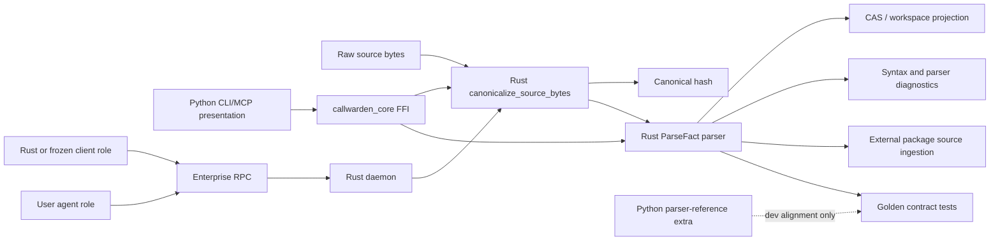
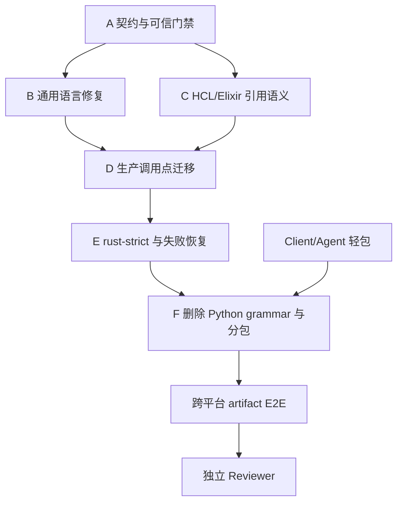

# Call Warden Rust-only Parser 生产切换设计与实施计划

> 状态：待实施  
> 版本：v1  
> 日期：2026-07-25  
> 适用版本：Call Warden 0.3.2+  
> 关联设计：
> [enterprise-phase1-phase3-detail.md](enterprise-phase1-phase3-detail.md)、
> [parse-input-abi.md](parse-input-abi.md)、
> [cross-platform-packaging-release-plan.md](cross-platform-packaging-release-plan.md)

## 1. 决策摘要

Call Warden 的 16 种 tree-sitter grammar 已经全部进入 Rust crate。当前发布包仍携带
Python `tree-sitter` 核心和 16 种 Python grammar wheel，原因不是 Rust 缺少 grammar，
而是生产路径仍保留 Python parser 作为失败回退，并且部分非主构建功能仍直接调用
`parsers.create_parser()`。

本计划采用以下决策：

1. 不进行全项目 Python 到 Rust 的一次性重写。
2. 只将生产解析路径切换为 Rust-only，Python CLI/MCP 表现层暂时保留。
3. `client` / `agent` 角色先拆成无 parser 轻包，不等待语言对齐。
4. `local` / `daemon` 在 16 语言契约、生产调用点和跨平台门禁全部通过后切换为
   `rust-strict`。
5. 默认发布包删除 Python parser、Python tree-sitter 核心及全部 grammar wheel。
6. Python parser 暂时保留在源码仓库和 `parser-reference` 开发依赖中，仅用于
   transition alignment、回归定位和旧版本对照，不进入正式安装包。
7. Rust 解析失败必须显式记录并 fail closed，不允许静默回退后伪装成功。
8. 发布回滚依赖版本回退或独立兼容包，不在默认进程中长期保留双 parser。

## 2. 现状证据

### 2.1 Rust grammar 覆盖

`rust_ext/Cargo.toml` 已包含 C、C++、Python、Rust、Go、Java、TypeScript、
JavaScript、Ruby、PHP、Scala、C#、Kotlin、Swift、Elixir、HCL grammar。

当前执行路径：

| 语言组 | 当前 Rust 状态 | 当前生产行为 |
|---|---|---|
| C | 专用 `batch_parse_c_files_pool` | Rust 成功时使用，失败回退 Python |
| 14 种通用语言 | `supported_languages()` 返回 | 默认分配给 Rust，异常回退 Python |
| HCL | Rust grammar 和 symbol rule 已存在 | 未进入 `supported_languages()`，引用提取依赖 Python |

14 种通用语言为：

`python`、`rust`、`go`、`java`、`typescript`、`javascript`、`ruby`、`php`、
`scala`、`csharp`、`cpp`、`kotlin`、`swift`、`elixir`。

### 2.2 文档与代码差异

旧设计声明通过 `RUST_PARSE_ENABLED_LANGS` 逐语言放行，但当前
`db/db_build.py` 没有实现该环境变量，实际直接使用
`callwarden_core.supported_languages()` 分流。

旧设计还声明需要：

- `test_kind_alignment`
- `test_signature_alignment`
- `test_visibility_alignment`

当前测试中不存在这三个测试。现有 `tests/test_rust_python_alignment.py`
主要比较：

- `(name, start_line, end_line)`
- `(callee_name, call_line)`
- 符号数量

因此现有 `47 passed` 不能作为删除 Python fallback 的充分证据。

### 2.3 已知解析差异

当前 alignment 白名单至少包含：

| 语言 | 差异 |
|---|---|
| TypeScript | 样例中的 class、method、function 等符号缺失 |
| PHP | property 符号缺失 |
| Scala | 对象方法调用缺失 |
| C++ | Rust 多提取 namespace，属于待裁决的投影差异 |
| Python/C++ | Rust 比 Python 多识别部分对象方法调用 |
| HCL | attribute 引用关系尚未由 Rust 完整提取 |

白名单只能用于迁移期发现差异，不能成为生产放行的永久豁免。尤其禁止用白名单接受
“整种语言返回零符号”或系统性漏调用。

### 2.4 Python parser 的生产调用点

删除 Python grammar 前必须迁移的不仅是全量构建，还包括：

- `db/db_build.py`
  - 全量构建 register/parse
  - Python multiprocess fallback
  - 小批量单文件 fallback
  - `_refresh_file_generic`
  - 历史版本或缓存相关解析
- `db/db_check_gate.py`
  - 语法检查
- `db/db_external.py`
  - Python/package 源码扫描
  - npm TypeScript/JavaScript 源码扫描
  - Java sources JAR 扫描
- 其他通过 `create_parser()` 或 parser 实例方法间接调用的生产入口

实现时必须再次运行生产调用图扫描，不能只依赖本设计中的静态清单。

### 2.5 发布包重复

`release/pyinstaller/callwarden.spec` 当前：

- 显式收集 Python `tree_sitter`
- 显式收集 16 种 Python parser 模块和 grammar
- 将 `cw`、`cw-client`、`cw-agent` 放入同一个 Analysis/PYZ/COLLECT
- 所有入口共享同一份完整运行时

这意味着即使 `cw-client` 和 `cw-agent` 不执行本地 parse，也会携带 parser。

本机当前 Python 环境测得 tree-sitter 核心和 grammar 未压缩大小：

| 组件 | 大小 |
|---|---:|
| `tree-sitter` 核心 | 0.25 MiB |
| 16 种 grammar wheel 文件 | 30.97 MiB |
| 合计 | 31.22 MiB |

压缩包收益由各平台原生库可压缩性决定，不能直接宣称减少 31.22 MiB。第一版门禁设为：

- 安装目录至少减少 25 MiB；
- 对应压缩包至少减少 8 MiB；
- 每个平台报告真实差值，不用一个平台的结果外推其他平台。

## 3. 目标与非目标

### 3.1 目标

1. 默认正式发布物中不包含 Python `tree_sitter` 和任何
   `tree_sitter_<language>` distribution。
2. 默认正式发布物中不包含 `callwarden.parsers.*` 语言实现模块。
3. 16 种语言的生产解析全部由 `callwarden_core` 完成。
4. local 构建、单文件 refresh、watcher、daemon refresh、check gate、外部源码扫描
   使用同一 canonical bytes 和 ParseFact 合约。
5. Rust parser 错误不会漏文件、写空图谱或静默切换实现。
6. client/agent 包不包含本地 parser、grammar 和不需要的本地构建依赖。
7. Windows amd64、macOS arm64、Linux x86_64/aarch64 的干净 runner 产物通过
   安装后 E2E。
8. Linux glibc/musl 兼容策略与发布 manifest 一致。
9. Python parser 可以作为开发期 reference 单独安装，但不能被生产冻结包意外收集。

### 3.2 非目标

- 不在本计划中把全部 CLI、MCP、任务编排和报表逻辑改写为 Rust。
- 不把 Semgrep 嵌入 Rust binary；Semgrep 继续作为平台相关 sidecar。
- 不把 sentence-transformers 模型迁移到 Rust。
- 不以减少包体为理由改变代码图谱 schema。
- 不以 Python parser 的所有历史行为作为绝对正确标准；冲突应由语言契约和真实语义裁决。
- 不在第一步删除源码仓库中的 `parsers/`。

## 4. 目标架构



正式运行时只有一份语法事实来源：Rust parser。Python 表现层可以继续存在，但不得构造
第二套 AST 或 ParseFact。

## 5. 解析契约

### 5.1 输入契约

所有生产入口必须遵守 `parse-input-abi.md`：

1. 从同一份 raw bytes 生成 canonical bytes。
2. canonicalization 只由 Rust 实现。
3. hash 与 parse 使用同一份 canonical bytes，禁止重新按路径读文件。
4. 记录 encoding、BOM、newline style、raw hash 和 canonical hash。
5. 写回前验证 raw hash，避免 TOCTOU。

### 5.2 输出契约

每个语言至少覆盖：

- symbols
  - stable local ID
  - name
  - kind
  - signature
  - visibility
  - lexical parent local ID
  - canonical byte start/end
  - line start/end
  - content/symbol hash
  - comment presence
- raw calls
  - caller local ID，可空
  - call ordinal
  - callee text/name
  - canonical byte start/end
  - line
- imports/references
  - source text
  - normalized target
  - language-specific reference kind
- diagnostics
  - syntax error count
  - unsupported construct count
  - partial parse marker
  - fatal parse error

若当前 ABI 缺少字段，应先补 ABI 和兼容版本，不得在 Python 层临时拼出生产事实。

### 5.3 错误语义

定义统一状态：

| 状态 | 行为 |
|---|---|
| `ok` | 发布完整 ParseFact |
| `partial` | 发布可用事实并持久化 diagnostics，不冒充完整成功 |
| `unsupported` | 不发布空图谱，记录语言/构造并进入可观测失败 |
| `failed` | 不替换上一代可查询 snapshot，记录失败并允许重试 |
| `stale` | generation CAS 拒绝，不覆盖新状态 |

生产 `rust-strict` 模式禁止捕获异常后调用 Python parser。

## 6. 测试与放行模型

### 6.1 两层真相源

迁移期使用两层测试：

1. **Python/Rust transition diff**
   - 用来发现历史行为变化；
   - 不把 Python 自动视为正确；
   - 差异必须分类为 Rust 缺陷、Python 缺陷或有意契约变化。
2. **语言 golden contract**
   - 人工确认预期符号、调用、引用、签名、可见性和范围；
   - 是移除 Python reference 后的长期真相源；
   - 任何输出变化必须显式更新 fixture 和原因。

### 6.2 单语言放行门

每种语言必须同时满足：

- grammar 可加载并在三个正式平台运行；
- golden fixtures 零未知差异；
- kind/signature/visibility/parent/byte range 对齐；
- calls/imports/references 契约通过；
- 空文件、语法错误、超大文件、非 UTF-8、BOM、CRLF 通过；
- 至少三个真实仓库样本通过；
- Rust 输出非系统性为空；
- 100 次重复解析结果确定；
- 无 panic、越界、死锁和未界定内存增长；
- 单文件 P95 小于 50 ms，或给出经过评审的语言例外；
- 全量解析不比当前已发布 Rust 路径回退超过 10%。

### 6.3 白名单策略

最终 production gate 要求 `KNOWN_SYMBOL_DIFFS` 和 `KNOWN_CALL_DIFFS` 中不存在
“Rust 缺失”的条目。允许保留的只有经评审确认的有意契约差异，并迁移为具名 golden
fixture，不再使用笼统 Counter 白名单。

以下永远不能白名单：

- 整种语言零 symbols；
- 整类 symbol/call/reference 系统性缺失；
- byte range 越界；
- hash 与 canonical bytes 不一致；
- parser panic；
- 文件因 stream/fallback 控制流而消失。

## 7. 运行模式与灰度

新增统一解析模式，替代多个隐式环境变量：

| 模式 | 可用环境 | 行为 |
|---|---|---|
| `rust-strict` | 正式发布默认 | 只用 Rust，失败显式记录 |
| `shadow` | 源码开发/CI | Rust 为主，Python reference 同步解析并只比较，不影响发布结果 |
| `python-reference` | 源码开发 | 仅用于历史对照，不进入冻结包 |

建议配置名：`CW_PARSE_MODE`。

约束：

- 正式 frozen build 固定允许 `rust-strict`；
- frozen build 收到 `python-reference` 或 `CW_DISABLE_RUST_PARSE` 时返回明确错误；
- `shadow` 结果写独立 diagnostics，不得污染 CAS、manifest 或 snapshot；
- 语言放行状态进入版本化 manifest，不只依赖进程环境变量。

## 8. 分阶段实施

### Phase 0：建立可信基线和门禁

目标：在修改解析行为前，先让测试能阻止系统性漏数据。

步骤：

1. 生成 16 语言能力清单：symbols/kinds/signatures/visibility/calls/imports/references。
2. 补 `kind`、`signature`、`visibility`、parent、byte range、ordinal 对齐测试。
3. 将现有白名单逐条分类，不允许“整语言零符号”通过。
4. 为每种语言建立 golden fixtures。
5. 增加真实仓库 corpus runner，结果保存为结构化 JSON。
6. 记录现有安装目录、压缩包、启动时间、RSS 和全量/增量 parse 基线。
7. 将 bundle inspector 改为能报告每个 distribution 的文件和字节占比。

完成门：

- 测试能够真实暴露 TypeScript、PHP、Scala、HCL 当前缺口；
- 失败测试有明确 issue/task 对应；
- baseline 由 CI artifact 持久化。

### Phase 1：先拆 client/agent 无 parser 轻包

目标：不等待语言修复，先让不需要本地解析的角色停止携带 grammar。

步骤：

1. 将 PyInstaller 的共享 Analysis 拆为：
   - local runtime；
   - client/agent runtime。
2. client/agent Analysis 禁止收集：
   - `callwarden.parsers.*`
   - `tree_sitter`
   - `tree_sitter_*`
   - NumPy 和本地 SQLite/GraphStore 依赖中未使用部分。
3. 运行协议级 register/list/status/refresh/query E2E。
4. Linux 容器中验证 client/agent 通过 UDS/TCP broker 调用 daemon。
5. bundle inspector 对 client/agent 设置 parser distribution 零容忍。

完成门：

- client/agent 安装后可完成所有声明的 enterprise RPC；
- bundle 中 parser/grammar 文件数为 0；
- client/agent 不因无 parser import 崩溃。

### Phase 2：修复 16 语言 Rust 语义缺口

目标：Rust parser 满足长期 golden contract。

优先级：

1. TypeScript：class/method/function/constructor 和 TSX。
2. PHP：property、visibility、trait/interface。
3. Scala：对象方法调用和 Scala 3 语法。
4. HCL：attribute traversal/reference、resource/data/module 地址。
5. Elixir：alias/import/use/require 与调用归属。
6. C/C++：namespace、macro、method、template 和投影规则。
7. 其余语言：signature、visibility、parent、byte range 补齐。

实施要求：

- 修改 `rust_ext/src/multi_lang.rs` 或拆出按语言模块，避免继续膨胀单文件；
- 每个语言修复独立测试和结果快照；
- 不通过改变 Python reference 来掩盖 Rust 缺失；
- grammar 版本变化必须更新 parser ABI 或 fixture provenance。

完成门：

- 16 语言 golden contract 通过；
- 不存在“Rust 缺失”的 production whitelist；
- HCL 进入正式 Rust supported language 集合；
- 所有 parser 输出满足 ParseFact ABI。

### Phase 3：迁移全部生产调用点

目标：生产代码不再实例化 Python parser。

步骤：

1. 建立 `RustParserFacade` 或等价窄接口，统一：
   - canonicalize bytes；
   - parse canonical bytes；
   - diagnostics；
   - batch/stream；
   - generation metadata。
2. 改造全量 build 和小批量 build。
3. 改造 `_refresh_file_generic` 和 watcher 单文件刷新。
4. 改造 check gate 语法检查。
5. 改造 external package/npm/JAR 源码扫描。
6. 改造历史版本、注释恢复或临时源码解析入口。
7. 删除生产代码中的 `_get_or_create_parser()` 和 `create_parser()` 调用。
8. 增加静态门禁：正式模块 import graph 中出现 `callwarden.parsers` 即失败。

完成门：

```powershell
rg -n -g "*.py" -g "!tests/**" -g "!testcode/**" `
  -e "create_parser\\(" -e "callwarden\\.parsers" db server cli analyzers cicd
```

除明确的开发 reference adapter 外应无匹配。

### Phase 4：切换 rust-strict 和失败恢复

目标：移除运行时 Python fallback，同时保持增量更新和 daemon 可恢复。

步骤：

1. 引入 `CW_PARSE_MODE` 和 frozen-mode 限制。
2. 将 Rust pool 创建失败、stream 中途失败、单文件 error 改为显式状态。
3. 失败 generation 不替换上一代 snapshot。
4. durable log 记录 failed/partial/retry 状态。
5. daemon 重启后只重放可重试 generation。
6. stale session/generation CAS 继续拒绝旧结果。
7. metrics 增加：
   - `parse_total`
   - `parse_ok`
   - `parse_partial`
   - `parse_failed`
   - `parse_unsupported`
   - `parse_latency`
   - `parse_bytes`
8. doctor 增加 Rust grammar/ABI 自检。

完成门：

- 任何 Rust parse 失败都可定位到 workspace/file/generation/language；
- 不出现空图谱覆盖；
- 不存在 Python fallback 调用；
- kill -9 恢复 E2E 通过。

### Phase 5：删除正式包 Python grammar

目标：默认发布物物理移除重复 parser runtime。

步骤：

1. 从 `release/pyinstaller/requirements-runtime.txt` 删除：
   - `tree-sitter`
   - 16 种 `tree-sitter-*`
2. 从 `callwarden.spec` 删除 parser hidden imports。
3. 将 `callwarden.parsers` 加入正式包 excludes。
4. 根据 import graph 删除仅由 Python parser 引入的间接依赖。
5. `parser-reference` 写入单独 dev/test requirements。
6. bundle inspector fail closed：
   - distribution 名禁止；
   - `_binding*.pyd/.so` 禁止；
   - `callwarden/parsers/*_parser.py` 禁止；
   - Rust `callwarden_core` 必须存在且真实 parse 成功。
7. 生成 before/after 文件清单和大小报告。

完成门：

- 安装目录至少减少 25 MiB，或给出逐文件证据解释平台差异；
- 压缩包至少减少 8 MiB；
- Rust extension 未被误删；
- frozen smoke test 不依赖系统 Python。

### Phase 6：跨平台产物与企业验收

正式矩阵：

| 平台 | 架构 | 角色 |
|---|---|---|
| Windows | amd64 | local/client |
| macOS | arm64 | local/client |
| Linux | x86_64 | local/client/agent/daemon |
| Linux | aarch64 | local/client/agent/daemon |

附加 Linux 兼容矩阵：

- glibc 构建的最低版本；
- musl 静态构建；
- Ubuntu 14.04–24.04 容器挂载路径；
- SMB/CIFS 与 VS Code Remote 工作区；
- 同 repo 不同分支和 dirty overlay。

每个平台执行：

1. 干净 runner 构建。
2. 解包静态检查。
3. 无系统 Python 环境启动。
4. 16 语言最小 parse。
5. 全量 build、单文件 refresh、watcher save-to-query。
6. client→daemon query。
7. schema N-1 upgrade 和失败回滚。
8. 包体、启动时间、RSS、parse latency 报告。

完成门：

- 全部正式 artifact 从安装包运行通过；
- CI 不从源码目录 import；
- 产物 manifest 记录 OS/arch/libc/parser ABI/grammar versions；
- SBOM 和许可证清单更新；
- release notes 明确不再包含 Python parser fallback。

### Phase 7：灰度发布和清理

1. 内部开发机先运行 `shadow`，收集真实差异。
2. 选择 1–2 个仓库运行 `rust-strict` canary。
3. 扩展到 10 用户 × 5 workspace 共享场景。
4. 观察一个完整开发周期：
   - checkout/repo sync；
   - dirty save；
   - daemon restart；
   - schema upgrade；
   - mixed encoding。
5. 发布 Rust-only parser 正式版。
6. 下一小版本删除冻结构建中的兼容开关。
7. Python parser 源码至少保留两个版本周期，再决定归档或移入独立包。

## 9. 回滚策略

### 9.1 发布前

- 任一语言 gate 失败：该版本不得删除 local/daemon 的 Python grammar。
- client/agent 轻包可独立发布，不受 local parser gate 阻塞。
- 不允许通过扩大白名单让 release 变绿。

### 9.2 发布后

优先级：

1. 回滚到上一正式安装包；
2. 关闭受影响 workspace 的自动 refresh，保留上一 snapshot；
3. 发布修复后的 Rust parser patch；
4. 极端情况下发布独立 `parser-compat` 包。

禁止在同一生产进程中临时下载 Python grammar 并静默恢复，因为这会破坏离线部署、
SBOM、签名和可复现性。

### 9.3 数据兼容

- 本计划原则上不改变 workspace schema；
- parser ABI 或 CAS key 变化时必须提升 parser ABI；
- 新 ABI 产物不能覆盖旧 ABI CAS entry；
- 回滚版本应能读取旧 snapshot，不能读取时从源文件重建；
- dirty overlay 在重建或回滚期间不得进入 Global CAS。

## 10. 性能与包体门禁

| 指标 | 门禁 |
|---|---:|
| client/agent parser distribution 数 | 0 |
| local/daemon Python grammar distribution 数 | 0 |
| 安装目录减少 | ≥25 MiB |
| 压缩包减少 | ≥8 MiB |
| 单文件 parse P95 | <50 ms，或经评审的语言例外 |
| watcher save-to-query P95 | <3 s |
| Rust parser panic | 0 |
| clean fixture fatal parse miss | 0 |
| generation 丢失 | 0 |
| stale generation 覆盖 | 0 |
| 10×5 clean workspace 重复 parse 率 | <5% |

包体比较必须使用同一 commit、同一 runner image、同一压缩参数和同一构建缓存状态。

## 11. Agent 工作包与文件所有权

### Agent A：契约与门禁

独占：

- `tests/test_rust_python_alignment.py`
- 新增 `tests/parser_contract/`
- corpus runner
- bundle size baseline 工具

不得修改 Rust parser 实现。输出失败清单供语言 Agent 修复。

### Agent B：通用语言 Rust 修复

独占：

- `rust_ext/src/multi_lang.rs`
- 可拆分的 `rust_ext/src/languages/*.rs`
- 对应 Rust unit tests

负责 TypeScript、PHP、Scala、C/C++ 及通用字段。

### Agent C：HCL/Elixir 与引用语义

独占：

- HCL/Elixir Rust language modules
- HCL traversal/reference tests
- Elixir import/use/alias tests

若与 Agent B 共用 `multi_lang.rs`，必须先由 Agent B 完成模块拆分再开始。

### Agent D：Python 生产调用点迁移

独占：

- `db/db_build.py`
- `db/db_check_gate.py`
- `db/db_external.py`
- Rust parser Python facade

不得修改 release spec。

### Agent E：失败恢复与 daemon 接线

独占：

- `rust_ext/src/daemon/`
- watcher/generation/durable log 相关模块
- health/metrics/doctor 接线

### Agent F：分包与发布

独占：

- `release/pyinstaller/`
- `release/build.py`
- Linux/macOS/Windows 打包脚本
- release workflow

只有收到 Agent A 的 gate artifact 和 Agent D 的生产调用零匹配证明后，才能删除依赖。

### Reviewer：独立验收

- 不参与上述实现；
- 从干净 checkout 运行验收；
- 检查 production callers 和真实 artifact；
- 实现 Agent 不得自行 apply/close 父任务。

## 12. 任务依赖



`Client/Agent 轻包` 可以在 A–E 期间并行，但不得改 local/daemon parser 依赖。

## 13. 建议测试命令

```powershell
# 解析契约
python -m pytest tests/test_rust_python_alignment.py -q
python -m pytest tests/test_p31_multi_lang.py tests/test_l9_rust_multilang.py -q

# Rust parser
cargo test --manifest-path rust_ext/Cargo.toml multi_lang --lib

# 生产调用点
rg -n -g "*.py" -g "!tests/**" -g "!testcode/**" `
  -e "create_parser\\(" -e "callwarden\\.parsers" db server cli analyzers cicd

# 发布物
python release/inspect_pyinstaller_bundle.py --strict <bundle-dir>
python release/_check_artifacts.py <artifact-dir>
```

实现 Agent 应把精确命令和输出摘要写入对应 task step result。真实 Linux/ARM/macOS
门禁不能用 Windows mock 代替。

## 14. Definition of Done

父任务只有在以下条件全部满足后才能进入 review：

1. 八个实施子任务全部进入 review；
2. 16 语言 golden contract 通过；
3. TypeScript/PHP/Scala/HCL 阻塞差异闭合；
4. kind/signature/visibility/parent/byte range/call ordinal 测试存在且通过；
5. 生产模块不再调用 Python parser；
6. frozen runtime 强制 `rust-strict`；
7. client/agent/local/daemon 正式产物均不含 Python grammar；
8. Windows/macOS/Linux x86_64/Linux aarch64 真实 artifact 通过；
9. 包体与性能报告满足门禁；
10. daemon watcher/generation/recovery E2E 通过；
11. 文档、SBOM、许可证和升级说明同步；
12. 独立 Reviewer 从源码调用、运行时行为和发布 artifact 三层复核通过。

## 15. 实施顺序建议

建议先实施：

1. 契约与可信门禁；
2. client/agent 无 parser 轻包；
3. TypeScript/PHP/Scala/HCL 修复。

不要先删除 requirements 或 spec hidden imports。只有在语言 gate、生产调用点和
rust-strict 失败语义全部闭合后，删除 Python grammar 才是可验证、可回滚的优化，而不是
把 fallback 从包里拔掉后等待用户替我们发现缺口。

## 16. 已创建的 cw 任务树

实施父任务：

`T-1784986236712-736b2331` — Rust-only parser 生产切换与 Python grammar 退场

| 阶段 | 任务 ID | 步骤数 | 依赖 |
|---|---|---:|---|
| P0-A 契约与可信门禁 | `T-1784986236713-5c859568` | 7 | 无 |
| P0-B client/agent 轻包 | `T-1784986236713-9925c885` | 5 | 无 |
| P0-C 通用语言修复 | `T-1784986236713-1d233675` | 7 | A |
| P0-D HCL/Elixir | `T-1784986236713-468d3f6b` | 5 | A；C 的模块拆分步骤 |
| P1-E 生产调用迁移 | `T-1784986236713-7d441ae4` | 7 | C、D |
| P1-F strict/recovery | `T-1784986236714-3c665954` | 7 | E |
| P1-G 删除 Python grammar | `T-1784986236714-d99b0b76` | 6 | A、B、F |
| P2-H 跨平台验收与复审 | `T-1784986236714-ca26c424` | 8 | G |

P0-D 的精确前置步骤为：

`S-1784986236713-d8f88c16` — `split_language_modules`

任务树合计 8 个子任务、52 个步骤。任务初始状态全部为 `open`；实现 Agent 应使用
`cw task next <task_id>` 领取步骤，完成后进入 `review`，由独立 Reviewer 决定
`apply/close`。
