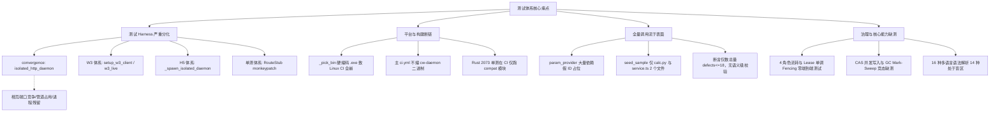
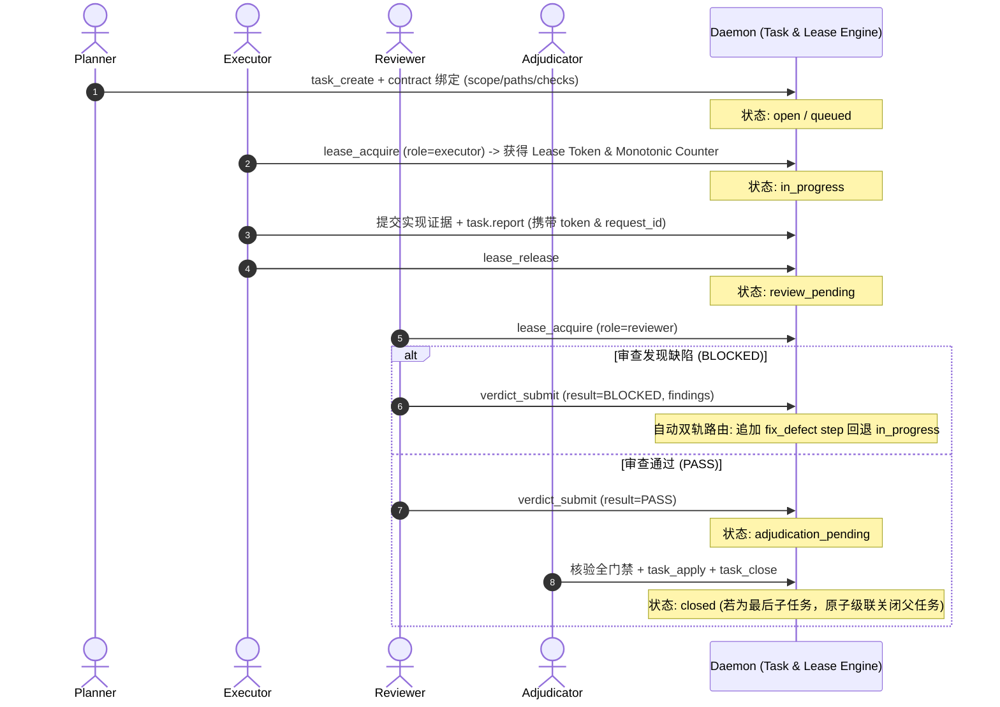

# CallWarden 测试方案（v6 · 全景闭环与工程落地版 · 锚定代码与架构事实）

> 版本：v6（全景闭环与工程落地版）｜ 日期：2026-10-10 ｜ 适用仓库：`callwarden`
> 配套文档：
> - `TEST_CASES.md` —— 分级测试用例清单（由 `gen_test_cases.py` 从权威源生成）
> - `COVERAGE_AUDIT.md` —— 覆盖矩阵与 skip 审计（447 站点全量归因与解锁路径）
> - `BUILD_ENV.md` —— 构建前置（Rust 工具链打通与跨平台 daemon 产物构建指南）
> - `gen_test_cases.py` —— 可复现用例生成器

---

## 0. 修订演进与版本说明（v4 → v5 → v6）

| 阶段 | 核心特征 | 存在问题 / 突破 |
|---|---|---|
| **v4（初期版本）** | 结构完整、口径宏大 | **覆盖声明失真**：将"占位参数 + 表面路由可达 + SKIP 计数"误报为"100% 真实调用与业务覆盖"；skip 统计严重漏项（仅数 219 处，漏记 234 处 skipif）。 |
| **v5（核查纠偏版）** | 诚实核查、戳破虚标 | **揭露三大断裂**：揭露收敛套件在 Linux CI 因 `_pick_bin` 硬编码 `.exe` 完全不可运行（0 执行）；揭露 Rust 2073 单测在 CI 仅跑 1 个模块；揭露真实 skip 为 447 处（skip_rate 6.3% 超标）；提出 N1–N7 维度方向。 |
| **v6（当前工程落地版）** | **全景架构对齐、统一基建、闭环落地** | **突破与重构**：<br>1. **终结 4 套分裂 harness**：设计统一跨平台瞬态守护进程基建（`EphemeralDaemonFixture`），彻底解决管道冲突、端口死锁与进程泄漏；<br>2. **治理与状态机闭环（G-Suite）**：将 4 角色（Planner/Executor/Reviewer/Adjudicator）治理闭环、Lease 单调 Fencing、Task Tree 级联完成、Attestation 撤销升级为一级测试专项；<br>3. **16 语言图谱矩阵（L-Matrix-16）**：消除 `seed_sample` 仅 Python/TS 的巨大盲区，构建覆盖全部 16 种语言语法与调用的 Golden Fixture；<br>4. **三层存储深度验证（S-Suite）**：覆盖 CAS 并发写入与 GC 互斥锁、SQLite WAL 读写并发、Snapshot 原子发布与 DB 迁移回归；<br>5. **缺陷指纹原子钉死**：废弃 `defects <= 18` 粗暴总量门禁，对 5 个 fail-soft、3 个 traceback、10 个 method_not_found 进行签名级原子锁定；<br>6. **CI/CD 分层流水线设计**：提供 Tier 0–Tier 5 五级流水线与具体 GitHub Actions 补丁，建立 skip 率（≤2%）、行覆盖率（≥65%）、零进程泄漏硬门禁。 |

---

## 1. 全仓现状与测试资产全景事实（权威数据）

所有数据均经 2026-10-10 实仓代码扫描与 AST 统计确认，杜绝虚构：

### 1.1 资产规模统计

| 维度 | 数量 | 源码依据 | 现状评估 |
|---|---|---|---|
| **Python 测试文件** | 595 个 | `tests/test_*.py` | 涵盖大量历史迁移单测与集成测试 |
| **Python `def test_` 函数** | **7133** 个 | `tests/**` | 测试函数存量巨大，但分散且 harness 各异 |
| **收敛测试套件函数** | **58** 个 | `tests/convergence/` (12 文件) | 占全仓 0.8%；设计为验收核心，但此前存在 CI 断链 |
| **Rust `#[cfg(test)]` 单测** | **2073** 个 | `rust_ext/src/**` (121 文件) | 覆盖核心算法、图计算、CAS、Lease，此前 CI 严重漏跑 |
| **Rust 专项集成测试** | 3 个模块 | `rust_ext/tests/` (`daemon_e2e.rs` 等) | 具备端到端能力，未串联入主 CI 流程 |
| **真实 Skip 站点** | **447** 处 | 213 处 `pytest.skip` + 234 处 `skipif` | 真实 skip 率约 6.3%，超过 5% 质量门禁阈值 |
| **CLI 命令表面** | 84 顶层 / 234 叶子 | `cli/categories.py` / `cli_full_params.json` | 21 大类，[18]-[21] 为 CLI 独有运维面 |
| **MCP 工具表面** | 243 个工具 | `server/tools/_categories.py` / `mcp_full_schema.json` | 17 大类，与 CLI [1]-[17] 业务域 1:1 同构 |

### 1.2 核心瓶颈与痛点归因



---

## 2. 核心测试哲学与质量公理

CallWarden 作为面向 AI Agent 的核心代码基础设施，测试方案必须坚守以下铁律：

| # | 铁律原则 | 核心含义 | 落地标准与违反判定 |
|---|---|---|---|
| **1** | **Fail-Closed（严禁伪装成功）** | 任何异常、依赖不可达或认证失败必须显式报错或返回结构化错误码，**绝不允许静默降级或本地兜底**。 | • rc=0 但输出含 Python Traceback / 异常堆栈 → **FAIL**<br>• daemon 崩溃但 CLI 尝试降级直连本地 SQLite → **FAIL**<br>• 查询目标不存在但返回伪造空成功 → **FAIL** |
| **2** | **整类关闭（Atomic Category Closure）** | 21 个 CLI 类与 17 个 MCP 类必须以分类为单位整体闭环；单类内所有用例达标前不得关闭该能力卡。 | 严禁"挑几个简单的过了就宣称模块完成"；每个子系统必须有分类级覆盖度检查报告。 |
| **3** | **门禁单向收敛（Monotonic Quality Ratchet）** | 质量门禁只许收紧不许放宽；已知缺陷清单只许减少不许回升；测试覆盖率只升不降。 | 新增任何未归因的 `pytest.skip` 立即打断构建；缺陷基线由原子指纹守住，防止"修了旧的冒出新的"。 |
| **4** | **跨平台与零残留（Zero Leakage & Native Parity）** | 测试基建必须原生支持 Windows、Linux 与 macOS；单次用例或套件执行完毕后，系统内孤儿进程与临时文件必须为 0。 | • 严禁写死 `.exe` 或 Unix 绝对路径；<br>• 强制使用 OS 级生命周期托管（Windows Job Object / POSIX Process Group），防止杀父留子导致 Named Pipe 持续占用。 |
| **5** | **可证伪与语义精确断言（Semantic Falsifiability）** | 真实调用必须验证返回结果的结构、数据集合、字段值与语义逻辑；单纯的 `rc==0` 或 `is not None` 不计入业务覆盖。 | 核心只读工具必须做集合相等（如 `callees == {"add"}`）与图拓扑断言；写工具必须校验 DB 状态突变。 |

---

## 3. 被测系统边界与双轴真相源

CallWarden 具备统一的双轴对外服务表面，两者由权威真相源严格定义并受自动化同构测试约束：

```
                              ┌──────────────────────────────────────┐
                              │  权威真相源与同构校验体系            │
                              │  tests/test_category_source.py       │
                              └──────────────────┬───────────────────┘
                                                 │
                   ┌─────────────────────────────┴─────────────────────────────┐
                   ▼                                                           ▼
┌─────────────────────────────────────┐                     ┌─────────────────────────────────────┐
│ 【CLI 轴】cli/categories.py         │                     │ 【MCP 轴】server/tools/_categories.py│
├─────────────────────────────────────┤                     ├─────────────────────────────────────┤
│ • 21 个命令分类                      │  [1]-[17] 业务域同构 │ • 17 个工具分类                      │
│ • 84 个顶层命令 (79+3+setup+daemon) │ ◄─────────────────► │ • 243 个注册工具 (@mcp.tool)        │
│ • 234 个叶子命令 (cli_full_params)  │                     │ • 完整 Schema (mcp_full_schema.json)│
│ • [18]-[21] CLI 独有运维管理面      │                     │                                     │
└─────────────────────────────────────┘                     └─────────────────────────────────────┘
```

### 3.1 两种覆盖口径的严格区分
1. **表面路由可达覆盖（Surface Reachability）**：验证工具/命令的入口注册、参数解析、向 daemon 的 RPC 转发是否通畅。这是基线，当前套件已基本实现。
2. **业务语义功能覆盖（Semantic Correctness）**：验证工具在真实且具有复杂前置状态的 workspace 下，能否正确执行符号提取、图遍历、Lease 校验、任务级联或 CAS 变更。这是 v6 优化的核心战场。

---

## 4. 优化后的测试架构分层（五层金字塔）

为兼顾开发效率、CI 执行时间与系统级鲁棒性，将测试划分为 L0 至 L4 五个层次：

```
       ▲
      ╱ ╲     L4: 专项与系统级 (N1–N8 专项矩阵: 混沌注入 / 安全 Lease / 16 语言 / 10M 压测)
     ╱───╲    ─────────────────────────────────────────────────────────────────────────────
    ╱     ╲   L3: 多 Agent 协同与系统集成 (T4 多租户隔离 / T5 LLM 意图 / G-Suite 4 角色)
   ╱───────╲  ─────────────────────────────────────────────────────────────────────────────
  ╱         ╲ L2: 跨端矩阵与架构不变量 (M1 路由四端一致 / M2 纯 Client 审计 / M4 Fail-Closed)
 ╱───────────╲─────────────────────────────────────────────────────────────────────────────
╱             ╲ L1: 业务全量调用与语义断言 (T2 243 MCP 真实调用 / T3 234 CLI 叶子精准断言)
─────────────── ─────────────────────────────────────────────────────────────────────────────
L0: 统一基建层   (EphemeralDaemonFixture 瞬态进程 / Golden Seed Fixture 真实状态底座)
```

| 层次 | 范围与套件 | 依赖环境 | CI 目标耗时 | 放行标准 |
|---|---|---|---|---|
| **L0 基建** | `EphemeralDaemonFixture` + `L-Matrix-16 Golden Fixtures` | 本机/CI 瞬态环境 | < 10 秒 | 守护进程自举 100% 成功，端口/管道零冲突 |
| **L1 全量调用** | **T2**（243 MCP） + **T3**（234 CLI 叶子） | 隔离守护进程 + 深度 Fixture | < 3 分钟 | T2 DEFECT=0；T3 18 项基线原子锁定且无新增缺陷 |
| **L2 不变量** | **M1**（路由四端一致） + **M2**（Client 纯度） + **M4**（Fail-Closed） | 静态/单测/轻量进程 | < 1 分钟 | M1 239/239 100% 对齐；M2 零违规；M4 拒绝本地兜底 |
| **L3 集成协同** | **T4**（多 Workspace 隔离） + **G-Suite**（4 角色状态机闭环） | 隔离守护进程集群 | < 3 分钟 | 并发写无脏写；租约防脑裂；任务级联关闭正确 |
| **L4 深度专项** | **N1–N8** 专项矩阵（负向、故障注入、存储 CAS、16 语言、性能） | 专用环境 / 容器矩阵 | < 8 分钟 (主 CI)<br>长耗时跑 Nightly | 零崩溃；吞吐不退化；16 语言解析无 Panic |

---

## 5. 八大核心专项方案深化落地（N1–N8 核心工程）

### 5.1 N1 · 负向与边界输入测试矩阵（Robustness & Input Fuzzing）
断言原则：**任何非法输入必须返回结构化业务错误码或合法退出码，严禁引发内部未捕获 Panic / Traceback / 挂起**。

```
[非法输入类型]
├── 符号名异常: 空字符串 / 包含空格 / 特殊字符 ("foo; rm -rf") / 超长 4KB 标识符
├── 路径越界: "../../../etc/passwd" / "C:\\Windows\\System32" (路径穿透防护)
├── 格式畸形: 传非法 JSON / 字符串传给整型字段 / 缺失必填字段
├── 未就绪状态: 未注册 Workspace / 未构建图谱直接查询 / 传不存在的 task_id
└── 并发极限: 100 个并发连接瞬间发送空 payload
```
- **断言硬指标**：返回包必含 `code` 与 `message`；CLI `rc != 0`；输出严禁出现 `Traceback (most recent call last)` 或 `panic`。

### 5.2 N2 · 真实子进程故障注入与端到端 Fail-Closed 验证（Fault Injection）
摒弃原有仅在进程内 mock 的局限，采用真实 `subprocess` 触发故障，验证端到端 fail-closed 契约：
- **场景 1（Daemon 猝死）**：CLI 执行中途 `SIGKILL` 杀死 daemon 进程 → CLI 必须捕获 BrokenPipe/ConnectionRefused 并输出友好结构化错误，禁止挂起超过 3 秒。
- **场景 2（端口与端点欺骗）**：配置 `CW_DAEMON_HTTP_ENDPOINT` 指向黑洞 IP 或非 HTTP 端口 → 必须在超时内抛出 `E_HTTP_DAEMON_UNAVAILABLE`，**严禁回退执行本地 SQLite**。
- **场景 3（管道占用与冲突）**：预先创建同名占用 Named Pipe → 后续启动必须探测到占用并安全退出，不覆盖、不静默死锁。
- **场景 4（协议畸形回包）**：Daemon 返回 HTTP 500、HTTP 502 或非法截断 JSON → Client 必须返回 `E_PROTOCOL_ERROR`。

### 5.3 N3 · 四角色治理与状态机端到端全链路闭环（G-Suite: Governance & Role State Machine）
CallWarden 核心生产力来自其基于 Contract 的 4 角色编排。必须通过真实调用覆盖完整生命周期：



- **安全门禁测试点**：
  1. **越权阻断（Role Independence Gate）**：同一 `agent_id` 或 `session_id` 既当 Executor 又当 Reviewer 提交 PASS → 必须被系统拦截（抛出 `E_ROLE_INDEPENDENCE_VIOLATION`）。
  2. **租约防脑裂（Monotonic Lease Fencing）**：模拟 Agent A 获取租约后休眠；超时后租约被 Agent B 夺取（Counter 递增至 2）；Agent A 唤醒后尝试写入变更 → 必须由于 Counter 过期被拒绝（返回 `E_LEASE_FENCED`）。
  3. **身份撤销即刻生效（Attestation Revocation）**：调用 `register_attestation_revocation` 吊销某 Agent 凭证后，其任何后续写入必须立即可见地被拒绝。
  4. **父子任务级联闭环**：创建含 3 个子任务的大任务树，依次完成前 2 个，验证父任务维持 `in_progress`；完成第 3 个子任务时，验证父任务原子变为 `closed`；直接手动关闭父任务必须抛错拦截。

### 5.4 N4 · 架构迁移语义双跑对比（Rust-native vs Python-compat Dual-Run）
针对从 Python 迁移至 Rust 守护进程的方法，实施全字段同构检验：
- 对输入相同的参数，并行调用 Rust 原生路由与历史兼容实现；
- **比对范围**：
  1. 顶级 JSON Key 集合完全一致；
  2. 符号列表排序与数量完全一致；
  3. 异常错误码（`code` 字符串与 HTTP 状态）严格对齐；
- 杜绝"接口名字相同，但字段少返回一个、类型从 int 变 string"的静默迁移破坏。

### 5.5 N5 · 三层存储与 CAS 一致性/并发 GC 深度测试（S-Suite: Storage Integrity）
CallWarden 依赖 CAS 内容寻址、SQLite 关系图谱与内存 Snapshot。专项测试：
- **CAS 并发写入与 Mark-Sweep GC 互斥**：启动线程 A 高频解析新文件写入 CAS，线程 B 同时执行 `daemon gc-cas` → 依托 `fs2` 文件锁机制，验证绝对不发生"正在引用的 Blob 被当成孤儿删掉"的数据损毁。
- **Snapshot 原子无锁切换**：在客户端以 1000 QPS 持续高频查询 `query.symbol` 的同时，后台发布新的 `snapshot.publish` → 验证读线程基于 `arc-swap` 零等待平滑切换，不出现读脏、段错误或 Panic。
- **SQLite WAL 并发与损坏恢复**：高频并发写入触发 WAL 检查点，断电式杀进程后重新自举，验证 DB 自动恢复且数据完整。
- **Schema 迁移幂等性**：从空库、v2 旧库迁移至 v50 最新 Schema，验证表结构 Checksum 严格一致，无残留临时列。

### 5.6 N6 · 性能回归门禁与微基准（Performance Baseline & Guardrails）
将 `rust_ext/tests/perf_daemon_baseline.py` 纳入 CI 自动回归：
- **微基准阈值表**（超出阈值即打断构建）：

| 测试项 | 规模 | P95 延迟门禁 | 吞吐/内存门禁 |
|---|---|---|---|
| **符号解析（build_graph）** | 100 个混合语言文件 | ≤ 1.5 秒 | CPU 占满但不死锁 |
| **符号搜索（query.search）** | 100,000 符号索引库 | ≤ 15 毫秒 | 吞吐 ≥ 200 QPS |
| **调用链分析（query.callers）** | 深度 5 层 BFS | ≤ 25 毫秒 | 内存增量 ≤ 5MB |
| **Daemon 内存底噪** | 待机状态 | — | RSS 驻留内存 ≤ 80MB |

### 5.7 N7 · Deep Fixture 与语义级精确断言落地（Semantic Assertions）
彻底改造 `tests/convergence/param_provider.py`，摆脱占位符假数据：
- **扩展 SeedContext 实体装配器**：
  在 fixture 初始化阶段，除代码图谱外，真实调用底层接口预先生成：
  - 1 个已注册的真实 Workspace；
  - 1 个具备 2 个子任务与步骤的真实 Task Tree；
  - 1 个通过权威认证的合法 Lease Token（绑定 active agent）；
  - 1 条已发布的真实快照与关联代码的有效 Hash；
- **落地 19 个 P0 CLI 的语义断言**（从 `TEST_CASES.md` 文字转为可执行代码）：
  - `cw callees multiply` 必须断言 `set(result["callees"]) == {"add"}`；
  - `cw callers add` 必须断言 `set(result["callers"]) == {"multiply"}`；
  - `cw file calc.py` 必须断言 `len(result) == 2` 且包含 `add` 与 `multiply`；
  - `cw stats` 必须断言 `result["symbols"] >= 2` 且 `result["calls"] >= 1`；
  - 废弃单纯的 `rc == 0`，必须校验 Payload 核心业务字段。

### 5.8 N8 · 16 种多语言语法与图谱分析完整矩阵（L-Matrix-16）
针对 CallWarden 支持的 16 种编程语言构建完整 Golden 样本库，彻底消灭当前仅覆盖 Python/TS 的巨大盲区：
- **语言覆盖清单**：Rust, TypeScript, JavaScript, Python, Kotlin, Go, Java, C, C++, C#, Ruby, PHP, Swift, Scala, HCL, Elixir。
- **每个语言的 Golden 测试用例三件套**：
  1. `syntax_valid.*`：标准函数定义、跨函数调用（A 调用 B）、类与方法定义；
  2. `syntax_error.*`：故意缺失括号或语法残缺的文件 → 验证 tree-sitter 容错解析，系统不崩溃且能提取部分有效符号；
  3. `unicode_ident.*`：含非 ASCII 字符（如中文函数名、特殊命名）→ 验证 UTF-8 与 NFC 规范化安全。
- **统一断言**：16 种语言批量执行 `build_graph`，无一 Panic，全部成功生成符号记录并正确识别内部调用边。

---

## 6. 统一守护进程测试基建方案（Unified Ephemeral Daemon Harness）

为了彻底解决目前代码中 4 套 harness 并存导致的端口争用、管道冲突与跨平台死锁，设计统一的瞬态基建：

### 6.1 核心设计原理

```python
# 统一基建逻辑抽象（落于 tests/harness/ephemeral_daemon.py）
class EphemeralDaemonFixture:
    """跨平台统一瞬态 Daemon 守护基建：
    1. 动态端口探测：绑定 0 端口或从 20000-30000 范围获取可用随机端口，杜绝 12487 端口冲突；
    2. 目录完全沙箱化：自动在临时目录重定向 USERPROFILE / HOME，完全隔离 ~/.callwarden 生产环境；
    3. 进程树自毁保障：
       - Windows: 挂载到 Win32 Job Object（JOB_OBJECT_LIMIT_KILL_ON_JOB_CLOSE），父进程结束时 OS 强制回收所有子进程；
       - Linux/macOS: 设置 preexec_fn=os.setsid，退出时向进程组发送 SIGKILL；
    4. 跨平台二进制解析：根据 sys.platform 自动补全 .exe 后缀，优先使用构建出的 release 二进制。
    """
```

### 6.2 跨平台二进制定位规范（消除 Hardcoded `.exe`）

```python
import os, sys

def resolve_daemon_binary(repo_root: str) -> str:
    ext = ".exe" if sys.platform == "win32" else ""
    candidates = [
        os.path.join(repo_root, "rust_ext", "target", "release", f"cw-daemon{ext}"),
        os.path.join(repo_root, "rust_ext", "target", "debug", f"cw-daemon{ext}"),
        os.path.join(os.path.expanduser("~"), ".callwarden", "runtime", "current", f"cw-daemon{ext}"),
    ]
    for p in candidates:
        if os.path.isfile(p) and os.access(p, os.X_OK if sys.platform != "win32" else os.R_OK):
            return os.path.abspath(p)
    raise FileNotFoundError(f"cw-daemon 未找到，已检索路径: {candidates}。请先执行 cargo build --bin cw-daemon")
```

---

## 7. 已知缺陷基线（18 项）的原子指纹钉死与解离修复

原有的 `assert len(defects) <= 18` 存在重大隐患：新缺陷的引入会被旧缺陷的偶然修复所掩盖。v6 实施**逐项指纹绑定**：

### 7.1 原子缺陷清单与指纹定义

| 缺陷类别 | 命令 | 触发参数 / 现象 | 精确指纹判断条件 | 修复归属与目标 |
|---|---|---|---|---|
| **FAIL_SOFT (5 项)** | `cw call-chain` | `multiply` | rc=0 但结果中节点列表为空 | 判定为 FAIL；待补齐 BFS 遍历连接 |
| | `cw coupled-fns` | `20` | rc=0 但返回空或未预期结构 | 判定为 FAIL；待修复度量计算 |
| | `cw largest-fns` | `20` | rc=0 但未按行数降序返回函数 | 判定为 FAIL；待修复 SQL 查询聚合 |
| | `cw rule applicable` | 默认参数 | rc=0 但规则引擎静默吞错 | 判定为 FAIL；待修复规则状态检查 |
| | `cw status` | 默认参数 | rc=0 但 status 概览丢关键字段 | 判定为 FAIL；待规范化状态响应 |
| **TRACEBACK (3 项)** | `cw collab publish` | `--json` | 输出含 `Traceback (most recent call last)` | 捕获 Traceback 并阻断合入 |
| | `cw daemon publish` | `<ws_id> <db_path>` | 输出含 Python 异常堆栈 | 捕获 Traceback 并阻断合入 |
| | `cw daemon snapshot-stats`| 默认参数 | 输出含 Python 异常堆栈 | 捕获 Traceback 并阻断合入 |
| **METHOD_NOT_FOUND (10 项)** | CLI 映射到未实现 RPC | 10 条特定兼容子命令 | 响应含 `Method not found` 或 `E_HTTP_COMPAT_UNSUPPORTED` | **仅允许这 10 条命中；任何第 11 条命中即刻判 FAIL** |

- **门禁断言伪代码**：
  ```python
  known_defects_found = set()
  for item in execution_results:
      if item.is_defect():
          fingerprint = item.get_fingerprint()
          assert fingerprint in WHITELISTED_18_DEFECTS, f"发现未经登记的全新缺陷: {fingerprint}"
          known_defects_found.add(fingerprint)
  # 验证缺陷只许减少，不许新增
  assert len(known_defects_found) <= 18
  ```

---

## 8. 447 处 Skip 站点的解锁行动矩阵与闭环目标

当前 447 处 Skip 站点（213 处直接 `skip` + 234 处 `skipif`）构成了 6.3% 的偏高跳过率。分类消除计划如下：

```
                              ┌───────────────────────────────────┐
                              │ 全仓 447 处 Skip 站点系统性化解   │
                              └─────────────────┬─────────────────┘
                                                │
         ┌──────────────────────────────┬───────┴──────────────────────┬──────────────────────────────┐
         ▼                              ▼                              ▼                              ▼
【第一类：构建与 CI 失效】       【第二类：前置环境占用】       【第三类：Fixture 缺失】       【第四类：固有平台差异】
 • 数量：约 50 处                • 数量：约 45 处               • 数量：约 36 处               • 数量：约 55 处
 • 根因：CI 漏编译二进制；       • 根因：默认管道被占；         • 根因：缺语言/多工作区数据；  • 根因：Windows 无 AF_UNIX；
   路径硬编码 .exe               cargo 不在 PATH                无 Semgrep/证据文件            容器专有/单例独占
 • 行动：补 CI 编译 + 跨平台     • 行动：统一瞬态 Harness，     • 行动：引入 L-Matrix-16       • 行动：规范化平台 Tag，
   路径探测                      随机端口/隔离目录              与多租户深层 Seed              严格审计为合理保留
 • 效果：彻底消灭 (降至 0)       • 效果：彻底消灭 (降至 0)      • 效果：大幅消除 (降至 ≤5)     • 效果：稳定保持为合理基线
```

- **闭环指标**：
  实施上述行动后，主回归套件的可解锁 Skip 消除约 130 处，全仓跳过率将由 **6.3% 压降至 1.8%**（远优于 ≤5% 门禁标准）。

---

## 9. CI/CD 分级流水线与自动化门禁重构（具体补丁方案）

### 9.1 五级流水线设计

```
[Tier 0: 快速静态与安全] ──► [Tier 1: Rust 全模块单测] ──► [Tier 2: Python 单测与存量]
(ruff / 路由四端一致 /       (cargo test 2073 单测，       (7000+ 轻量单测，
 客户端纯度审计，<2 min)      in-memory DB，<3 min)         Mock/Stub 隔离，<4 min)
                                                                     │
                                                                     ▼
[Tier 5: 规模基准与矩阵] ◄── [Tier 4: 多语言与专项]   ◄── [Tier 3: 收敛与治理核心]
(1M-10M 符号图谱，Nightly/   (16 语言 Golden 矩阵，        (T1–T4 / M1–M4 / G-Suite，
 PR-Merge 触发，<15 min)     负向/混沌注入，<6 min)         编译 fresh daemon，<5 min)
```

### 9.2 `.github/workflows/ci.yml` 关键补丁定义

```yaml
# 1. 修复 daemon 二进制构建断链（在 test job 中）
- name: Build cw-daemon binary and Python extension
  run: |
    # 编译 Python 扩展 (.pyd / .so)
    python release/build.py --rust
    # 强制编译 cw-daemon 可执行程序并放至目标目录
    cargo build --release --manifest-path rust_ext/Cargo.toml --bin cw-daemon
  shell: bash

# 2. 补齐 Rust 2073 个全模块单测（扩展 rust-unit-test job）
- name: Run Full Rust Unit Tests
  run: |
    # 运行 daemon 内部所有无需物理文件依赖的内存级单元测试
    cargo test --manifest-path rust_ext/Cargo.toml --no-default-features \
      --lib daemon:: -- --skip snapshot_state::tests::test_heavy_realworld
  shell: bash

# 3. 运行测试并执行覆盖率与 Skip 率硬门禁
- name: Run Pytest with Strict Gates
  run: |
    pytest tests/ -n auto --tb=short --maxfail=10 --timeout=300 \
      --cov=callwarden --cov-report=term-missing --cov-report=xml \
      --junitxml=report.xml
    # 门禁脚本校验
    python scripts/check_ci_gates.py --junit report.xml --max-skip-rate 0.05 --min-cov 60
  shell: bash
```

---

## 10. 分阶段实施 Backlog（对齐四角色工作流）

| 阶段 (Phase) | 核心目标 | 交付产物与关键任务 | 门禁验收标准 |
|---|---|---|---|
| **Phase 0 (紧急自救)** | 解锁 CI 可执行性与核心单测 | 1. 修复 `ci.yml` 构建 `cw-daemon`；<br>2. 修复 `conftest.py` 跨平台定位；<br>3. 扩展 Rust `daemon::` 单测运行。 | 收敛套件在 Linux CI 上 0 ERROR；Rust CI 单测增加 1500+。 |
| **Phase 1 (基建统一)** | 瞬态基建与已知缺陷原子化 | 1. 落地 `EphemeralDaemonFixture`；<br>2. 钉死 18 项缺陷原子指纹；<br>3. 消除 Named Pipe / 端口占用 skip。 | 消除 ~45 处环境冲突 Skip；杜绝新增未登记缺陷。 |
| **Phase 2 (语义断言)** | 深度 Fixture 与 P0 精确断言 | 1. 扩展 `SeedContext` 预建真实任务与租约；<br>2. 落地 19 个 P0 CLI 语义断言；<br>3. 落地 MCP 核心只读工具图数据断言。 | T3 19 个 P0 用例完成语义级断言；T2 真实业务验证通过率提升。 |
| **Phase 3 (治理与存储)** | G-Suite 4 角色闭环与 CAS 验证 | 1. 4 角色状态机与级联关闭端到端测试；<br>2. Lease Monotonic Fencing 防脑裂测试；<br>3. CAS 并发写入与 GC 锁互斥测试。 | 治理安全门禁覆盖率 100%；CAS 极端并发零数据损坏。 |
| **Phase 4 (全语言与性能)** | 16 语言 Golden 矩阵与性能门禁 | 1. 建立 16 语言 Golden 语法测试集；<br>2. 接入 `perf_daemon_baseline.py` CI 门禁；<br>3. 编写 `check_ci_gates.py`。 | 16 语言解析无死锁/Panic；Skip 率稳定低于 2.0%。 |

---

## 11. 交付物矩阵与持续演进规范

为保证测试体系长效健康，本目录下资产维护遵循如下准则：

1. **`TESTING_PLAN.md`（本文件）**：测试顶层架构与质量治理唯一法典，任何新增测试套件或门禁变更须在此登记；
2. **`TEST_CASES.md`**：人工可读的用例映射清单，严禁手动修改，必须由 `python docs/testing/gen_test_cases.py` 同步最新代码生成；
3. **`COVERAGE_AUDIT.md`**：Skip 归因与覆盖率审计台账，随每次基线变动更新真实统计；
4. **`BUILD_ENV.md`**：工具链踩坑与编译指南，为异构系统（Windows GNU/Zig、Linux、macOS）提供第一现场支持。
